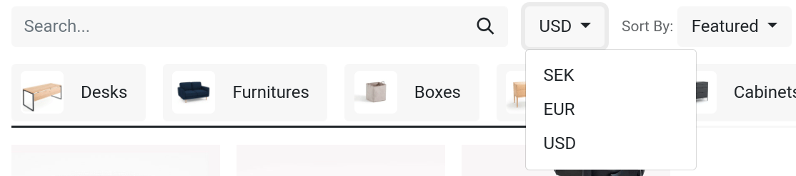
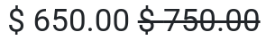

================
Price management
================

Odoo offers multiple options to select the price displayed on your website, as well as
condition-specific prices based on set criteria.

Taxes
=====

Tax configuration
-----------------

To add a tax on a product, you can either set a tax in the :guilabel:`Customer Taxes` field of the
**product template** or use
:doc:`fiscal positions </applications/finance/accounting/taxes/fiscal_positions>`.

.. seealso::
   - :doc:`/applications/finance/accounting/taxes`
   - :doc:`/applications/finance/accounting/taxes/avatax`
   - :doc:`/applications/finance/accounting/taxes/fiscal_positions`

Tax display
-----------

Choosing the displayed price tax usually depends on a country's regulations or the type of customers
**(B2B vs. B2C)**. To select the type of price displayed, go to :menuselection:`Website -->
Configuration --> Settings`, scroll down to the :guilabel:`Shop - Products` category, and select
:guilabel:`Tax Excluded` or :guilabel:`Tax Included`.

- :guilabel:`Tax Excluded`: the price displayed on the website is **tax-excluded**, and the tax is
  computed at the cart-review step;
- :guilabel:`Tax Included`: the price displayed on the website is **tax-included**.

.. note::
   This setting is **global**, and the tax-display type is the same for (all of) your website(s). It
   is, therefore, not possible to select different tax displays for different websites. This may be
   a significant point of consideration when implementing a database with multiple ecommerce
   websites aimed at varying customer types (i.e., B2B and B2C).

You can choose to display the type of pricing next to the product price by going to
:menuselection:`Website --> Site --> Homepage --> Shop`, selecting a product, and then
:menuselection:`Edit --> Customize tab` and enabling :guilabel:`Tax Indication`.

.. image:: price_management/price-tax-display-type.png
   :align: center
   :alt: Tax type displayed on the product page

.. seealso::
   :doc:`/applications/finance/accounting/taxes/B2B_B2C`

Price per unit
==============

It is possible to display a :doc:`price per unit
</applications/inventory_and_mrp/inventory/product_management/product_replenishment/uom>` on the
product page. To do that, go to :menuselection:`Website --> Configuration --> Settings` and enable
:guilabel:`Product Reference Price` under the :guilabel:`Shop - Products` section. When enabled,
ensure an amount is set in the :guilabel:`Base Unit Count` field of the **product template**, and in
the :guilabel:`Sales Price`.

.. image:: price_management/price-cost-per-unit.png
   :align: center
   :alt: Cost per unit pricing on the product template

The price per unit of measure can be found above the :guilabel:`Add to Cart` button on the product
page.

.. image:: price_management/price-cost-per-unit-page.png
   :align: center
   :alt: Cost per unit pricing on the product page

.. note::
   Pay attention that having the price per unit may be **mandatory** in some countries.

.. seealso::
   :doc:`/applications/inventory_and_mrp/inventory/product_management/product_replenishment/uom`

.. _ecommerce/pricelists:

Price configuration: pricelists
-------------------------------

Pricelists are the primary tool to manage prices on your eCommerce. They allow you to define
website-specific prices - different from the price on the product template - based on the **country
group**, **currency**, **minimum quantity**, **period**, or **variant**. You can create as many
pricelists as needed, but it is mandatory to have at least one pricelist configured per website. If
no custom pricelists are added, Odoo defaults to the **Public Pricelist** for all websites.

.. seealso::
   :doc:`/applications/sales/sales/products_prices/prices/pricing`

Configuration
~~~~~~~~~~~~~

Pricelists can be found under :menuselection:`Website --> eCommerce --> Pricelists`, but must first
be activated. For that, head to :menuselection:`Website --> Configuration --> Settings` and scroll
down to the :guilabel:`Shop - Products` section. There, you can find two options:

- :guilabel:`Multiple prices per product`;
- :guilabel:`Advanced price rules (discounts, formulas)`.

The **first** option allows you to set different prices per customer *segment*, i.e., registered
customers, gold customers, regular customers, etc. The **second** option allows you to set *price
change* rules such as **discounts**, **margins**, **roundings**, etc.

Foreign currency
~~~~~~~~~~~~~~~~

If you are selling in **multiple currencies** and have pricelists in foreign currencies, customers
can select their corresponding pricelist anywhere on the :guilabel:`Shop` page from the drop-down
menu next to the **search bar**.

.. seealso::
   - :doc:`/applications/sales/sales/products_prices/prices/pricing`
   - :doc:`/applications/sales/sales/products_prices/prices/currencies`

Permanent discount
------------------

If you have permanently reduced the price of a product, a popular means to attract customers is the
**strikethrough** strategy. The strategy consists in displaying the previous price crossed out and
the **new discounted price** next to it.

To display a 'striked' price, enable the :guilabel:`Comparison Price` option under
:menuselection:`Website --> Configuration --> Settings --> Shop - Products category`. Then, head to
the product's template (:menuselection:`Website --> eCommerce --> Products`), and in the
:guilabel:`Compare to Price` field, enter the **new** price.
