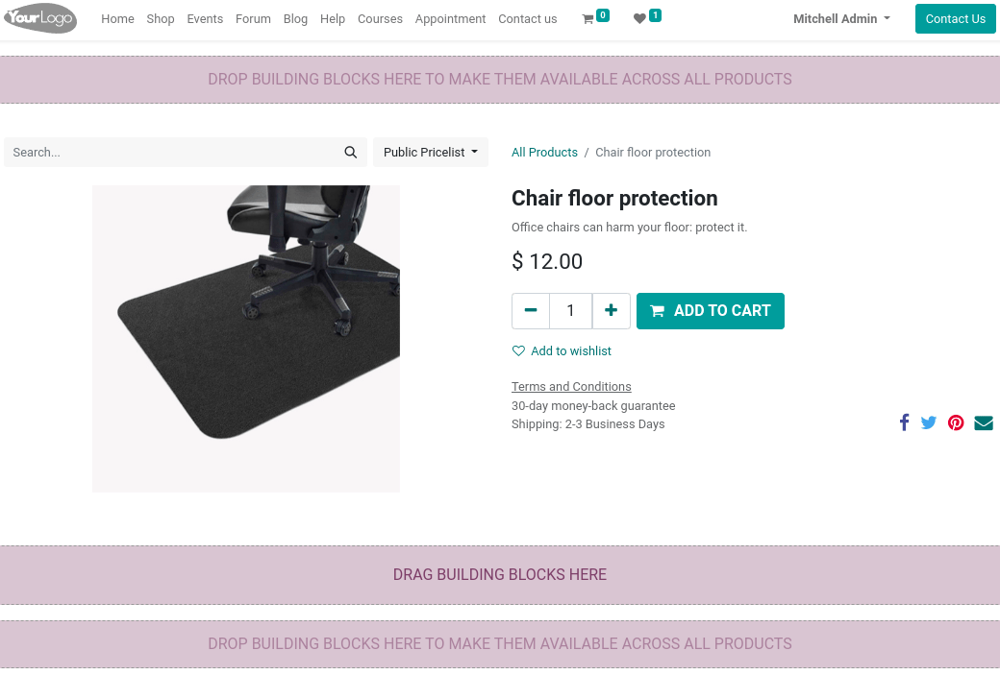

========
Products
========

Odoo allows you to create, import, and manage your products' pages all within the **Website** app.

Add products to the catalog
===========================

To add a product to your catalog, you can either do it in:

- The front end: from the :guilabel:`Homepage`, click :guilabel:`+ New` in the top-right corner, and
  select :guilabel:`Product`. Enter the name of your product, and :guilabel:`Save`;
- The back end: by going to :menuselection:`eCommerce --> Products --> Create`. You can find more
  information on product creation :doc:`here <../../../sales/sales>`;
- By importing: you can :ref:`import data <import-data>` using XLSX or CSV files.

.. seealso::
   - :doc:`../../../sales/sales/products_prices/products/import`

Publish
-------

Upon creation, products are defaulted as :guilabel:`Unpublished` in your eCommerce catalog.
**Unpublished products** are only visible to users with access rights to your eCommerce, whereas
:guilabel:`Published` products are visible to all users. When you wish to render a product visible
to all users, go to :menuselection:`Site --> Homepage --> Shop`, select the product, and enable the
:guilabel:`Published` status in the top-right corner.

Product page design
===================

Once a product is created, you can access its **product's page** through :menuselection:`Site -->
Homepage --> Shop`, selecting the product, and clicking :guilabel:`Edit`. Here, you can change the
**layout** of the page, enable **features**, add **content**, etc. Note that **enabled features**
apply to *all* product pages.

Features
--------

.. _ecommerce-features:

In the **website builder** window, click :guilabel:`Customize` to enable additional features such as
:guilabel:`Rating`, :guilabel:`Share`, etc.

- :guilabel:`Customers`: :guilabel:`Rating` adds a rating option on the page; :guilabel:`Share` adds
  share buttons via social media networks and email;
- :guilabel:`Select Quantity`: if enabled, allows to choose the quantity added to cart;
- :guilabel:`Tax Indication`: notifies if the price is **VAT included** or **excluded**;
- :guilabel:`Variants`: shows all possible variants of the product as a :guilabel:`Products List`;
  :guilabel:`Options` as selectable options to compose the variant yourself;
- :guilabel:`Cart`: :guilabel:`Buy Now` adds a checkout button taking the customer directly to the
  checkout page; :guilabel:`Wishlist` allows to add the product to a wishlist;
- :guilabel:`Specification`: allows you to select where the **specification** category is displayed.
   This only applies to products with **variants**.

.. note::
   - To allow **wishlists**, the option must be enabled in :menuselection:`Configuration -->
     Settings --> Shop - Products --> Wishlists`;
   - To access the :guilabel:`Variants` options, the :guilabel:`Product Variants` option must first
     be enabled under :menuselection:`Configuration --> Settings --> Shop - Products`. You can learn
     more about variants :doc:`here <../../../sales/sales/products_prices/products/variants>`.

Layout
------

Within the same :guilabel:`Customize` tab as the :ref:`features <ecommerce-features>`, the layout
configuration can be changed according to your needs.

- :guilabel:`Images Width`: changes the *width* of the image product displayed on the page;
- :guilabel:`Layout`: the :guilabel:`Carousel` layout displays a large, main image with smaller ones
  underneath; whereas the :guilabel:`Grid` displays four images in a square layout (see pictures
  below);
- :guilabel:`Image Zoom`: if the zoom occurs on :guilabel:`Pop-up on Click`, when hovering over the
  image (:guilabel:`Magnifier on hover`), on :guilabel:`Both`, or :guilabel:`None`;
- :guilabel:`Image Spacing`: how far apart the images are;
- :guilabel:`Columns`: how many columns of images are displayed;
- :guilabel:`Main Image`: click :guilabel:`Replace` to change the product's main image;
- :guilabel:`Extra Images`: click :guilabel:`Add` or :guilabel:`Remove all` to add or remove product
  images. You can also add images and videos via URL.

.. note::
   Images must be either PNG or JPG and at least 1042px in height or width. To trigger the zoom, the
   image has to be bigger than 1024x1024

.. image:: products/products-layout.png
   :align: center
   :alt: Product images layout

Add content
-----------

You can use **building blocks** to add content to your product page. These blocks can be used to add
extra text and picture galleries, features such as call to actions or comparisons, etc. Depending on
*where* you drop the **building block**, it may be available either on the *product page* only, or
on the *whole* website.

Product configuration
=====================

Multiple languages
------------------

If multiple languages are available on your website and you wish to have the product's information
translated, it is necessary to encode these translated information in the **product's form**. Fields
with multiple languages available are identifiable by their abbreviation language (ex. :abbr:`EN
(English)`) next to their field.

The **eCommerce-related** fields to translate are:

- :guilabel:`Product name`;
- :guilabel:`Out-of-Stock Message` (under the :guilabel:`Sales` tab);
- :guilabel:`Sales Description` (under the :guilabel:`Sales` tab);

.. tip::
   Having untranslated content on a web page may be detrimental to the user experience and
   therefore, your SEO.

Website availability
--------------------

A product can be available on *one* or *all* websites, but it is not possible to select *some*
websites and not others. To define a product's availability, go to
:menuselection:`eCommerce --> Products`, select your product, and in the :guilabel:`Sales` tab,
click the :guilabel:`Website` you wish the product to be available on. Leave it empty for *all*.

Digital files
-------------

It is possible to add a download link for customers at the end of the checkout. To do that, first
enable :guilabel:`Digital Content` under :menuselection:`Configuration --> Settings --> Shop -
Checkout Process`. Then, on the **product's form**, click on :menuselection:`More --> Digital Files`
and :guilabel:`Create` a new file.

.. image:: products/products-digital-files.png
   :align: center
   :alt: Digital Files menu

For the configuration:

- :guilabel:`Name`: the name of your file;
- :guilabel:`Type:` select if it is either a **file** or a **URL**. Accordingly, you either have a
  :guilabel:`File Content (base64)` field to upload your file, or a URL field to enter your URL.
- :guilabel:`Website`: The website on which that file is *available*. If you want it available for
  *all* websites, leave it empty.

The file is then available in the **purchase order** of the customer's portal, after the checkout.

Stock management
================

Under the :menuselection:`Configuration --> Settings --> Shop - Products`, you can enable and
configure inventory management options.

.. important::
   To display the stock level on the product page, the :guilabel:`Product Type` on the **product's
   form** must be set to :guilabel:`Storable` (only available when the **Inventory** app is
   installed).

In the :guilabel:`Inventory Defaults` sub-section, you can select the eCommerce selling strategy of
products:

- :guilabel:`Out-of-stock (Continue Selling)`: enabling it displays an **"Out-of-stock** message on
  the product page, but allows customers to continue placing orders. Leave it  unchecked to prevent
  orders;
- :guilabel:`Show Available Qty`: enabling it displays the available quantity left under a specified
  threshold on the product page. Odoo shows the "On hand" quantity minus the quantity already
  reserved for outgoing transfers.

Additionally, you can **prevent the sale** of a product if its price equals `0`. To do so, go to
:menuselection:`Configuration --> Settings --> Shop - Products`, and enable :guilabel:`Prevent Sale
of Zero Priced Product`. This replaces the :guilabel:`Add to Cart` button by a :guilabel:`Contact
us` button.

Product comparison
==================

You can enable a **product comparison tool** for your eCommerce by going to
:menuselection:`Configuration --> Settings --> Shop - Products`, and ticking :guilabel:`Product
Comparison Tool`. The **product comparison tool** allows to save products' **specifications** and
compare them against each other on a single page.

On the product page, scroll down to the **specification** section, and click :guilabel:`Compare`.
Repeat the same process for all products you wish to compare. Then, click the :guilabel:`Compare`
button of the pop-up window at the bottom of the page to reach the comparison summary.

.. image:: products/products-compare.png
   :align: center
   :alt: Product comparison window
