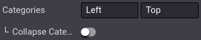

================
Product variants
================

Product variants are variations, such as different colors, materials, etc., of the same product.
These variations can differ in price and availability from the product. Product variants can either
be :doc:`created <../../../sales/sales/products_prices/products/variants>` or
:doc:`imported <../../../sales/sales/products_prices/products/import>`.

To use product variants, enable them under :menuselection:`Website --> Configuration --> Settings`,
in the :guilabel:`Shop - Products` section.

.. seealso::
   - :doc:`../managing_products/products`
   - :doc:`../../../sales/sales/products_prices/products/variants`
   - :doc:`../../../sales/sales/products_prices/products/import`

Product configurator
====================

Adding attributes and values to a product template allows the enabling of the **product
configurator** on the product page. Customers use it to configure and select the product variant of
their choice; or in the case of multiple attributes, combine those to create a specific variant.

.. image:: variants/variants-configurator.png
   :align: center
   :alt: Variants configurator

The **display type** of each attribute used in the product configurator can be edited through the
**website builder** by clicking :menuselection:`Edit --> Customize` on the product page, and then
clicking on one of the attributes. You can then select between four options:

- :guilabel:`Radio`
- :guilabel:`Pills`
- :guilabel:`Select`
- :guilabel:`Color`

.. image:: variants/variants-display-type.png
   :align: center
   :alt: Display type options for attributes

.. _variants-configurator-backend:

Alternatively, the **display type** can be edited through :menuselection:`Website --> eCommerce -->
Attributes`, selecting an **attribute**, and then choosing a :guilabel:`Display Type`; or through
the **product template** by going to :menuselection:`eCommerce --> Products`, selecting a product,
and then clicking :guilabel:`Attributes and Variants`.

.. tip::
   Specific combinations of values can be excluded from the product configurator. This way,
   customers are unable to select the excluded combination of values. To do so, go to
   :menuselection:`Website --> eCommerce --> Products`, select a product, and go to
   :guilabel:`Attributes and Variants`. Then, click on an **attribute**, select a **value**, and in
   the :guilabel:`Exclude for` section, select a :guilabel:`Product Template` and the
   :guilabel:`Attribute Values` to exclude.

Product specifications
======================

Values used for each attribute are displayed as a **specification list** at the bottom of the
product page. To be visible, the **specification list** must first be enabled on the product page by
going to :menuselection:`Edit --> Customize` and selecting a placement for the field
:guilabel:`Specification`.

.. image:: variants/variants-specifications.png
   :align: center
   :alt: Specifications list on the product page

.. tip::
   The product **specification list** can also be used on products without variants. For that, make
   sure to have no values combination. Products with single values for their attributes do not
   generate variants.

Filter catalog by attributes
============================

Customers **can** filter the **catalog** based on product attributes and values, allowing them to
:ref:`filter <ecommerce-browsing>` the catalog based only on the attribute(s) of their choice.

To enable **attributes filtering**, go to :menuselection:`Edit --> Customize` from your **main shop
page** and click on one of the :guilabel:`Categories` in the left column. Here, enable either
:guilabel:`Left`, :guilabel:`Top`, or **both**, in the :guilabel:`Attributes` field.

