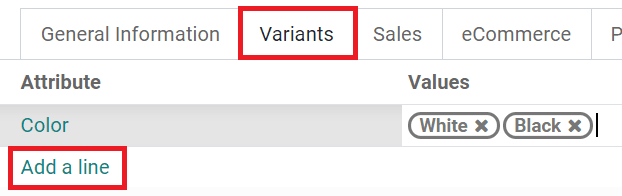

================
Product variants
================

Product variants are variations, such as different colors, materials, etc., of the same product.
These variations can differ in price and availability from the product. Product variants can either
be :doc:`created <../../../sales/sales/products_prices/products/variants>` or
:doc:`imported <../../../sales/sales/products_prices/products/import>`.

To use product variants, go to :menuselection:`Website --> Configuration --> Settings`, tick the
:guilabel:`Variants` check box in the :guilabel:`Products` section and click :guilabel:`Save`.

.. seealso::
   - :doc:`../../../sales/sales/products_prices/products/variants`
   - :doc:`../../../sales/sales/products_prices/products/import`

Create product attributes and variants
======================================

Product variants are created by adding attributes and values to a product template. This allows the
enabling of the **product configurator** on the product page, which customers can use to configure
and select the product variant of their choice; or, in the case of multiple attributes, combine
them to create a specific variant.

.. image:: variants/variants-configurator.png
   :alt: Variants configurator

To create variants for your products, proceed as follows:

#. Go to :menuselection:`Website --> Products --> Products` and select the product from the list.
#. Select the :guilabel:`Attributes & Variants` tab and click :guilabel:`Add a line`.
#. In the :guilabel:`Attribute` field, select an existing attribute or create a new one.
#. Specify the possible values for the attribute (i.e. the different options) in the
   :guilabel:`Values` field.
#. Click :guilabel:`Save` to save your changes.

.. tip::
   To prevent customers from selecting specific combinations of values, you can exclude these
   combinations from the product configurator. To do so, click the :guilabel:`Configure` button
   corresponding to the attribute in the :guilabel:`Attributes and Variants` tab in the product
   template. Then, select the attribute value for which you wish to exclude other attribute values
   and, in the :guilabel:`Exclude for` section, select a :guilabel:`Product Template` and the
   :guilabel:`Attribute Values` to exclude. For example, with the following configuration, customers
   cannot select the color black for the customizable desk or if they also selected aluminum legs.

   .. image:: variants/exclude_value_combinations.png
      :alt: Exclude specific combinations of values from the product configurator.

Display type
------------

To edit the **display type** of the attributes used in the product configurator, go to
:menuselection:`Website --> Configuration --> Attributes` and select an attribute, or go to
:menuselection:`Website --> Products --> Products` and select an attribute in the
:guilabel:`Attributes and Variants` tab.

Four options are available:

  - :guilabel:`Radio`: attribute values appear as radio buttons
  - :guilabel:`Pills`: attribute values appear as buttons
  - :guilabel:`Select`: attribute values appear in a dropdown menu
  - :guilabel:`Color`: attribute values appear as small colored disks; you can select the color of
    the disk for each attribute value by clicking the corresponding disk in the
    :guilabel:`Attribute values` tab, then picking a color.

Edit product variants
=====================

You can edit product variant-specific data such as their picture, internal reference, barcode,
volume, weight and cost. To do so, go to :menuselection:`Website --> Products --> Products`, select
the product from the list and click the :guilabel:`Variants` smart button. Then, select the product
variant and click :guilabel:`Edit`.

Set specific prices per variant
===============================

To add extra costs to a product's standard price for a specific product variant, go to
:menuselection:`Website --> Products --> Products` and select the product from the list. Select the
:guilabel:`Attributes & Variants` tab and click the :guilabel:`Configure` button. Then, select the
attribute value for which you wish to add extra costs and specify the additional cost in the
:guilabel:`Value Price Extra` field. It is displayed next to the attribute value on your website.

.. note::
   Advanced price computation methods for product variants can be defined using :doc:`Pricelist
   formulas </applications/sales/sales/products_prices/prices/pricing>`.
