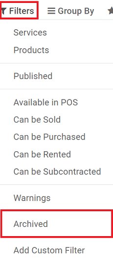

=======================
Manage product variants
=======================

Product variants are used to offer variations of the same product to your customers on the product's
page.

Let's say one of your customers selects a T-shirt from your product catalog.

Then, they choose the size and color they want. The various size and color combinations are known as
product variants.

Create attributes & variants
============================

In order to create various attributes and variants for your products, you first need to turn on
*Variants* in :menuselection:`Sales --> Configuration --> Settings`.

Then, select a product from the Products list (:menuselection:`Sales / Website --> Products -->
Products`). When the product detail form opens, click on *Edit*, and go to the *Variants* tab.

Here, you can add as many different attributes as you'd like by clicking on *Add a line*.

These attributes appear as three different types:

- Radio buttons
- Color buttons
- Drop-down menu

Several variants appear as soon as there are two values for one attribute.

Don't forget to hit *Save* once all variants have been entered.

.. image:: variants/values.png
   :align: center
   :alt: ecommerce product variants values

Edit variants
=============

After you hit *Save*, you are able to see all the variants from the product template detail form via
the *Variants* smart button.

.. image:: variants/smart-button.png
   :align: center
   :alt: ecommerce product variants smart button

Clicking the *Variants* smart button takes you to the Product Variants page, where you can edit the
following data for each specific variant:

- Picture(s)
- Internal Reference (SKU #)
- Barcode
- Volume
- Weight
- Cost

.. note::
   Both the Barcode and the Internal Reference are variant-specific. You need to populate them once
   the variants are generated.

Set specific prices per variant
===============================

You can set a specific public price per variant by clicking on *Configure Variants* in the product
detail form (top-left corner). That takes you to the *Product Variant Values* page for that product.

To set a specific public price for a particular variant, simply click on the variant you want to
modify, then click on *Edit*.

The *Value Price Extra* field represents the monetary value that is added to the original product
price whenever the corresponding attribute value is selected.

This is how the *Value Price Extra* looks on your website:

.. note::
   Pricelist formulas let you set advanced price computation methods for product variants. See
   :doc:`../maximizing_revenue/pricing`.

Disable/archive variants
========================

You can disable/archive specific variants so they are no longer available in quotes or on your
website (not existing in your stock, deprecated, etc.). Simply select *Archive* in their detail
form. You can reactivate them the same way.

To retrieve such items, hit *Archived* in the *Filters* category while searching the variants list.

.. seealso::
   - :doc:`../../../sales/sales/products_prices/products/variants`
