===============================================
Cross-selling, upselling, and promotional codes
===============================================

Cross-selling, upselling, and promotional codes are great ways to boost your sales and enhance the
overall shopping experience for your customers.

First, let's take a look at how to properly "cross-sell" products (or services) with Odoo.

Cross-selling
=============

Let's say, you sell computers. Wouldn't it be smart to entice your customers to buy a top-notch
screen or an extra-warranty to go along with their purchase? That tactic is known as
"cross-selling."

Cross-selling is typically used with the following:

* *Accessory* products on the checkout page
* *Optional* products on a new *Add to Cart* screen.

Accessory products
~~~~~~~~~~~~~~~~~~

Accessory products show up when the customer reviews their cart before paying for their
transaction. Accessories can be anything that would go with the main product.

For example, if the customer bought a desk, some accessories could be a lamp or a chair.

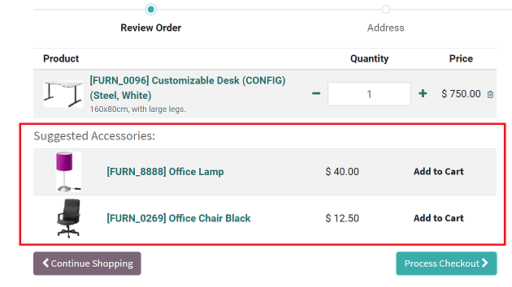

Select your *Accessory Products* in the *eCommerce* tab of the product detail page.

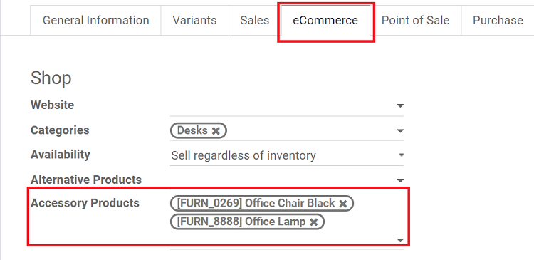

.. note::
    In the case that several items are added to a cart, there's an algorithm to figure out the best
    accessories to display. If any item is the accessory of several products added to the cart,
    it'll likely be atop the list of suggested accessories.

Optional products
~~~~~~~~~~~~~~~~~

Optional products are items that are directly related to the product that was added to cart. You
can configure your optional products on the detail form of a product, under the *Sales* tab.

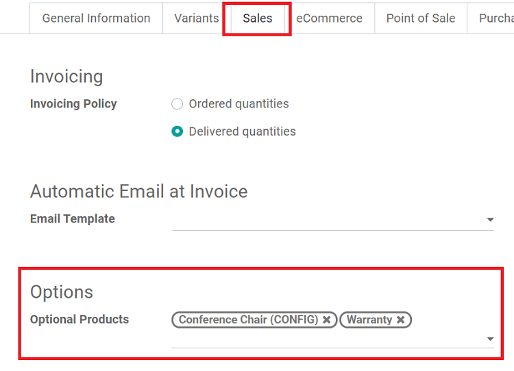

For example, if a customer put a conference desk in their cart, some optional products could be a
conference chair, a warranty, or anything else of this nature.

Whenever the main product is added to cart, a pop-up will appear as an extra step.

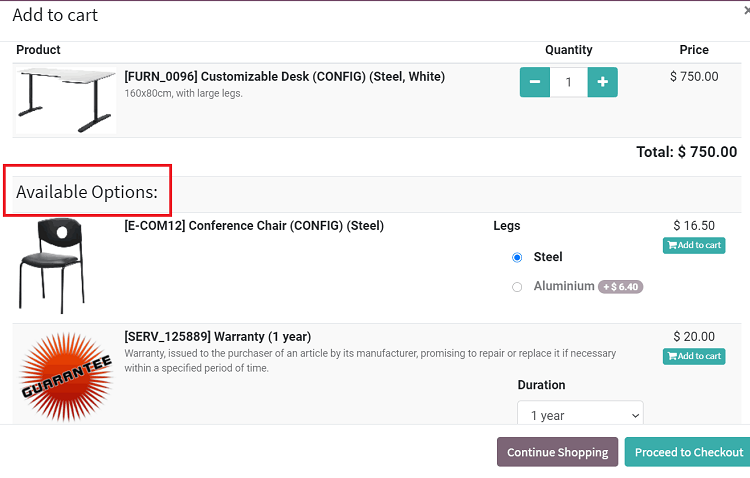

Upselling
=========

Upselling is when you suggest more expensive alternative products, as customers look at basic
items. That way, your customer will spend more time browsing your catalog, and potentially
purchase an even pricier item.

Upselling your customers with alternative products (at higher prices) is the *best* way to
*maximize* your revenue.

To start upselling:
~~~~~~~~~~~~~~~~~~~

* Choose what products you want to upsell by selecting *Alternative Products* in the *eCommerce* tab
  of the product detail form.

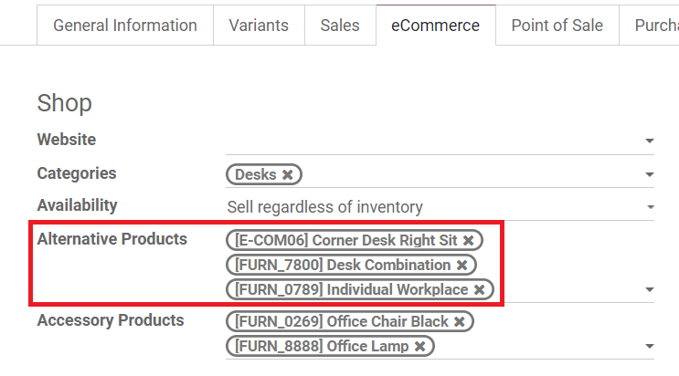

* Turn on *Alternative Products* from the *Customize* menu of the product web page.

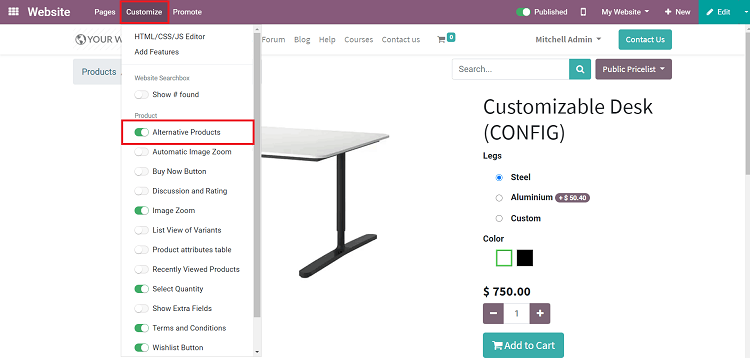

Now, your customers will be presented with pricier alternative products to consider at the
bottom of the product page, as they check out a more "basic" item.

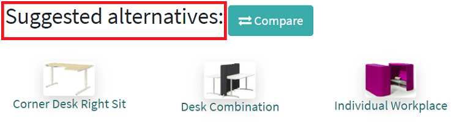

Promotional codes
=================

Promotional codes are a great way to boost your sales. Creating your own Promotional
Programs will entice and encourage customers to purchase goods (or services) from you because of
a specific deal or discount.

Customers access these deals by entering in a promotional code as they checkout.

Setup
~~~~~

* Go to :menuselection:`Website --> Configuration --> Settings` and activate *Pricelists*

* Then, activate *Advanced price rules (discounts, formulas)*.

* Activate *Coupons & Promotions* here, as well.

* Click *Save*.

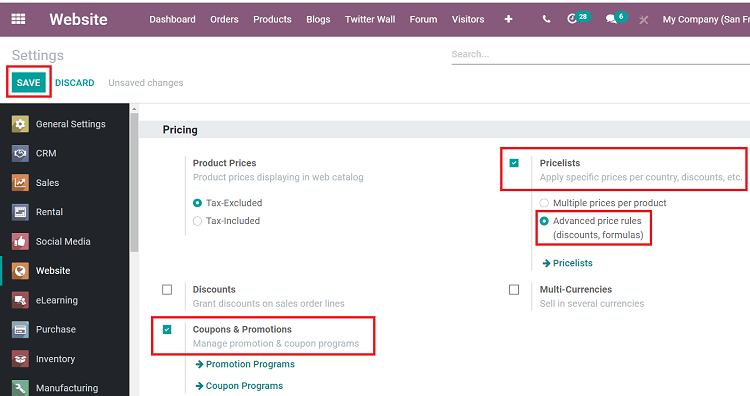

* Go to :menuselection:`Products --> Pricelists` to create a new
  Pricelist with your desired discount rule.

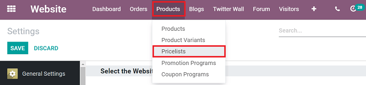

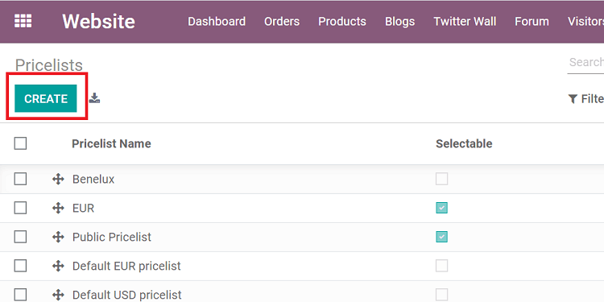

*  Give the Pricelist an appropriate title, before clicking on *Add a line* in the *Price Rules*
   tab.

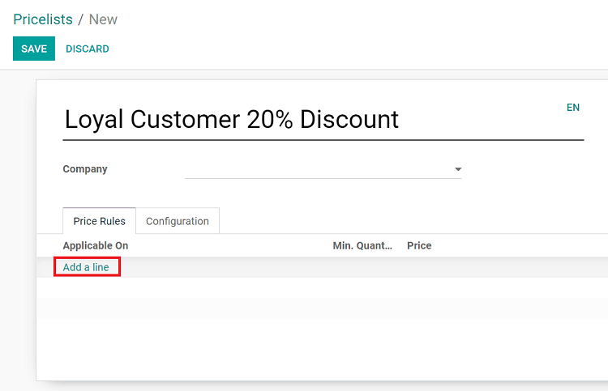

*  A pop-up appears, in which you can configure your promotional program in multiple ways.

.. image:: cross-selling-upselling-promo/pricelist-config-pop-up.png
   :align: center
   :alt: pricelist configuration pop-up

On this pop-up, you will be able to configure the following:

-  What the promotion will apply on: All Products, Product Category, Product, or Product Variant
-  The minimum quantity a customer would have to purchase in order to qualify for the promotion
-  The start and end date of the specific promotion
-  How the price will be computed: Fixed Price, Percentage (discount), or Formula

.. note::
   If Percentage (discount) is selected, you will be asked to enter in a discount amount in the
   *Percentage Price* field.

To create your promo code, click the *Configuration* tab and enter in your custom promotional
code in the *E-commerce Promotional Code* field. Then, hit *Save*.

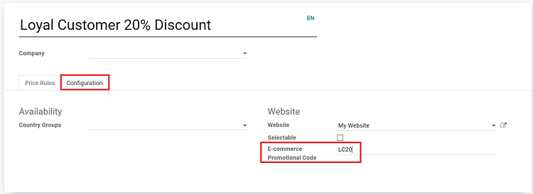

On your website
~~~~~~~~~~~~~~~

You'll need to activate the promo code feature on the frontend of your website. To do that,
simply navigate to your "Review Order" page on your website, and select
:menuselection:`Customize --> Promo Code`

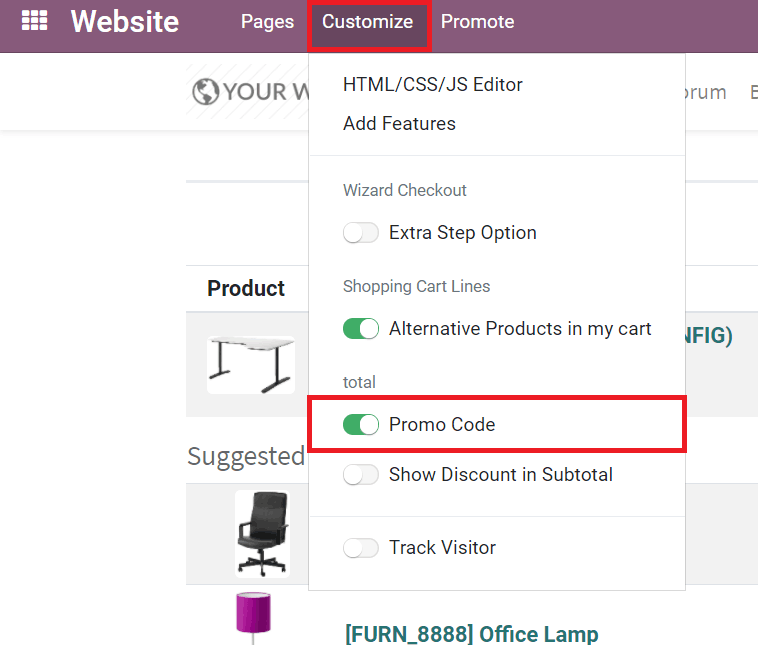

Once that's activated an "I have a promo code" option will appear beneath the total.

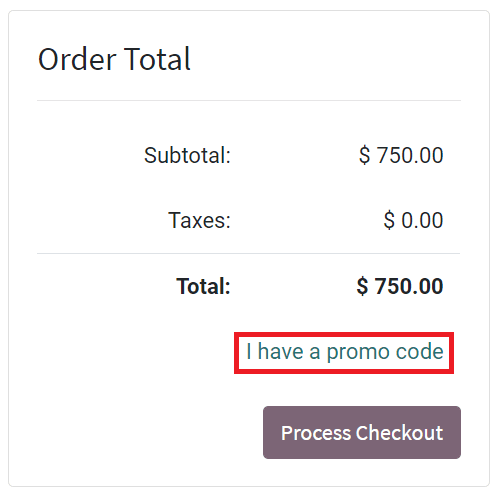

When clicked, a promo code field will appear. Customers enter their promo code in this field and
hit *Apply*.

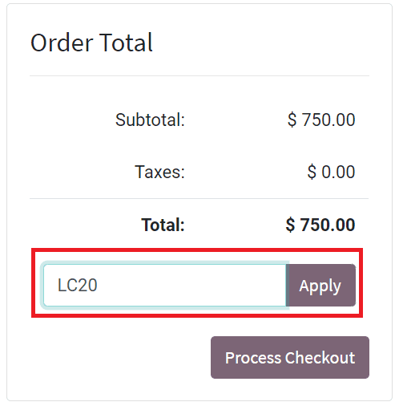

Upon clicking *Apply*, the discount will instantly apply itself to the total.

You will be able to see what promotional Pricelist (if any) was used during any transaction by
accessing the Sales Order, found on the main dashboard on the *Sales* app (or if you go to
:menuselection:`Website --> Orders --> Orders`.)

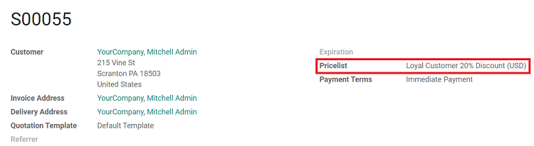

Analysis
~~~~~~~~

Every promo code used by the customer is stored in Odoo's system, so you can analyze the
performance of your marketing campaigns with ease, efficiency, and accuracy.

Go to :menuselection:`Sales --> Reporting --> Sales` and group data by *Pricelist*. Once, you've
grouped by *Pricelist*, you will see color-coated Pricelists at the top of your analytics.

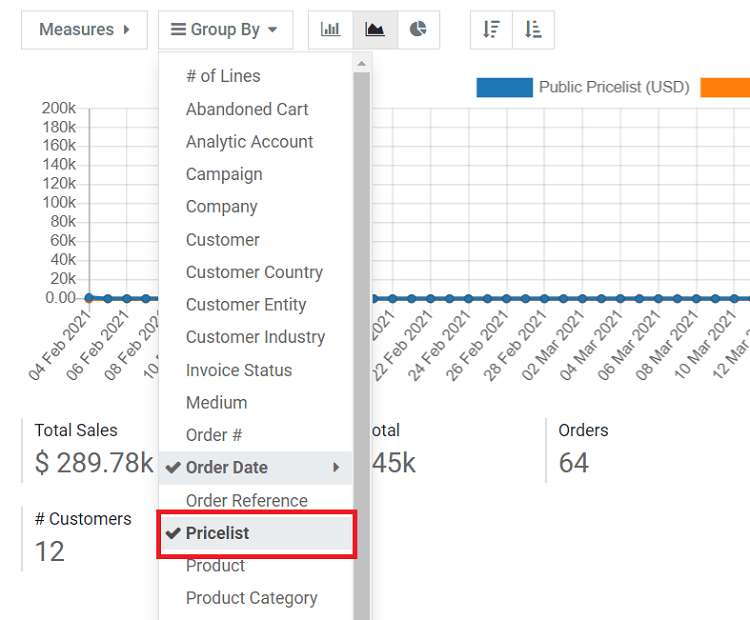

For a clearer view, you can click on certain Pricelists that you want to block out, to make data
easier to analyze.

.. image:: cross-selling-upselling-promo/sales-analytics-block-pricelist.png
   :align: center
   :alt: sales analytics blocked pricelists results

.. note::
   Promotion Programs can be created and configured *without* a Pricelist. However, Pricelists make
   it easier to analyze and track the effectiveness of the promotion. Coupons are similar to
   Promotional Programs, but you can assign them to a specific number of customers.
