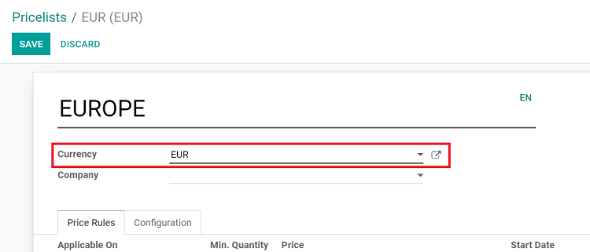
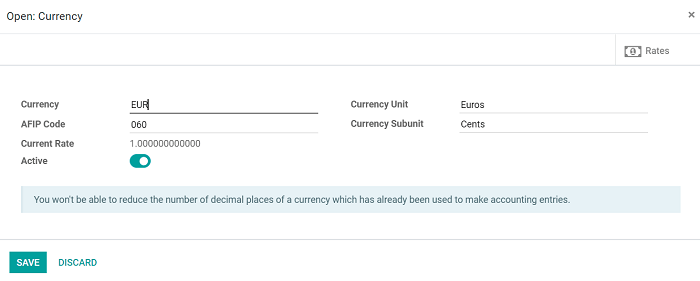
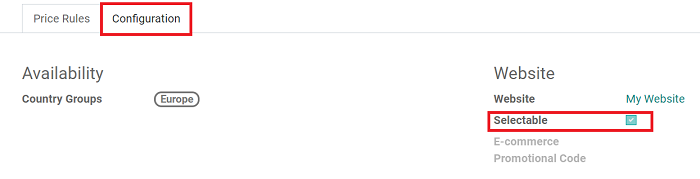
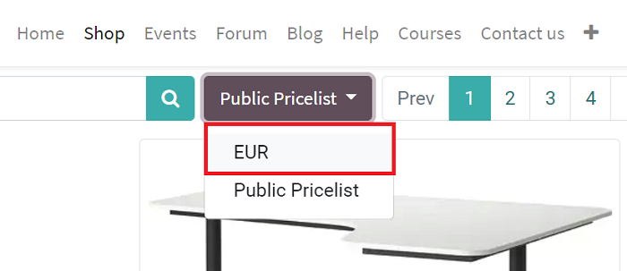

=================================
Adapt prices for online customers
=================================

With Odoo eCommerce, you can have prices automatically adapt to specific customers that visit
your online store.

Users can enforce a specific pricelist based on the geo-localization of the customer, and they can
even allow their customers to choose the currency they want to pay with. Having prices adapt to
specific customers enhances the overall shopping experience in numerous ways.

.. seealso::
   As a pre-requisite, check out how to manage product pricing:
   :doc:`../../../sales/sales/products_prices/prices/pricing`).

Apply price based on GEO-IP
===========================

To assign country groups to your pricelists, go to
:menuselection:`Website --> Products --> Pricelists`.

Then, create (or select) a pricelist to modify the configuration (and currency) to fit your
specific needs.

Clicking the box next to the currency field reveals a currency-related pop-up, in which you enter
in all the pertinent information related to that specific form of currency.

.. note::
   Visitors who aren't logged in, still get to pay with their own currency when landing on your
   website. Or, they can choose from any pricelists from the drop-down menu on the product
   catalog page. Customers who are logged in get the pricelist that matches their country.

Currency selector
=================

If you work with several currencies, you can let your customers choose which one they want to use.

To enable that, go to
:menuselection:`Pricelist detail form --> Edit --> Configuration --> Check the "Selectable" box`

This adds that pricelist to the price drop-down menu, which can be found atop your product
catalog on the front-end of your website.

.. seealso::

  * :doc:`../../../sales/sales/products_prices/prices/pricing`
  * :doc:`../../../sales/sales/products_prices/prices/currencies`
