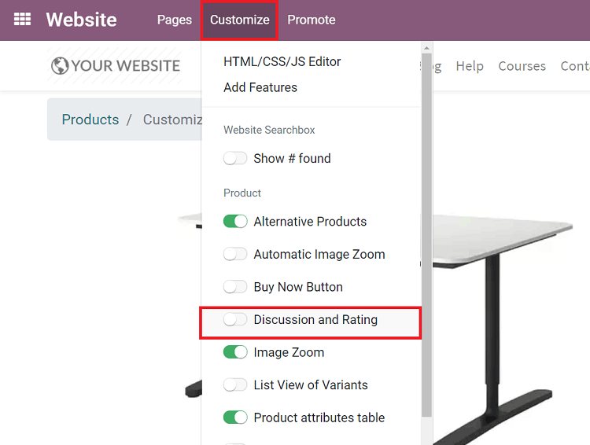
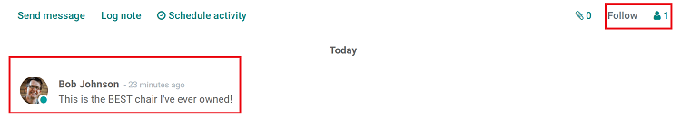
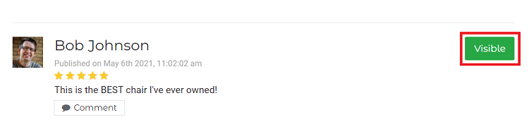

=====================
Discussion and Rating
=====================

One of the best ways to make more informed business decisions is gather honest, genuine feedback
from your customers.

With Odoo, you can let customers share their thoughts, feelings, and opinions about your products,
website, and the overall shopping experience with just a couple of clicks.

.. image:: reviews/discussion-rating.png
   :align: center
   :alt: sample comment on product page

Getting started
===============

In order for customers to leave ratings and feedback on products, you first need to activate the
*Discussion and Rating* setting.

To do that, go to a product page on the front-end of your website, and select
:menuselection:`Customize --> Discussion and Rating`.

.. note::
    Customers need to log in in order to share their comments. (see
    :doc:`../../../websites/ecommerce/shopper_experience/portal`).

Review posts
============

Whenever a comment on a product page is published, the user who created the product (and all the
product followers) get notified about it. The comment also shows up in the *Chatter* section on
that product's detail page in the back-end.

In the upper-right corner of the *Chatter*, you are able to follow the product (if you aren't
already). You can also see how many followers this product has in this section, as well.

.. note::
   By default, the user who created the product is set as a follower.

Moderate and unpublish
======================

You can view and moderate reviews and comments on the product page located on the front-end of
your website. You can also view comments in the *Chatter* of the product detail form in the
back-end of the website, but you can only moderate them on the front-end.

To unpublish a post, open the product page on the front-end of your website, and click the
*Visible* button to turn it red (*Employees Only*). You can change it back the same way.

.. image:: reviews/employees-only.png
   :align: center
   :alt: comment on product page is only visible to employees
