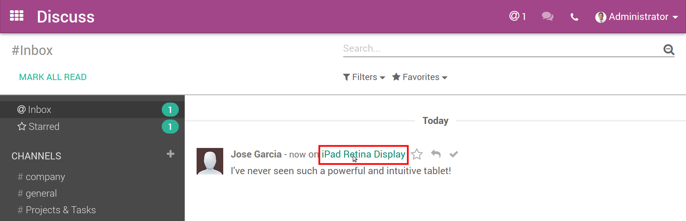
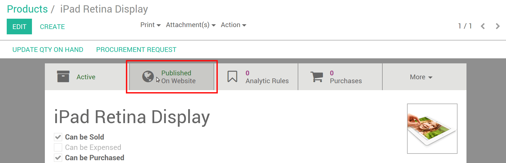

===============================
How to enable comments & rating
===============================

Publishing and monitoring customer experience will help you gain the trust
of new customers and better engage with your community. In 2 clicks, allow
your customer to share their feedback!

.. image:: reviews/comment_post.png
   :align: center

Setup
=====

Activate comments & rating from the *Customize* menu of the product web page.

.. image:: reviews/comment_setup.png
   :align: center

.. note::
    Visitors must log in to share their comments. Make sure they are able to
    do so (see Portal documentation).

Review the posts in real time
=============================

Whenever a post is published, the product manager and all the product followers
get notified in their Inbox (*Discuss* menu).

.. image:: reviews/comment_new.png
   :align: center

.. note::
    By default the user who created the product is automatically set as follower.

Click the product name to open the detail form and review the comment (in the
product discussion thread).

Moderate & unpublish
====================

You can easily moderate by using the chatter, either in the product detail form
or on the web page.

To unpublish the post, open the product web page and click the *Published* button
to turn it red (*Unpublished*). 

.. image:: reviews/comment_unpublish.png
   :align: center

..tip::
    You can access the web page from the detail form by clicking the *Published*
    smart button (and vice versa).

