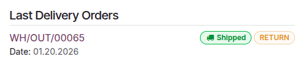

==============
Order handling
==============

In Odoo's e-commerce workflow, an online purchase typically goes through three main steps:
:ref:`sale <ecommerce/handling/sales>`, :ref:`delivery <ecommerce/handling/delivery>`, and
:ref:`invoicing <ecommerce/handling/invoices>`. Each step generates key documents, including sales
orders upon order confirmation, delivery orders to manage :doc:`picking
</applications/inventory_and_mrp/inventory/shipping_receiving/picking_methods>`,
:doc:`packing
</applications/inventory_and_mrp/inventory/shipping_receiving/setup_configuration/multipack>`, and
:doc:`shipping <shipping>`, and invoices. Odoo eCommerce also offers additional tools to send
:ref:`abandoned cart emails <ecommerce/handling/abandoned_cart>`, ensure :ref:`stock availability
<ecommerce/handling/stock-management>`, and handle product :ref:`returns and refunds
<ecommerce/handling/returns>`.

.. _ecommerce/handling/sales:

Sale
====

To view all quotations and orders, navigate to :menuselection:`Website --> eCommerce -->
Orders`, and select one to open it. The status bar at the top of the order shows its current status:

- :guilabel:`Quotation`: A product has been :ref:`added to the cart
  <ecommerce/checkout/add-to-cart>`, but the customer has not yet completed the :ref:`checkout
  process <ecommerce/checkout/steps>`. If the customer is not logged in, the quotation is assigned
  to the default *Public User* contact.
- :guilabel:`Quotation Sent`: The customer has completed the :ref:`checkout process
  <ecommerce/checkout/steps>` and confirmed the order, but the :ref:`payment
  <ecommerce/checkout/payment>` has not yet been confirmed.
- :guilabel:`Sales Order`: The customer has completed the :ref:`checkout process
  <ecommerce/checkout/steps>`, confirmed the order, and the :ref:`payment
  <ecommerce/checkout/payment>` has been successfully received.

.. tip::
   - The :guilabel:`Confirmed` filter is enabled by default in the :guilabel:`Orders` list. To
     view *all* quotations and orders, remove the filter.
   - To view only orders in the :guilabel:`Quotation Sent` stage, go to :menuselection:`Website -->
     eCommerce --> Orders` and remove the :guilabel:`Confirmed` filter. Then, open the
     :icon:`fa-caret-down` dropdown menu and, under :guilabel:`Filters`, select :guilabel:`Unpaid`.
   - E-commerce orders can be automatically assigned to a specific sales team or salesperson. To do
     so, go to :menuselection:`Website --> Configuration --> Settings`. In the :guilabel:`eCommerce`
     section, under :guilabel:`Orders Assignment`, select the relevant :guilabel:`Sales Team` or
     :guilabel:`Salesperson`.

.. note::
   - This three-step process is not visible to customers. However, they can view their orders and
     check their status through the customer :doc:`portal
     </applications/general/users/user_portals>`.
   - If the customer pays via :ref:`wire transfer <payment_providers/bank_payments/wire_transfer>`,
     the quotation is *not* automatically confirmed. In this case, the customer receives a
     notification on the :guilabel:`My account` page of their :doc:`customer account
     <customer_accounts>` to review and pay for the order. After the payment is received, the order
     must be manually confirmed in the backend.

.. seealso::
   - :doc:`checkout`
   - :doc:`/applications/finance/payment_providers`

.. _ecommerce/handling/abandoned_cart:

Abandoned carts
---------------

An abandoned cart is created when a customer adds products to the cart but does not go through the
:ref:`checkout process <ecommerce/checkout/steps>` or leaves the website before completing it. It
is possible to automatically send an email reminder to the customer for these pending orders.

To enable abandoned cart reminders:

#. Go to :menuselection:`Website --> Configuration --> Settings`.
#. In the :guilabel:`eCommerce` section, enable :guilabel:`Follow up abandoned carts`.
#. Set the time delay after which the reminder email is sent in the :guilabel:`Send after` field,
   then click :guilabel:`Save`.
#. If needed, click the :icon:`fa-arrow-right` :guilabel:`Customize Abandoned Email Template`
   link to customize the :doc:`email template </applications/general/companies/email_template>`.

To view all abandoned carts, go to :menuselection:`Website --> eCommerce --> Orders` and remove
the :guilabel:`Confirmed` filter. Open the :icon:`fa-caret-down` dropdown menu and, under
:guilabel:`Filters`, select :guilabel:`Abandoned`.

.. note::
   - To receive reminders, customers must have entered their contact details during
     checkout or be logged in when adding items to the cart. Without the customer details, it
     remains a :ref:`quotation <ecommerce/handling/sales>` with no follow-up.
   - Abandoned cart reminders are only sent for carts created after the feature is enabled.
     Existing abandoned carts are not affected.

.. _ecommerce/handling/delivery:

Delivery
========

.. note::
   - The :doc:`Inventory app </applications/inventory_and_mrp/inventory>` must be installed to
     process deliveries.
   - Delivery orders are not generated for :guilabel:`Service` or :doc:`subscription
     </applications/sales/subscriptions>` products.

Once a sales order is confirmed, a delivery order is automatically created. To access it, click
the :icon:`fa-truck` :guilabel:`Delivery` smart button on the sales order.

The next step is preparing e-commerce orders in the warehouse. Depending on order volume, refill and
stock management strategies, or available resources, different :doc:`stock handling flows
for receipts and deliveries
</applications/inventory_and_mrp/inventory/shipping_receiving/daily_operations>` can be implemented.
These flows may involve manually receiving, :doc:`picking
</applications/inventory_and_mrp/inventory/shipping_receiving/picking_methods>`, and :doc:`packing
</applications/inventory_and_mrp/inventory/shipping_receiving/setup_configuration/multipack>`
products, printing :doc:`shipping labels
</applications/inventory_and_mrp/inventory/shipping_receiving/setup_configuration/labels>`, and
:doc:`shipping  <shipping>` orders to customers, or handling these processes through
:doc:`dropshipping
</applications/inventory_and_mrp/inventory/shipping_receiving/daily_operations/dropshipping>` or
:doc:`consignment flows
</applications/inventory_and_mrp/inventory/shipping_receiving/daily_operations/owned_stock>`.

After completing the warehouse operations, return to the delivery order and click
:guilabel:`Validate` once the order has been shipped.

.. tip::
   To enable automatic confirmation emails for completed delivery orders (:guilabel:`Done`
   status), go to :menuselection:`Inventory --> Configuration --> Settings`, scroll to the
   :guilabel:`Shipping` section, and enable :guilabel:`Confirmation Email`.

.. _ecommerce/handling/stock-management:

Stock management
----------------

To ensure that products ordered by customers are reserved in stock, go to :menuselection:`Inventory
--> Configuration --> Operation Types`, click the :guilabel:`Delivery Orders` operation type, and
set the :guilabel:`Reservation Method` field to :doc:`At Confirmation
</applications/inventory_and_mrp/inventory/shipping_receiving/reservation_methods/at_confirmation>`.
When enabled, product quantities are automatically reserved once the order is confirmed, preventing
items from becoming unavailable after the order is placed.

.. note::
   If the customer pays by :ref:`wire transfer <payment_providers/bank_payments/wire_transfer>`,
   products are not reserved in stock until the payment is received and the order is manually
   confirmed.

.. seealso::
   :doc:`shipping`

.. _ecommerce/handling/returns:

Returns and refunds
-------------------

Customers can :doc:`return </applications/sales/sales/products_prices/returns>` products
through the :doc:`customer portal </applications/general/users/user_portals>` by navigating to the
:guilabel:`Your Orders` section, selecting the relevant order, and clicking the :guilabel:`Return`
button. A return document is automatically generated.

Once the returned items are received, initiate the :doc:`return and refund process
</applications/sales/sales/products_prices/returns>` in the backend.

.. note::
   - :doc:`Returning </applications/sales/sales/products_prices/returns>` products may not be
     possible depending on the :doc:`product type
     </applications/inventory_and_mrp/inventory/product_management/configure/type>`.
   - To issue :doc:`refunds </applications/finance/accounting/customer_invoices/credit_notes>`,
     the payment must have been made through a :ref:`refund-compatible payment provider
     <payment_providers/supported_providers>`.

.. seealso::
   :doc:`/applications/services/helpdesk/advanced/after_sales`

.. _ecommerce/handling/invoices:

Invoicing
=========

The final step of an e-commerce order is generating and sending the :doc:`customer invoice
</applications/finance/accounting/customer_invoices>`. Depending on your needs, invoices can
be generated manually or automatically.

To automate invoicing:

#. Go to :menuselection:`Website --> Configuration --> Settings`.
#. In the :guilabel:`eCommerce` section, enable :guilabel:`Automatic Invoice`.
#. Select the relevant :guilabel:`Email Template`, then click :guilabel:`Save`.
#. If needed, click the :icon:`fa-arrow-right` icon next to the template name to customize the
   :doc:`email template </applications/general/companies/email_template>`.

.. note::
   - Customers can view their invoices under :guilabel:`Your Invoices` in the :doc:`portal
     </applications/general/users/user_portals>`.
   - Invoices are only sent automatically if (and when) the :doc:`payment
     </applications/finance/payment_providers>` is registered.
   - When automatic invoicing is disabled and invoices are created manually, they appear as
     :doc:`pro-forma invoices </applications/sales/sales/invoicing/proforma>` in the customer
     portal until they are manually :ref:`sent to the customer <accounting/invoice/sending>`.

.. seealso::
   - :doc:`/applications/finance/accounting/payments`
   - :doc:`/applications/sales/sales/invoicing/invoicing_policy`
   - `Create a customer invoice from a sales order <https://www.youtube.com/watch?v=14AIEJ_B7rA>`_
