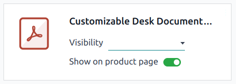
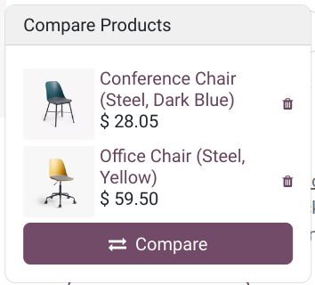

:show-content:

========
Products
========

**Odoo eCommerce** allows you to :ref:`add products <ecommerce/products/add-products>` and manage
your :ref:`product pages <ecommerce/products/product-page>` directly from the Website app. It also
allows you to add :ref:`product variants <ecommerce/products/product-variants>` and
:ref:`digital files <ecommerce/products/digital-files>`,
:ref:`translating <ecommerce/products/translation>` the product page content,
:ref:`managing stock <ecommerce/products/stock-management>`, and enabling
:ref:`product comparisons <ecommerce/products/product-comparison>`.

.. _ecommerce/products/add-products:

Add products
============

.. _ecommerce/products/create-products:

Create products
---------------

To create a product from the frontend, click :guilabel:`+ New` in the top-right corner, then
:guilabel:`Product`. Enter the :guilabel:`Product Name`, :guilabel:`Sales Price`, the default
:guilabel:`Customer Taxes` for local transactions, and :guilabel:`Save`. You can then update the
product's details, add an image, and :ref:`customize <ecommerce/products/customization>` the product
page. When you :guilabel:`Save`, the product page is automatically published.

.. tip::
   - You can also create a product from the backend by going to
     :menuselection:`Website --> eCommerce --> Products` and clicking :guilabel:`New`.
   - Products created from the frontend are automatically :ref:`published <website/un-publish-page>`,
     while products created from the backend are not. To publish a product, click the
     :guilabel:`Go to Website` smart button to access the product page, then toggle the switch from
     :guilabel:`Unpublished` to :guilabel:`Published`.

.. seealso::
   :doc:`Create new products using the Barcode Lookup database
   </applications/general/integrations/barcodelookup>`.

.. _ecommerce/products/import-products:

Import products
---------------

To :ref:`import product data <import-data>` using XLSX or CSV files, go to
:menuselection:`Website --> eCommerce --> Products`, click the :icon:`fa-cog` (:guilabel:`gear`)
icon, then :ref:`Import records <import-data>`.

.. tip::
   To publish **large batches** of products, follow these steps:

   #. Go to :menuselection:`Website --> eCommerce --> Products`.
   #. Remove the :guilabel:`Published` filter and switch to the :guilabel:`List` view.
   #. Click the :icon:`fa-sliders` (:guilabel:`dropdown toggle`) icon and enable
      :guilabel:`Is published`.
   #. Click the :guilabel:`Is Published` column to re-order it by **published** or **unpublished**
      products.
   #. Select the products to publish by ticking their box.
   #. In the :guilabel:`Is Published` column, tick the box for any of the selected products, then
      :guilabel:`Confirm` to publish them.

.. _ecommerce/products/shop-page:

Shop page
=========

To customize the layout of the main :guilabel:`Shop` page or modify its content, click
:guilabel:`Edit`. Go to the :guilabel:`Blocks` tab to add
:doc:`building blocks <../../websites/website/web_design/building_blocks>` or to the
:guilabel:`Customize` tab to change the page layout or add features:

- :guilabel:`Layout`: Select :guilabel:`Grid` or :guilabel:`List`.

   - :guilabel:`Size`: Set the number of products displayed per page and line.
   - :guilabel:`Style`: Select :guilabel:`Default`, :guilabel:`Cards`, :guilabel:`Thumbnails`, or
     :guilabel:`Grid`.
   - :guilabel:`Image Size`: Choose the aspect ratio for the product images:
     :guilabel:`Landscape (4/3)`, :guilabel:`Default (1/1)`, :guilabel:`Portrait (4/5)`, or
     :guilabel:`Vertical (2/3)`. You can also adjust the display by changing the :guilabel:`Fill`
     options to best fit your design preferences.

- :guilabel:`Search Bar`: Toggle the switch to display a search bar at the top of the products
   page.

- :guilabel:`Prod. Desc.`: Toggle the switch to display the product description below the product's
  name.

- :guilabel:`Categories`: display product categories on the :guilabel:`Left`, on the
  :guilabel:`Top`, or both. If :guilabel:`Left` is selected, you can enable
  :guilabel:`Collapse Categories` to make the category menu collapsible.

- :guilabel:`Datepicker`: Toggle the switch to display a date range calendar to check the
  availability of rental products over a specific period. The
  :doc:`Rental app <../../sales/rental>` must be installed to use this feature.

- :guilabel:`Attributes`: Show product attributes on the :guilabel:`Left` and/or display a
  :icon:`fa-sliders` (:guilabel:`dropdown toggle`) icon at the :guilabel:`Top` allowing customers to
  filter products based on their attributes.

  - :guilabel:`Price Filter`: Toggle the switch to display a :guilabel:`Price Range` bar, which
    allows customers to filter products according to a specific price range by dragging adjustable
    handles.
  - :guilabel:`Product Tags`: Toggle the switch to display the :guilabel:`Product Template Tags` on
    the product page and allow customers to filter products using those tags by going to the
    :guilabel:`Tags` section in the left column.

- :guilabel:`Top Bar`: Select :guilabel:`Sort By` to display a dropdown list in the top bar for
  sorting products and/or :guilabel:`Layout` to allow customers to switch to the grid or list view
  using the related icons.

- :guilabel:`Default Sort`: Choose how products are sorted by default: :guilabel:`Featured`,
  :guilabel:`Newest Arrivals`, :guilabel:`Name (A-Z)`, :guilabel:`Price - Low to High`, or
  :guilabel:`Price - High to Low`.

- :guilabel:`Buttons`:

  - Select the :icon:`fa-shopping-cart` (:guilabel:`Shopping cart`) option to display an
    :icon:`fa-shopping-cart` (:guilabel:`Add to cart`) icon on each product's image, which takes the
    customer to the checkout page.

  - Select the :icon:`fa-heart-o` (:guilabel:`Wishlist`) option to display an
    :icon:`fa-shopping-cart` (:guilabel:`Add to wishlist`) icon on each product's image allowing
    logged-in customers to save products to a wishlist.

  - Select the :icon:`fa-exchange` (:guilabel:`Compare`) option to display the :icon:`fa-exchange`
    (:guilabel:`Compare`) icon on each product's image allowing customers to :ref:`compare products
    <ecommerce/products/product-comparison>` based on their attributes.

.. tip::
   To feature a product, go to the :ref:`product form <ecommerce/products/product-form>` and click
   the :icon:`fa-star-o` (:guilabel:`Favorite`) icon next to the product's name.

.. _ecommerce/products/product-page:

Product page
============

To access a product's page, go to the :guilabel:`Shop` and click on the product. Click
:guilabel:`Edit` to :ref:`customize <ecommerce/products/customization>` the page or
:ref:`edit its images <ecommerce/products/image-customization>`.

.. _ecommerce/products/product-form:

To access the backend **product form**, click the :icon:`fa-cog` :guilabel:`Product` button in the
top-right corner of the product page. Alternatively, navigate to :menuselection:`Website -->
eCommerce --> Products` and select the product. You can configure the product page from the form
by adding :ref:`variants <ecommerce/products/product-variants>`, :ref:`digital documents
<ecommerce/products/digital-files>`, or :ref:`translating <ecommerce/products/translation>` content.

.. tip::
   Click the :guilabel:`Go to Website` smart button to return to the frontend product's page.

.. _ecommerce/products/customization:

Customization
-------------

To customize a product page, click :guilabel:`Edit`. Go to the :guilabel:`Blocks` tab to add
:doc:`building blocks <../../websites/website/web_design/building_blocks>`.

.. tip::
   - When dragging and dropping a building block on the product page, placing it above or below the
     top or bottom blue lines makes it visible on all product pages.
   - You can edit any text on your website simply by clicking on it while in :guilabel:`Edit` mode.

Go to the :guilabel:`Customize` tab to modify the page layout or add features:

- :guilabel:`Terms and Conditions`: Toggle the switch to display a link to your
  :doc:`terms and conditions <../../finance/accounting/customer_invoices/terms_conditions>` on the
  product page.

- :guilabel:`Customers`:

   - :guilabel:`Rating`: Allow logged-in portal users to submit product reviews by clicking the
     stars below the product's name and sharing their experience in the :guilabel:`Customer Reviews`
     section at the bottom. Reviews are visible from the product page using the :icon:`fa-plus`
     (:guilabel:`plus`) icon next to the :guilabel:`Customer Reviews` heading or from the product
     form's chatter. To restrict visibility to internal employees, toggle the :guilabel:`Public`
     switch next to the review comment.
   - :guilabel:`Share`: Add social media and email icon buttons allowing customers to share the
     product through those channels.

- :guilabel:`Select Quantity`: Toggle the switch to allow customers to select the product quantity
  they want to purchase.

- :guilabel:`Tax indication`: Toggle the switch to indicate if the price is
  :ref:`VAT included or excluded <ecommerce-price-management-tax-display>`.

- :guilabel:`Variants`: Show all possible product :ref:`variants <ecommerce/products/product-variants>`
  vertically as a :guilabel:`Products List` or horizontally as selectable :guilabel:`Options` to
  compose the variant yourself.

- :guilabel:`Product Tags`: Toggle the switch to display the :guilabel:`Product Template Tags` on
  the product page and allow customers to filter products using those tags.

- :guilabel:`Cart`:

   - :guilabel:`Buy Now`: Add a :icon:`fa-bolt` :guilabel:`Buy Now` option to take the customer to
     the checkout page.
   - :guilabel:`Wishlist`: Add an :icon:`fa-heart-o` :guilabel:`Add to wishlist` option allowing
     logged-in customers to save products in a wishlist.
   - :guilabel:`Compare`: Add a :icon:`fa-exchange` :guilabel:`Compare` option, allowing customers
     to :ref:`compare products <ecommerce/products/product-comparison>` based on their attributes.

- :guilabel:`Specification`: Select :guilabel:`Bottom of Page` to display a detailed list of the
  attributes and their values available for the product. This option only works for products with
  :ref:`variants <ecommerce/products/product-variants>` if the
  :ref:`Product comparison tool <ecommerce/products/product-comparison>` is enabled in the Website
  :guilabel:`Settings`.

.. note::
   - :guilabel:`Variants`, :icon:`fa-heart-o` :guilabel:`Wishlist`, and :icon:`fa-exchange`
     :guilabel:`Compare` options must be enabled by going to
     :menuselection:`Website --> Configuration --> Settings`, in the :guilabel:`Shop - Products`
     section.
   - Enabled functions apply to all product pages.
   - Products with single values for their attributes do not generate variants but are still
     displayed in the :guilabel:`Product Specifications`.

.. _ecommerce/products/image-customization:

Image customization
-------------------

To customize the images available on the product page, go to the :guilabel:`Customize` tab:

- :guilabel:`Images Width`: Changes the width of the product images displayed on the page.
- :guilabel:`Layout`: The :guilabel:`Carousel` layout allows customers to navigate from one image to
  the next using the :icon:`fa-angle-left` (:guilabel:`left arrow`) or :icon:`fa-angle-right`
  (:guilabel:`right arrow`); whereas the :guilabel:`Grid` displays four images in a square layout.
- :guilabel:`Image Zoom`: Select the zoom effect for product images: :guilabel:`Magnifier on hover`
  :guilabel:`Pop-up on Click`, :guilabel:`Both`, or :guilabel:`None`.
- :guilabel:`Thumbnails`: Align thumbnails on the :icon:`fa-long-arrow-left` (:guilabel:`Left`) or
   at the :icon:`fa-long-arrow-down` (:guilabel:`Bottom`).
- :guilabel:`Main Image`: Click :guilabel:`Replace` to change the product's main image.
- :guilabel:`Extra Images`: :guilabel:`Add` extra images or videos (including via URL) or
  :guilabel:`Remove all` product images.

.. note::
   Images must be in PNG or JPG format and with a minimum size of 1024x1024 to trigger the zoom.

.. _ecommerce/products/product-variants:

Product variants
================

:doc:`Product variants <../../sales/sales/products_prices/products/variants>` are different versions
of the same product, such as various colors or materials, with potential differences in price and
availability.

To configure product variants for a product:

#. Go to :menuselection:`Website --> Configuration --> Settings`.
#. Scroll down to the :guilabel:`Shop - Products` section and enable the
   :guilabel:`Product Variants` feature.
#. Access the :ref:`product forms <ecommerce/products/product-form>` and go to the
   :guilabel:`Attributes & Variants` tab, where you can add attributes and values, allowing customers
   to configure and select product variants on the product page. For multiple attributes,
   you can combine them to create specific variants.

To display or hide an attribute on the :guilabel:`Shop` page and allow visitors to filter them,
go to :menuselection:`Website --> eCommerce --> Attributes`, click on the attribute, and select
:guilabel:`Visible` or :guilabel:`Hidden` in the :guilabel:`eCommerce Filter Visibility` field.

.. tip::
   - To display the product attributes on :ref:`the main Shop page <ecommerce/products/shop-page>`,
     set the :guilabel:`Attributes` feature to :guilabel:`Left` using the website editor.
   - To group attributes under the same section when
     :ref:`comparing products <ecommerce/products/product-comparison>`, go to the
     :guilabel:`eCommerce Category` field and either select an :doc:`existing category or create a
     new one <../../websites/ecommerce/products>`.

.. note::
   Two attribute values are needed to make the filter visible.

.. seealso::
   :doc:`Product variants <../../sales/sales/products_prices/products/variants>`

.. _ecommerce/products/digital-files:

Digital files
=============

You can link digital files like certificates, eBooks, or user manuals to the products. These
documents are available :ref:`before payment <ecommerce-products-digital-files-before-payment>` on
the product page or in the customer portal :ref:`after checkout <ecommerce-products-digital-files-after-payment>`.

To link a digital file to a product, go to the :ref:`product form <ecommerce/products/product-form>`
and click the :guilabel:`Documents` smart button. Then, click :guilabel:`Upload` to upload a file
directly, or for additional options, click :guilabel:`New`, then :guilabel:`Upload your file`.

.. tip::
   - You can link a URL instead of a digital file. To do so, click :guilabel:`New`, go to the
     :guilabel:`Type` field, and select :guilabel:`URL`.
   - To edit an existing file, click the :icon:`fa-ellipsis-v` (:guilabel:`dropdown menu`) in the
     top-right corner of the document card and click :guilabel:`Edit`.

.. _ecommerce-products-digital-files-before-payment:

Digital files available before payment
--------------------------------------

To make the file available on the product page (before payment), leave the :guilabel:`Visibility`
field blank and toggle the :guilabel:`Show on product page` switch.

.. _ecommerce-products-digital-files-after-payment:

Digital files available after payment
-------------------------------------

To make the file available (after payment), set the :guilabel:`Visibility` field to
:guilabel:`Confirmed order` and turn off the :guilabel:`Show on product page` switch.

.. _ecommerce/products/translation:

Translation
===========

If multiple languages are available on your website, you can translate a product's information
directly on the :ref:`product form <ecommerce/products/product-form>`. Fields that support multiple
languages are identifiable by their abbreviation language (e.g., EN) next to their field.

The eCommerce-related fields to translate are:

- :guilabel:`Product name`.
- :guilabel:`Out-of-Stock Message` (under the :guilabel:`Sales` tab).
- :guilabel:`Sales Description` (under the :guilabel:`Sales` tab).

.. note::
   - Having untranslated content on a web page may be detrimental to the user experience and
     :doc:`SEO <../../websites/website/pages/seo>`. You can use the
     :doc:`Translate <../website/configuration/translate>` feature to translate the page's content.
   - To check the language(s) of your website, go to :menuselection:`Website --> Configuration -->
     Settings` and go to the :guilabel:`Website Info` section.

.. _ecommerce/products/website-availability:

Website availability
--------------------

To set the product's website availability, navigate to the :ref:`product form
<ecommerce/products/product-form>`, go to the :guilabel:`Sales` tab, and in the
:guilabel:`eCommerce shop` section, select the :guilabel:`Website` you wish the product to be
available on. Leave the field blank to make the product available on *all* websites.

.. note::
   You can make a product available on either *one* website or *all* websites, but selecting only
   *some* websites is not possible.

.. _ecommerce/products/stock-management:

Stock management
================

To enable and configure inventory management options, go to :menuselection:`Website -->
Configuration --> Settings`, scroll down to the :guilabel:`Shop - Products` section and the
:guilabel:`Inventory Defaults` sub-section.

.. important::
   - The **Inventory** app must be installed to see the inventory management options.
   - To display the stock level on the product page, the :guilabel:`Product Type` field must be set
     to :guilabel:`Storable` in the :ref:`product form <ecommerce/products/product-form>`.

Inventory
---------

In the :guilabel:`Inventory Defaults` sub-section, fill in those fields:

- :doc:`Warehouse <../../inventory_and_mrp/inventory/warehouses_storage/inventory_management/warehouses>`.
- :guilabel:`Out-of-Stock`: Enable :guilabel:`Continue Selling` to allow customers to place orders
  even when the product is **out of stock**. Leave the box unchecked to **prevent orders**.
- :guilabel:`Show Available Qty`: Displays the available quantity left under a specified threshold
  on the product page. The available quantity is calculated based on the :guilabel:`On hand`
  quantity minus the quantity already reserved for outgoing transfers.

.. _ecommerce/products/product-comparison:

Product comparison
==================

To allow website visitors to compare products based on their attributes, go to
:menuselection:`Website --> Configuration --> Settings`, scroll down to the
:guilabel:`Shop - Products` section, and enable :guilabel:`Product Comparison Tool`.

The :icon:`fa-exchange` (:guilabel:`Compare`) icon is now available on each product card on the main
shop page when customers hover their mouse over it. To compare products, customers can click the
:icon:`fa-exchange` (:guilabel:`Compare`) option on the products they want to compare, then click
:icon:`fa-exchange` :guilabel:`Compare` in the pop-up window at the bottom of the page to reach the
comparison summary.

.. note::
   - The :guilabel:`Product Comparison Tool` is only available for products with
     :ref:`attributes <ecommerce/products/product-variants>`.
   - Selecting the :icon:`fa-exchange` (:guilabel:`Compare`) option from a product page is also
     possible.

.. toctree::
   :titlesonly:

   products/catalog
   products/price_management
   products/cross_upselling
