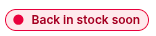
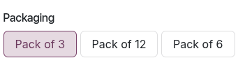

:show-content:

========
Products
========

**Odoo eCommerce** allows you to :ref:`add products <ecommerce/products/add-products>` and manage
your :doc:`product pages <../ecommerce/ecommerce_design/product_page>` directly from the Website app.
It also allows you to add :ref:`digital files <ecommerce/products/digital-files>`, :ref:`translate
<ecommerce/products/translation>` the product page content, and :ref:`manage the stock
<ecommerce/products/stock-management>`.

.. _ecommerce/products/add-products:

Add products
============

.. _ecommerce/products/create-products:

Create products
---------------

To create a product from the frontend, click :guilabel:`+ New` in the top-right corner, then
:guilabel:`Product`. Enter the :guilabel:`Product Name`, :guilabel:`Sales Price`, the default
:guilabel:`Customer Taxes` for local transactions, and :guilabel:`Save`. You can then update the
product's details, add an image, and :ref:`customize <ecommerce_design/product_page/customization>`
the product page. When you :guilabel:`Save`, the product page is automatically published.

.. tip::
   - You can also create a product from the backend by going to
     :menuselection:`Website --> eCommerce --> Products` and clicking :guilabel:`New`.
   - Products created from the frontend are automatically :ref:`published <website/pages/un-publish-page>`,
     while products created from the backend are not. To publish a product, click the
     :guilabel:`Go to Website` smart button to access the product page, then toggle the switch from
     :guilabel:`Unpublished` to :guilabel:`Published`.

.. seealso::
   - :doc:`Create new products using the Barcode Lookup database
     </applications/inventory_and_mrp/barcode/setup/barcodelookup>`.
   - :doc:`Configure the Gelato connector in Odoo to synchronize the product catalog and automate
     order fulfilment with Gelato </applications/sales/sales/gelato>`.

.. _ecommerce/products/import-products:

Import products
---------------

To :ref:`import product data <essentials/export_import_data/import-data>` using XLSX or CSV files,
go to :menuselection:`Website --> eCommerce --> Products`, click the :icon:`fa-cog`
(:guilabel:`gear`) icon, then :ref:`Import records <essentials/export_import_data/import-data>`.

.. tip::
   To publish **large batches** of products, follow these steps:

   #. Go to :menuselection:`Website --> eCommerce --> Products`.
   #. Remove the :guilabel:`Published` filter and switch to the :guilabel:`List` view.
   #. Click the :icon:`fa-sliders` (:guilabel:`dropdown toggle`) icon and enable
      :guilabel:`Is published`.
   #. Click the :guilabel:`Is Published` column to re-order it by **published** or **unpublished**
      products.
   #. Select the products to publish by ticking their box.
   #. In the :guilabel:`Is Published` column, tick the box for any of the selected products, then
      :guilabel:`Confirm` to publish them.

Product information
-------------------

.. _ecommerce/products/product-form:

To add general information about a product, navigate to :menuselection:`Website -->
eCommerce --> Products` and select the product. You can configure the product page from the form
by adding :ref:`variants <ecommerce/categories_variants/product-variants>`, :ref:`digital documents
<ecommerce/products/digital-files>`, or :ref:`translating <ecommerce/products/translation>` content.

.. _ecommerce/products/description:

You can also add an e-commerce-specific product description to be displayed below
the product name on the product's page. To do so, go to the :guilabel:`Sales`
tab, scroll down to the :guilabel:`Ecommerce description` section, and add a description. Use Odoo's
:doc:`rich-text editor <../../essentials/html_editor>` features to personalize the content.

.. tip::
   Click the :guilabel:`Go to Website` smart button to return to the frontend product's page.

.. _ecommerce/products/images:

Product images and videos
-------------------------

To add more media items, such as images and videos, navigate to the
:ref:`product form <ecommerce/products/product-form>`, then go to the :guilabel:`Sales` tab
and click :guilabel:`Add Media` under the :guilabel:`Ecommerce Media` section. In the
:guilabel:`Select a media` pop-up window, go to the :guilabel:`Images` tab, select an image,
click :guilabel:`Upload an image` or :guilabel:`Add URL`. Or navigate to the :guilabel:`Videos` tab,
paste a video URL or embed code. Once done, click :guilabel:`Add`.

.. tip::
   Click the :icon:`fa-globe` :guilabel:`Go to Website` smart button to access the product's page
   on the website and :ref:`customize <ecommerce/product_page/image-customization>` product images
   and videos using the website editor.

.. _ecommerce/products/digital-files:

Digital files
=============

You can link digital files like certificates, eBooks, or user manuals to the products. These
documents are available :ref:`before payment <ecommerce-products-digital-files-before-payment>` on
the product page or in the customer portal
:ref:`after checkout <ecommerce-products-digital-files-after-payment>`.

To link a digital file to a product, go to the :ref:`product form <ecommerce/products/product-form>`
and click the :guilabel:`Documents` smart button. Then, click :guilabel:`Upload` to upload a file
directly, or for additional options, click :guilabel:`New`, then :guilabel:`Upload your file`.

.. tip::
   - You can link a URL instead of a digital file. To do so, click :guilabel:`New`, go to the
     :guilabel:`Type` field, and select :guilabel:`URL`.
   - To edit an existing file, click the :icon:`fa-ellipsis-v` (:guilabel:`dropdown menu`) in the
     top-right corner of the document card and click :guilabel:`Edit`.

.. _ecommerce-products-digital-files-before-payment:

Digital files available before payment
--------------------------------------

To make the file available on the product page (before payment), leave the :guilabel:`Visibility`
field blank and toggle the :guilabel:`Show on product page` switch.

.. image:: products/digital-files.png
   :alt: digital file available before payment on the  product page

.. _ecommerce-products-digital-files-after-payment:

Digital files available after payment
-------------------------------------

To make the file available (after payment), set the :guilabel:`Visibility` field to
:guilabel:`Confirmed order` and turn off the :guilabel:`Show on product page` switch.

.. _ecommerce/products/translation:

Translation
===========

If multiple languages are available on your website, you can translate a product's information
directly on the :ref:`product form <ecommerce/products/product-form>`. Fields that support multiple
languages are identifiable by their abbreviation language (e.g., EN) next to their field.

The e-commerce-related fields to translate are:

- :guilabel:`Product name`.
- :guilabel:`Out-of-Stock Message` (under the :guilabel:`Sales` tab).
- :guilabel:`Sales Description` (under the :guilabel:`Sales` tab).

.. note::
   - Having untranslated content on a web page may be detrimental to the user experience and
     :doc:`SEO <../../websites/website/structure/seo>`. You can use the
     :doc:`Translate <../website/configuration/translate>` feature to translate the page's content.
   - To check the language(s) of your website, go to :menuselection:`Website --> Configuration -->
     Settings` and go to the :guilabel:`Website Info` section.

.. _ecommerce/products/website-availability:

Website availability
--------------------

To set the product's website availability, navigate to the :ref:`product form
<ecommerce/products/product-form>`, go to the :guilabel:`Sales` tab, and in the
:guilabel:`eCommerce shop` section, select the :guilabel:`Website` you wish the product to be
available on. Leave the field blank to make the product available on *all* websites.

.. note::
   - You can make a product available on either *one* website or *all* websites, but selecting only
     *some* websites is not possible. To sell the product on multiple specific websites without
     making it available on all, **duplicate** the product for each website and assign the
     corresponding website to each duplicate.
   - Enable the :guilabel:`Is Published` toggle to make sure the product is available for website
     visitors.

.. _ecommerce/products/stock-management:

Stock management
================

To enable and configure inventory management options, go to :menuselection:`Website -->
Configuration --> Settings`, scroll down to the :guilabel:`Shop - Products` section and the
:guilabel:`Inventory Defaults` sub-section.

.. important::
   - The **Inventory** app must be installed to see the inventory management options.
   - To display the stock level on the product page, the :guilabel:`Product Type` field must be set
     to :guilabel:`Storable` in the :ref:`product form <ecommerce/products/product-form>`.

.. tip::
   If a unique reference is needed for inventory management, install the :doc:`Manufacturing app
   </applications/inventory_and_mrp/manufacturing>`, and create :doc:`Kit bills of materials
   </applications/inventory_and_mrp/manufacturing/advanced_configuration/kit_shipping>`. Each
   kit links its published "virtual" products to the main reference tracked in Inventory. This
   ensures that any item sold on the website is converted into the corresponding stocked item in
   the delivery order.

.. _ecommerce/products/stock-management/inventory:

Inventory
---------

In the :guilabel:`Inventory Defaults` sub-section, fill in those fields:

- :doc:`Warehouse <../../inventory_and_mrp/inventory/warehouses_storage/inventory_management/warehouses>`.
- :guilabel:`Out-of-Stock`: Enable :guilabel:`Continue Selling` to allow customers to place orders
  even when the product is **out of stock**. Leave the box unchecked to prevent orders.
- :guilabel:`Show Available Qty`: Displays the available quantity left under a specified threshold
  on the product page. The available quantity is calculated based on the :guilabel:`On hand`
  quantity minus the quantity already reserved for outgoing transfers.

To inform customers that a product is out of stock, configure an :guilabel:`Out-of-Stock
Message`. To do so, go to the product form and navigate to the :guilabel:`Sales` tab. Under the
:guilabel:`Ecommerce shop` section, compose an :guilabel:`Out-of-Stock Message`.

.. note::
   - A :icon:`fa-envelope-o` (:guilabel:`envelope`) :guilabel:`Get notified when back in stock`
     button appears on the product page when an item is out of stock. Customers can click
     the link to enter their email address and receive a notification once the item is back
     in stock.
   - To create an :guilabel:`Out-of-Stock Message` and have the notification option available,
     the :ref:`Track inventory setting <inventory/product_management/tracking-inventory>` must be
     enabled on the product form.

.. _ecommerce/products/stock-management/packagings:

Packagings
----------

To offer different product pack sizes to customers on the e-commerce, configure product
:doc:`packagings
</applications/inventory_and_mrp/inventory/product_management/configure/packaging>`. Then, go to
:menuselection:`Website --> eCommerce --> Products`, select a product, and navigate to the
:guilabel:`Sales` tab of the product form. Under :guilabel:`Upsell & cross-sell`, add as many
package types as needed in the :guilabel:`Packagings` field. The available package types are
displayed on the e-commerce :doc:`product page <../ecommerce/ecommerce_design/product_page>`.

.. tip::
   It is also possible to add packagings to a specific :ref:`product variant
   <ecommerce/categories_variants/product-variants>`. To do so, go to the product form, click the
   :icon:`fa-sitemap` :guilabel:`Variants` :ref:`smart button
   <products/variants/variants-smart-button>`, and select the relevant product variant. Under
   :guilabel:`Sales`, add as many package types as needed in the :guilabel:`Packagings` field.

.. toctree::
   :titlesonly:

   products/prices
   products/cross_upselling
   products/categories_variants
