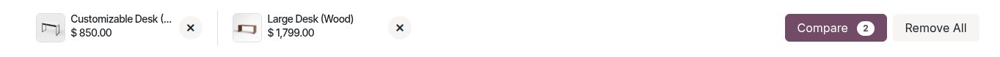
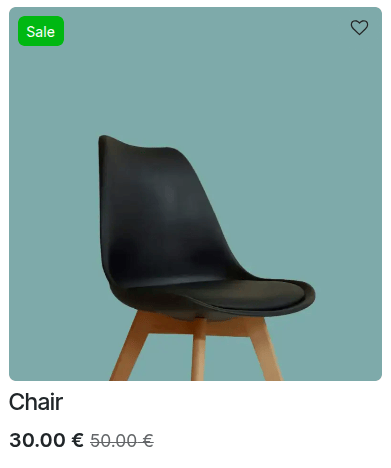

===================
Additional features
===================

Odoo eCommerce provides additional features for online shops, including a :ref:`product comparison
<ecommerce/products/additional_features/product-comparison>` tool, a :ref:`wishlist
<ecommerce/products/additional_features/wishlists>`, and :ref:`product highlight options
<ecommerce/products/additional_features/product-highlight>`.

.. _ecommerce/products/additional_features/product-comparison:

Product comparison
==================

The :icon:`fa-exchange` (:guilabel:`Add to compare`) button allows website visitors to compare
products based on their :ref:`attributes <ecommerce/products/product-variants>`. Customers can
click this button to select the products they wish to compare, then click :guilabel:`Compare` in
the pop-up window at the bottom of the page to see the comparison summary.

This button can be enabled independently in different sections of the website:

.. tabs::

   .. tab:: Product page

      Go to a product page, open the website editor, go to the :guilabel:`Style` tab, navigate to
      the :guilabel:`Products Details` section, and toggle the :icon:`fa-exchange`
      :guilabel:`Compare` button. Once done, it becomes available on each product page that has
      attributes.

   .. tab:: Catalog page

      To display the :icon:`fa-exchange` (:guilabel:`Compare`) button on the
      :ref:`shop page <ecommerce/catalog/product-listing>`, open the website editor, go to
      the :guilabel:`Style` tab, and click the :icon:`fa-paint-brush` (:guilabel:`paint brush`) icon
      next to :guilabel:`Product Design`. In the :guilabel:`Actions` section, toggle the
      :icon:`fa-exchange` (:guilabel:`Compare`) button, and choose between :guilabel:`Inline` and
      :guilabel:`On Hover`.

.. note::
   You can only compare a maximum of four products at a time.

.. _ecommerce/products/additional_features/wishlists:

Wishlist
========

The :icon:`fa-heart-o` (:guilabel:`Add to wishlist`) button allows customers to add products
to their wishlist, i.e., save them for later. It is enabled by default and available on each
product page.

This button can be enabled independently in different sections of the website:

.. tabs::

   .. tab:: Product page

      Go to a product page, open the website editor, go to the :guilabel:`Style` tab, navigate to
      the :guilabel:`Products Details` section, and toggle the :icon:`fa-heart`
      :guilabel:`Wishlist` button. Once done, it becomes available on each product page.

   .. tab:: Catalog page

      To display the :icon:`fa-heart-o` (:guilabel:`Wishlist`) button on the
      :ref:`shop page <ecommerce/catalog/product-listing>`, open the website editor, go to
      :guilabel:`Style`, and click the :icon:`fa-paint-brush` (:guilabel:`paint brush`) icon next to
      :guilabel:`Product Design`. In the :guilabel:`Actions` section, toggle the :icon:`fa-heart`
      (:guilabel:`Wishlist`) button and choose between :guilabel:`Fixed` and :guilabel:`Fixed -
      On Hover`.

   .. tab:: Header

      To display the :icon:`fa-heart` (:guilabel:`Wishlist`) icon in the header, open the website
      editor, click the header, navigate to the :guilabel:`Show/Hide Elements` section, and toggle
      the :icon:`fa-heart` (:guilabel:`Wishlist`) icon next to :guilabel:`Show Empty`. If it is not
      enabled, the wishlist icon only appears when an item has been added to the wishlist. The
      number of items in the wishlist is also displayed next to the icon.

Wishlist page
-------------

It is possible to customize the layout of the :guilabel:`My Wishlist` page. To do so, open
the website editor while on the wishlist page, and in the :guilabel:`Style` tab under the
:guilabel:`Wishlist Page` section, choose a :guilabel:`Products Design`. Depending on the selected
design, adapt the layout according to :guilabel:`Desktop` or :guilabel:`Mobile` devices.
Click the :icon:`fa-paint-brush` (:guilabel:`paint brush`) icon next to :guilabel:`Products Design`
to access more customization options.

.. tip::
   - Customers can move products from their cart to their wishlist by clicking the :guilabel:`Save
     for later` button in the :guilabel:`Order summary` :ref:`checkout step
     <ecommerce/checkout/review_order>`.
   - On the :guilabel:`My Wishlist` page, customers can move products from their wishlist to the
     cart.

.. _ecommerce/products/additional_features/product-highlight:

Product highlight
=================

The eCommerce app allows you to highlight products to increase their visibility. To do so, go to
:menuselection:`Website --> eCommerce --> Product Ribbons`. You can either use one of the
preconfigured ribbons (:guilabel:`Sold out`, :guilabel:`Sale`, :guilabel:`Out of stock` or
:guilabel:`New!`) or create a :guilabel:`New` one. Add a ribbon name, and select the method to
:guilabel:`Assign` it:

- :guilabel:`Manually`: assign the ribbon manually.
- :guilabel:`On Sale`: the ribbon is displayed when the product is on sale, e.g., when using a
  :ref:`comparison price <ecommerce/prices/permanent-discounts>`.
- :guilabel:`When New`: the ribbon is displayed when a new product is added. Specify the number of
  :guilabel:`days after publication` it should be displayed.
- :guilabel:`when out of stock`: the ribbon is displayed when the product is currently no longer
  available.

Choose its :guilabel:`Position`, either :guilabel:`Left` or :guilabel:`Right`, and a
:guilabel:`Style`, either :guilabel:`Ribbon` or :guilabel:`Badge`. Define the :guilabel:`Text Color`
and the :guilabel:`Background Color`. Then :guilabel:`Save`. The ribbon is now available for all
the ecommerce products.

.. tip::
   - There are other ways to create a new product ribbon:

     - Access the product form, and under the :guilabel:`Sales` tab, change or create the ribbon in
       the :guilabel:`Ribbon` field.
     - Edit/create ribbons from the :doc:`website editor <../../website/web_design>`.
       To do so, go to the :guilabel:`Style` tab, and navigate to the :guilabel:`Product Details`
       section. Click the green :icon:`fa-plus` (:guilabel:`Create`) icon next to the
       :guilabel:`Ribbon` field or the :icon:`fa-pencil-square-o` (:guilabel:`Edit`) icon next to
       the :guilabel:`Ribbon` label. The :guilabel:`Assign` feature is not available for
       configuration in the website editor.

       .. image:: additional_features/create-new-ribbon.png
          :alt: Create a new ribbon in the website editor

   - It is also possible to add ribbons for specific :ref:`product variants
     <ecommerce/products/product-variants>`. To do so, go to :menuselection:`Website -->
     eCommerce --> Products` and select a product. Click the :guilabel:`Variants` smart button,
     choose a variant, and add a ribbon in the :guilabel:`Variant Ribbon` field of the
     :guilabel:`Sales` section.
