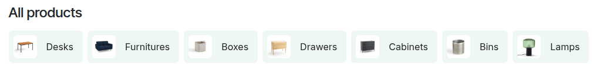

===============
Product catalog
===============

The e-commerce catalog displays products for customers to browse. It is organized using :ref:`product
categories <ecommerce/categories_variants/categories>`, available :ref:`product variants
<ecommerce/categories_variants/product-variants>`, sorting options, and navigation paths.
Essentially, the e-commerce catalog is the shop page of your website.

The product catalog features a :ref:`toolbar and some filters <ecommerce/catalog/toolbar-and-filters>`
in the sidebar (or slide-out menu), along with a dedicated :ref:`product listing area
<ecommerce/catalog/product-listing>`. Additionally, the shop and category pages' :ref:`layout
<ecommerce/catalog/customize-layout>`, as well as the :ref:`e-commerce footer
<ecommerce/catalog/footer>`, can be customized, and you can add :ref:`building blocks
<ecommerce/catalog/catalog-blocks>` as needed.

To customize the catalog, go to the shop page, click :guilabel:`Edit` in the upper-right corner,
select the section you want to change, and navigate to the :guilabel:`Style` tab.

.. _ecommerce/catalog/toolbar-and-filters:

Toolbar and filters
===================

The toolbar and sidebar (or slide-out menu) provide advanced filtering tools to help customers
search and navigate the product catalog using :ref:`categories <ecommerce/catalog/categories>` and
:ref:`attributes <ecommerce/catalog/attributes>`.

.. tip::
   If you do not want to display a toolbar or sidebar, disable all related options in the website
   editor, :ref:`hide attributes <ecommerce/categories_variants/attributes>`, and make sure to only
   assign one pricelist to the website.

.. _ecommerce/catalog/categories:

Categories
----------

To create a :ref:`category <ecommerce/categories_variants/categories>` quick access in the toolbar
or general access in the sidebar, click the :guilabel:`Top` and/or :guilabel:`Sidebar` button next
to :guilabel:`Categories`, and choose a :guilabel:`Style` for them. When the :guilabel:`Sidebar` is
selected, the option :guilabel:`Collapse Category Recursive` appears, allowing you to collapse the
category in the sidebar.

.. note::
   The category filters located in the sidebar are not affected by the :guilabel:`Filters` setting.

.. _ecommerce/catalog/toolbar:

Toolbar
-------

It is possible to display a search bar or sort-by options in the toolbar of the shop page by
clicking the :guilabel:`Sort By` and/or :guilabel:`Search` buttons next to the :guilabel:`Toolbar`
label. Toggle the :guilabel:`Floating` switch on to always display the search bar, the
:ref:`pricelist selector <ecommerce/prices/pricelists>` (if any), and sort-by options at the bottom
of the window, even when scrolling, and select a :guilabel:`Default Sort` option.

.. note::
   The default sort applies to *all* :ref:`categories <ecommerce/categories_variants/categories>`.

.. _ecommerce/catalog/filters:

Filters
-------

Set the :guilabel:`Filters` field to:

- :guilabel:`Sidebar`: to display filters in the side panel;
- :guilabel:`Off-screen menu`: to display filters in a slide-out menu that opens when clicking
  the :icon:`fa-sliders` :guilabel:`Filters` button in the toolbar;
- :guilabel:`Hide`: to hide filters entirely.

By default, two :guilabel:`Filters` are enabled:

  - :guilabel:`Price`: Use the switch to display a :guilabel:`Price Range` bar, which
    allows customers to filter products according to a specific price range by dragging adjustable
    handles.
  - :guilabel:`Tags`: Toggle the switch to display product :guilabel:`Tags` on the shop page, and
    allow customers to filter products using those tags by going to the
    :guilabel:`Tags` section.

    .. tip::
       To create product tags on your e-commerce, go to :menuselection:`Website --> eCommerce
       --> Product Tags`, and click :guilabel:`New`. Add a :guilabel:`Tag` name, toggle the
       :guilabel:`Visible to customers` switch, and select a :guilabel:`Color`. Optionally, add an
       image. Then go to the product form, and assign the relevant tags where needed.

For :doc:`rental products <../../../sales/rental>`, you can also add a :guilabel:`Rental Date`
option to display a date range calendar to check their availability over a specific period.

.. _ecommerce/catalog/attributes:

Attributes
~~~~~~~~~~

When you offer :ref:`product variants <ecommerce/categories_variants/product-variants>` with
different :ref:`attributes <ecommerce/categories_variants/attributes>`, those options appear
in the sidebar or slide-out menu when filters are shown. The menu automatically adapts to the
number of attribute sections:

- **Up to 4 attributes**: all the attribute values are displayed.
- **More than 4 attributes**: the sections are automatically collapsed.

.. note::
   - For :guilabel:`Radio` and :guilabel:`Select` :ref:`display types
     <products/variants/attributes>`, a :guilabel:`View More` button appears when there are more
     than **8** values, and a search field when the number of values exceeds **20**.
   - At least two attribute values are required for the filter to be visible.
   - The attribute filters located in the sidebar or slide-out menu are affected by the
     :guilabel:`Filters` setting.

.. seealso::
   - :doc:`../../../sales/sales/products_prices/products/variants`
   - :doc:`categories_variants`

.. _ecommerce/catalog/product-listing:

Product listing area
====================

.. _ecommerce/catalog/layout:

Define the number of products to display on your shop pages by configuring the :guilabel:`Size`
displayed per page and line, and specify the number of columns for :guilabel:`Mobile` devices.

.. note::
   The number of products displayed on a page may affect performance and page loading speed.

In addition, you can manually change a product’s position on the shop page or product category page.
To do so, click a specific product, change its :guilabel:`Size`, and :guilabel:`Re-order` it using
the arrows in the :guilabel:`Product` section of the :guilabel:`Style` tab. The
:icon:`fa-angle-double-left` (:guilabel:`double left arrow`) and :icon:`fa-angle-double-right`
(:guilabel:`double right arrow`) buttons allow you to move the product to the extreme left or right,
and the :icon:`fa-angle-left` (:guilabel:`single left arrow`) and :icon:`fa-angle-right`
(:guilabel:`single right arrow`) buttons allow you to move it one row to the left or right. You can
also choose or create a :ref:`ribbon or badge
<ecommerce/products/additional_features/product-highlight>` to highlight a specific product.

.. tip::
   It is also possible to change the products' positions on the shop page by going to
   :menuselection:`Website --> eCommerce --> Products`, switching to the list view, and
   dragging and dropping the products within the list.

.. _ecommerce/catalog/products-design:

Product card design
-------------------

To customize the product cards' design, choose a :guilabel:`Products Design`, click the
:icon:`fa-paint-brush` :guilabel:`(paint brush)` icon next to it to:

- Choose a :guilabel:`Preset` layout;
- Adapt the :guilabel:`General` design;
- Customize the :guilabel:`Text & content` (e.g., show a :guilabel:`Description`, and
  :guilabel:`Ratings`);
- Customize the :guilabel:`Images`' layout (e.g., enable :guilabel:`Secondary
  Image` to show a second image when hovering over the product image on the shop or category page);
- Enable some :guilabel:`Actions` (e.g., :icon:`fa-shopping-cart`
  :ref:`Add to cart <ecommerce/checkout/add-to-cart>`, :icon:`fa-exchange` :ref:`Compare
  <ecommerce/products/additional_features/product-comparison>`, or :icon:`fa-heart` :ref:`Wishlist
  <ecommerce/products/additional_features/wishlists>`) and customize their placement.

.. tip::
   You can also add a :ref:`variant picture <ecommerce/categories_variants/attributes>` on the
   product card and product page.

.. _ecommerce/catalog/customize-layout:

Shop and category page design
=============================

The design of the shop and individual category pages can be customized as follows:

- Choose whether the :guilabel:`Content Width` of the shop and category pages should be
  :guilabel:`Regular` or :guilabel:`Full` width.
- Define the headers: navigate to the relevant page, then change the header directly on the page
  if needed. Toggle the :guilabel:`Show Title` and/or the :guilabel:`Center Content` switches. For
  product category pages, toggle the :guilabel:`Show Description` switch to show the :ref:`category
  description <ecommerce/categories_variants/categories>`.
- Use :doc:`building blocks <../../website/web_design/building_blocks>` to add content in the
  top/bottom section of the page, either for the entire shop page or for a specific category. In
  the latter case, the block appears *only* when filtering by that category. To do so, move the
  block to the far top or bottom section to display it on the general shop page or to the area
  below the category's name at the top or beneath the product list to display it only when filtering
  by that specific category.

  .. image:: catalog/catalog-header-footer.png
     :alt: Place building block in the header or footer.

  .. tip::
     - Adding content to an e-commerce category page helps improve the :doc:`SEO
       <../../website/structure/seo>` strategy. Using keywords linked to the products or the
       e-commerce categories can also increase organic traffic. Additionally, each category has its
       own specific URL that can be pointed to and is indexed by search engines.
     - E-commerce categories can also be added as :ref:`mega menu items
       <website/header_footer/mega-menus>` for quick access.
     - It is also possible to customize individual :ref:`product pages
       <ecommerce/products/product-form>`.

.. _ecommerce/catalog/catalog-blocks:

Catalog blocks
==============

The :guilabel:`Catalog` :doc:`building blocks
</applications/websites/website/web_design/building_blocks>` can be used, for example, to create
quick access to the shop page, showcase specific product categories, highlight a specific product
selection, or add a banner with general information or promotions.

Depending on the selected template, you can :ref:`customize <website/building_blocks/edit>` the
blocks in the :guilabel:`Style` tab.

.. example::
   .. image:: catalog/catalog-products-block.png
      :alt: Example of a catalog block for specific products

   For example, this specific :guilabel:`Catalog` block template displays a selection of
   products and can be customized to:

   - Adapt the block's design.
   - Select a :guilabel:`Cards Design`, and :ref:`configure <ecommerce/catalog/products-design>` it
     using the :icon:`fa-paint-brush` :guilabel:`(paint brush)` icon.
   - Define which items are shown in the block by selecting the relevant :guilabel:`Filter` option,
     e.g., :guilabel:`Newest Products` to show the latest arrivals.
   - Select a specific product category in the :guilabel:`Category` dropdown list.
   - Filter products by toggling the :guilabel:`Tags` and/or :guilabel:`Show variants` options.

.. _ecommerce/catalog/footer:

E-commerce-specific website footer
==================================

The :ref:`website footer <website/header_footer/footer-design>` can also be configured to use
the e-commerce-specific template. Then, add the relevant :ref:`links <website/elements/links>`, and
adapt the footer's text and layout as needed in the website editor. The :doc:`available payment
methods </applications/finance/payment_providers>` are also shown in this footer. To adapt their
display, go to the :guilabel:`Supported Payment Methods` section in the website editor.

.. note::
   It is not possible to create a customized footer per category.
