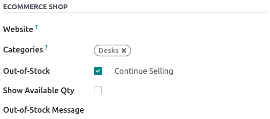
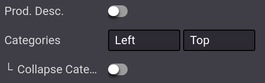
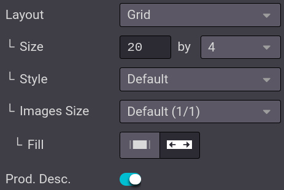
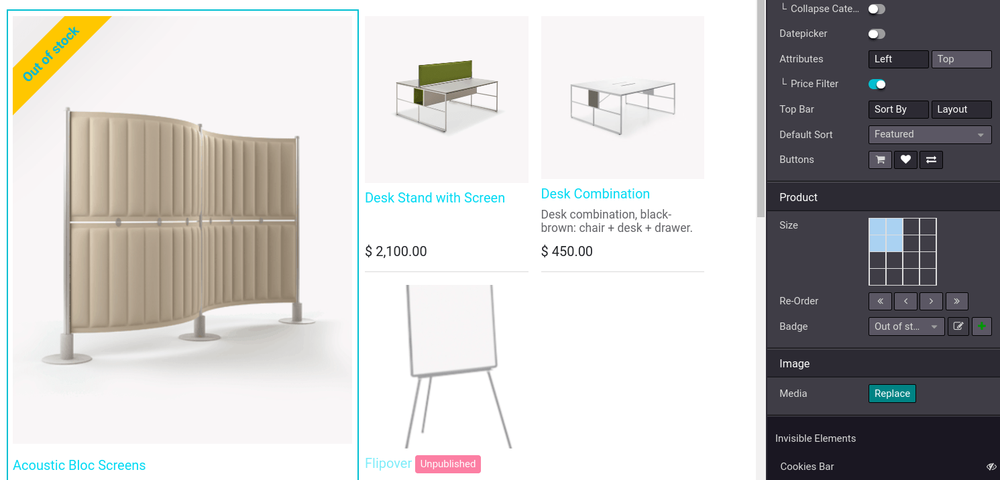
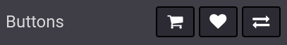
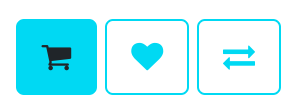
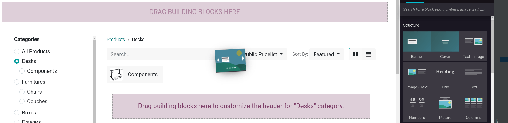
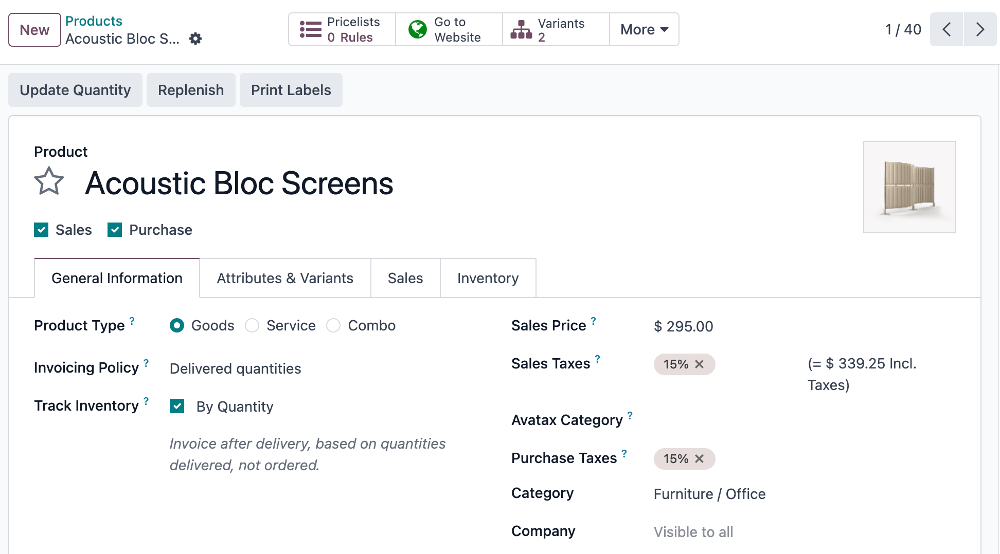

=======
Catalog
=======

The eCommerce catalog is the equivalent of your physical store shelves: it allows customers to see
what you have to offer. Clear categories, available options, sorting, and navigation threads help
you structure it efficiently.

Categorize the product catalog
==============================

In Odoo, there is a **specific category model** for your eCommerce. Using eCommerce categories for
your products allows you to add a navigation menu on your eCommerce page. Visitors can then use it
to view all products under the category they select.

To do so, go to :menuselection:`Website --> eCommerce --> Products`, select the product you wish to
modify, click on the :guilabel:`Sales` tab, and select the :guilabel:`Categories` you want under
:guilabel:`eCommerce Shop`.

.. note::
   A single product can appear under multiple eCommerce categories.

When your product's categories are configured, go to your **main shop page** and click on
:menuselection:`Edit --> Customize tab`. In the :guilabel:`Categories` option, you can either enable
a menu on the :guilabel:`Left`, on the :guilabel:`Top`, or both. If you select the :guilabel:`Left`
category, the option :guilabel:`Collapsable Category Recursive` appears and allows to render the
:guilabel:`Left` category menu collapsable.

.. seealso::
   :doc:`../products`

.. _ecommerce-browsing:

Browsing
--------

The eCommerce category is the first tool to organize and split your products. However, if you need
an extra level of categorization in your catalog, you can activate various **filters** such as
attributes or sort-by search.

Attributes
~~~~~~~~~~

Attributes refer to **characteristics** of a product, such as **color** or **material**, whereas
variants are the different combinations of attributes. :guilabel:`Attributes and Variants` can be
found under :menuselection:`Website --> eCommerce --> Products`, select your product, and
:guilabel:`Attributes & Variants` tab.

.. seealso::
   - :doc:`../../../sales/sales/products_prices/products/variants`

.. image:: catalog/catalog-attributes.png
   :align: center
   :alt: Attributes and variants of your product

To enable **attribute filtering**, go to your **main shop page**, click on :menuselection:`Edit -->
Customize tab` and select either :guilabel:`Left`, :guilabel:`Top`, or both. Additionally, you can
also enable :guilabel:`Price Filtering` to enable price filters.

.. note::
   :guilabel:`Price Filter` works independently from **attributes** and, therefore, can be enabled
   on its own if desired.

.. tip::
   You can use **attribute filters** even if you do not work with product variants. When adding
   attributes to your products, make sure only to specify *one* value per attribute. Odoo does not
   create variants if no combination is possible.

Sort-by search
~~~~~~~~~~~~~~

It is possible to allow the user to manually **sort the catalog** using the search bar. From
your **main shop page**, click on :menuselection:`Edit --> Customize tab`; you can enable or disable
the :guilabel:`Sort-By` option as well as the :guilabel:`Layout` button. You can also select the
:guilabel:`Default Sort` of the :guilabel:`Sort-By` button. The default sort applies to *all*
categories.

The **sorting** options are:

- Featured
- Newest Arrivals
- Name (A-Z)
- Price - Low to High
- Price - High to Low

In addition, you can **manually edit** the catalog's order of a product by going to **the main shop
page** and clicking on the product. Under the :guilabel:`Product` section of the
:guilabel:`Customize` section, you can rearrange the order by clicking on the arrows. `<<` `>>` move
the product to the **extreme** right or left, and `<` `>` move the product by **one** row to the
right or left. It is also possible to change the catalog's order of products in
:menuselection:`Website --> eCommerce --> Products` and drag-and-dropping the products within the
list.

.. image:: catalog/catalog-reorder.png
   :align: center
   :alt: Product rearrangement in the catalog

Page design
===========

Category page
-------------

You can customize the layout of the category page using the website builder.

.. important::
   Editing the layout of the category page is global; editing one category layout affects *all*
   category pages.

To do so, go on to your :menuselection:`Category page --> Edit --> Customize`. Here, you can choose
the layout, the number of columns to display the products, etc. The :guilabel:`Product Description`
button makes the product description visible from the category page, underneath the product picture.

.. tip::
   You can choose the size of the grid, but be aware that displaying too many products may affect
   performance and page loading speed.

Product highlight
-----------------

You can highlight products to make them more visible on the category or product page. On the page of
your choice, go to :menuselection:`Edit --> Customize` and click on the product to highlight. In the
:guilabel:`Product` section, you can choose the size of the product image by clicking on the grid,
and you can also add a **ribbon** or :guilabel:`Badge`. This displays a banner across the product's
image, such as:

- Sale;
- Sold out;
- Out of stock;
- New.

Alternatively, you can activate the :doc:`developer mode <../../../general/developer_mode>` on the
**product's template**, and under the :guilabel:`Sales` tab, change or create the ribbon from the
:guilabel:`Ribbon` field.

.. note::
   The :doc:`developer mode <../../../general/developer_mode>` is only intended for experienced
   users who wish to have access to advanced tools. Using the **developer mode** is *not*
   recommended for regular users.

Additional features
===================

You can access and enable additional feature buttons such as **add to cart**, **comparison list**,
or a **wishlist**. To do so, go to your **main shop page**, and at the end of the
:guilabel:`Products Page` category, click on the feature buttons you wish to use. All three buttons
appear when hovering the mouse over a product's image.

- :guilabel:`Add to Cart`: adds a button to
  :doc:`add the product to the cart <../checkout_payment_shipping/cart>`;
- :guilabel:`Comparison List`: adds a button to **compare** products based on their price, variant,
  etc.;
- :guilabel:`Wishlist Button`: adds a button to **wishlist** the product.

Add content
===========

You can use **building blocks** to add content on the category page, with a variety of blocks
ranging from :guilabel:`Structure` to :guilabel:`Dynamic Content`. Specific areas are defined to use
blocks are defined and highlighted on the page when **dragging-and-dropping** a block.

- If you drop a building block **on top** of the product list, it creates a new category header
  specific to *that* category.
- If you drop a building **on the top** or **bottom** of the page, it becomes visible on *all*
  category pages.

.. tip::
   Adding content to an eCommerce category page is beneficial in terms of **SEO** strategy. Using
   **keywords** linked to the products or the eCommerce categories improves organic traffic.
   Additionally, each category has its own specific URL that can be pointed to and is indexed by
   search engines.

Multi-channel promotion
=======================

Expand your reach by connecting your product catalog to platforms like **Google Merchant Center
(GMC)**. This integration allows you to create an automated feed of your product catalog, making it
easier to promote your products on Google Shopping and other platforms.

By enabling the **Google Merchant Center Data Source**, your website will generate a dynamic
`/gmc.xml` feed containing essential product information such as names, prices, descriptions,
images, and availability. This feed can be customized to include multiple languages and pricelists,
ensuring your products are displayed correctly for different regions and audiences.

Here is an example of a product and the corresponding `/gmc.xml` generated file:

The resulting XML output might look like this:

.. code-block:: xml

   <rss xmlns:g="http://base.google.com/ns/1.0" version="2.0">
      <channel>
         <title>Home | Your Website</title>
         <link>https://yourwebsite.com/</link>
         <description>This is the homepage of the website</description>
         <item>
            <g:id>FURN_6666</g:id>
            <g:title>Acoustic Bloc Screens</g:title>
            <g:description></g:description>
            <g:link>https://yourwebsite.com/shop/acoustic-bloc-screens-23#attribute_values=4</g:link>
            <g:image_link>https://yourwebsite.com/web/image/product.product/31/image_1920</g:image_link>
            <g:availability>in_stock</g:availability>
            <g:price>295.0 USD</g:price>
            <g:sale_price>265.5 USD</g:sale_price>
            <g:sale_price_effective_date>2024-12-01T00:00/2024-12-31T23:59</g:sale_price_effective_date>
            <g:product_detail>
               <g:attribute_name>Color</g:attribute_name>
               <g:attribute_value>White</g:attribute_value>
            </g:product_detail>
            <g:item_group_id>23</g:item_group_id>
            <g:product_type>Desks &gt; Components</g:product_type>
            <g:shipping>
               <g:country>BE</g:country>
               <g:service>Standard delivery</g:service>
               <g:price>14.99 USD</g:price>
            </g:shipping>
            <g:free_shipping_threshold>
                  <g:country>BE</g:country>
                  <g:price_threshold>1000.0 USD</g:price_threshold>
            </g:free_shipping_threshold>
         </item>
      </channel>
   </rss>

Follow the steps below to enable and configure this feature.

Configuration
-------------

Start by making the `/gmc.xml` feed accessible:

- Go to :menuselection:`Settings --> Website`.
- In the **SEO** section, enable the option **Google Merchant Center Data Source**.

Next, set up the connection with Google Merchant Center:

- Log in to your Google Merchant Center account.
- Head over to the **Data sources** section by clicking on the gear icon :guilabel:`(⚙)` and
  selecting **Data sources**.
- Click on **Add product source**.
- Add the URL of your product feed (`/gmc.xml`) as the link to your product source file.

   Example: `https://yourwebsite.com/gmc.xml`.

Localized feeds
---------------

Creating language-specific feeds for each country you sell in is essential. It ensures clarity and
cultural relevance in product information, potentially boosting sales.

To target mutliple languages and countries, append the desired language code to the URL. Example:
Use `/fr/gmc.xml` for French.

.. note::
   The selected language must first be enabled in your website's settings.

It is also possible to create different feeds for different currencies, which allows customers to
view prices in their local currency.

To enable this feature, create a pricelist with the foreign currecny and include it's name in the
feed URL. Example: `/gmc-EUR.xml` for a pricelist named "EUR".

.. note::
   The pricelist must be selectable.

.. seealso::
   For a detailed explanation of all fields in the `/gmc.xml` file, refer to Google's documentation:
   `Google Merchant Center Product Feed Specifications
   <https://support.google.com/merchants/answer/7052112>`_.
