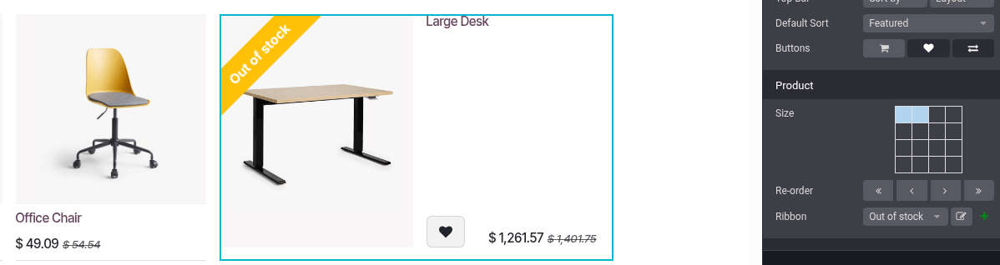
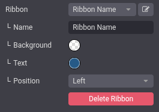

=======
Catalog
=======

The eCommerce catalog displays products for customers to browse. It is organized using product
categories, available options, sorting, and navigation paths. Essentially, the eCommerce catalog
is the shop page of your website.

The product catalog includes a :ref:`top bar <ecommerce/catalog/top-bar>`, a :ref:`side panel
<ecommerce/catalog/side-panel>`, and a :ref:`product listing area
<ecommerce/catalog/product-listing>`. With Odoo, you can :ref:`customize the layout
<ecommerce/catalog/customize-layout>`, filter by :ref:`categories and attributes
<ecommerce/catalog/categories>`, and use :ref:`additional features
<ecommerce/catalog/additional-features>` according to your needs.

You can customize the shop page using the website editor. To access it, go to the shop page,
click :guilabel:`Edit` in the upper-right corner, and navigate to the :guilabel:`Customize` tab.

.. _ecommerce/catalog/top-bar:

Top bar
=======

The top bar can include a search bar, a currency selector,
:ref:`sort-by and display options <ecommerce/catalog/sort-by-and-display-option>`, and
:ref:`category quick access <ecommerce/catalog/categories>`.

.. _ecommerce/catalog/sort-by-and-display-option:

Sort-by search and display options
----------------------------------

You can toggle the :guilabel:`Search Bar`, display :ref:`categories <ecommerce/catalog/categories>`
and/or :ref:`attributes <ecommerce/catalog/attributes>`, and enable or disable the
:guilabel:`Sort-By` as well as the :ref:`Layout <ecommerce/catalog/layout>` buttons in
the :guilabel:`Top Bar`.

The :guilabel:`Sort-by` button is toggled by default, and customers can choose between the
following :guilabel:`Default Sort` options:

- :guilabel:`None`
- :guilabel:`Featured`
- :guilabel:`Newest Arrivals`
- :guilabel:`Name (A-Z)`
- :guilabel:`Price - Low to High`
- :guilabel:`Price - High to Low`

The default sort applies to *all* :ref:`categories <ecommerce/catalog/categories>`.

.. tip::
   If you don't want to display a top bar or :ref:`side panel <ecommerce/catalog/side-panel>`,
   you can disable all related options in the website editor.

.. _ecommerce/catalog/side-panel:

Side panel
==========

The side panel provides advanced filtering tools to organize your product categories.
To further :ref:`categorize <ecommerce/catalog/categories>` the shop page, you can activate
various filters, such as the :ref:`attribute <ecommerce/catalog/attributes>` filter.

You can also add a :guilabel:`Datepicker` option to display a date range calendar to check
the availability of rental products over a specific period. The :doc:`Rental app
<../../../sales/rental>` must be installed to use this feature.

It is also possible to toggle the :guilabel:`Collapsible sidebar` switch to make the side panel
manually collapsible.

.. tip::
   To use a price range or tags filter, you have to enable :ref:`attributes
   <ecommerce/catalog/attributes>` first.

.. _ecommerce/catalog/categories:

Product categorization in catalog
=================================

eCommerce categories are used to organize products into groups, making it easier for customers
to browse the online store.

To create eCommerce categories, go to :menuselection:`Website --> eCommerce -->
eCommerce Categories`, and click :guilabel:`New`. On the category form, add a
:guilabel:`Name`, optionally enter a :guilabel:`Parent Category`, and write a :guilabel:`Category
Description`, if needed.

To use eCommerce categories, go to :menuselection:`Website --> eCommerce --> Products`, select
the product you wish to modify, go to the :guilabel:`Sales` tab, navigate to the
:guilabel:`Ecommerce shop` section, and select the :guilabel:`Categories` it belongs to.

.. note::
   A single product can belong to multiple eCommerce categories.

Once the categories are configured and assigned to the relevant products, go to the main shop page
and open the website editor. In the :guilabel:`Categories` option, you can either enable
a menu on the :guilabel:`Left`, i.e., in the :ref:`side panel <ecommerce/catalog/side-panel>`,
or on the :guilabel:`Top`, i.e., in the :ref:`top bar <ecommerce/catalog/top-bar>`, or both.
If you select the :guilabel:`Left` category, the option :guilabel:`Collapsible Category Recursive`
appears, allowing you to collapse the category in the side panel.

.. image:: catalog/catalog-panel-categories.png
   :alt: Categories options for your eCommerce website

.. seealso::
   :doc:`../products`

.. _ecommerce/catalog/attributes:

Attributes
----------

Attributes refer to characteristics of a product, such as the color or material, whereas
variants are the different combinations of attributes. To configure attributes and variants, go to
:menuselection:`Website --> eCommerce --> Products`, select a product, and click the
:guilabel:`Attributes & Variants` tab. Add as many attributes as desired.

.. seealso::
   :doc:`../../../sales/sales/products_prices/products/variants`

.. image:: catalog/catalog-attributes.png
   :alt: Attributes and variants of your product

To enable attribute filtering, go to your main shop page, then open the website editor, and set
the :guilabel:`Attributes` field to :guilabel:`Left` (:ref:`side panel
<ecommerce/catalog/side-panel>`) and/or :guilabel:`Top` (:ref:`top bar
<ecommerce/catalog/top-bar>`).

.. tip::
   When attribute filtering is enabled in the top bar, customers must click the :icon:`fa-sliders`
   (:guilabel:`dropdown toggle`) button to access it.

When enabling :guilabel:`Attributes`, more options become available:

  - :guilabel:`Price Filter`: Toggle the switch to display a :guilabel:`Price Range` bar, which
    allows customers to filter products according to a specific price range by dragging adjustable
    handles.
  - :guilabel:`Product Tags Filter`: Toggle the switch to display the :guilabel:`Product Tags` on
    the shop page, and allow customers to filter products using those tags by going to the
    :guilabel:`Tags` section in the :ref:`side panel <ecommerce/catalog/side-panel>`.

.. tip::
   - If you want to use tags on your e-commerce, go to :menuselection:`eCommerce --> Product Tags`
     and click :guilabel:`New`. In the :guilabel:`Product Templates` tab of the product tags form,
     add the products to link to the given tag. You can also add product variants in the
     :guilabel:`Product Variants` tab and view a summary of all selected products in
     the :guilabel:`All Products` tab.
   - Price filtering works independently from attributes and, therefore, can be enabled on its own,
     if desired.

.. _ecommerce/catalog/product-listing:

Product listing area
====================

You can customize the layout of the entire shop page, as well as that of :ref:`individual category
pages <ecommerce/catalog/customize-layout>`.

.. tip::
   It is also possible to customize individual :ref:`product pages <ecommerce/products/product-form>`.

.. _ecommerce/catalog/layout:

In the website editor, choose the :ref:`layout <ecommerce/catalog/sort-by-and-display-option>`, and
set the default layout to either :guilabel:`Grid` or :guilabel:`List` view.

Use the following options to further adjust the layout:

   - :guilabel:`Size`: Set the number of products displayed per page and line.
   - :guilabel:`Gap`: Define the gap between the products.
   - :guilabel:`Style`: Select :guilabel:`Default`, :guilabel:`Cards`, :guilabel:`Thumbnails`, or
     :guilabel:`Grid`.
   - :guilabel:`Image Size`: Choose the aspect ratio for the product images:
     :guilabel:`Landscape (4/3)`, :guilabel:`Default (1/1)`, :guilabel:`Portrait (4/5)`, or
     :guilabel:`Vertical (2/3)`. You can also adjust the display by changing the :guilabel:`Fill`
     options to fit your design preferences best.

Toggle the :guilabel:`Prod. Desc.` switch to display the product description below the product's
name.

.. tip::
   You can choose the size of the grid, but be aware that displaying too many products may affect
   performance and page loading speed.

In addition, you can manually change a product’s position on the shop page. To do so, go to the
main shop page, click the product, and open the website editor. In the :guilabel:`Product` section,
you can reorder the products by using the arrows. The `<<` `>>` buttons allow to move the product to
the extreme left or right, and `<` `>` allow to move it one row to the left or right.

.. tip::
   It is also possible to change the products' positions on the shop page by going to
   :menuselection:`Website --> eCommerce --> Products`, switching to the list view, and
   dragging and dropping the products within the list.

Product highlight
-----------------

You can highlight products to make them more visible on the shop page. To do so, go
to the website editor and click the product to highlight. In the :guilabel:`Product` section, you
can choose the size of the product image by clicking the grid, and you can also add a
:guilabel:`Ribbon`. This displays a banner across the product's image, such as :guilabel:`Sale`,
:guilabel:`Sold out`, :guilabel:`Out of stock` or :guilabel:`New!`.

To create a new ribbon, click the green :icon:`fa-plus` (:guilabel:`Create`) icon next to the
:guilabel:`Ribbon` field. Then add a :guilabel:`Ribbon name`, define its :guilabel:`Position`,
and choose a :guilabel:`Background` and a :guilabel:`Text` label. To edit the ribbon, click the
:icon:`fa-pencil-square-o` (:guilabel:`Edit`) icon next to the :guilabel:`Ribbon` label.

The ribbon is now available for all the eCommerce products.

.. tip::
   - There are other ways to create a new ribbon:

     - Go to :menuselection:`Website --> eCommerce --> Product Ribbons` and click :guilabel:`New`.
     - Activate the :doc:`developer mode <../../../general/developer_mode>`, access the product
       form, and under the :guilabel:`Sales` tab, change or create the ribbon in the
       :guilabel:`Ribbon` field.

   - It is also possible to add ribbons for specific :ref:`product variants
     <ecommerce/products/product-variants>`. To do so, go to :menuselection:`Website -->
     eCommerce --> Products` and select a product. Click the :guilabel:`Variants` smart button,
     choose a variant, and add a ribbon in the :guilabel:`Variant Ribbon` field of the
     :guilabel:`Sales` section.

.. _ecommerce/catalog/customize-layout:

Shop and category page design
-----------------------------

Use :doc:`building blocks <../../website/web_design/building_blocks>` to add content on the shop
and/or category page.

You can customize the top and/or bottom section of the catalog, either for the entire shop page or
for a specific category. In the latter case, the block appears *only* when filtering by that
category. To do so, move the block to the far top or bottom section to display it on the general
shop page or to the area below the category's name at the top or beneath the product list to
display it only when filtering by that specific category.

 .. image:: catalog/catalog-header-footer.png
    :alt: Place building block in the header or footer.

.. tip::
   - Adding content to an eCommerce category page helps improve the :doc:`SEO
     <../../website/structure/seo>` strategy. Using keywords linked to the products or the
     eCommerce categories can also increase organic traffic. Additionally, each category has its
     own specific URL that can be pointed to and is indexed by search engines.
   - eCommerce categories can also be added as :ref:`mega menu items
     <website/header_footer/mega-menus>` for quick access.

.. _ecommerce/catalog/additional-features:

Additional features
===================

You can access and enable additional feature buttons such as a :guilabel:`Add to cart` or
:guilabel:`Wishlist` button or a :guilabel:`Comparison list`. To do so, open the website editor,
click the desired feature buttons. All three buttons appear when hovering the mouse over
a product's image.

- :icon:`fa-shopping-cart` (:guilabel:`Add to cart`): adds a button to
  :doc:`add the product to the cart <../checkout>`;
- :icon:`fa-exchange` (:guilabel:`Compare`): adds a button to compare products based on
  their price, variant, etc.;
- :icon:`fa-heart-o` (:guilabel:`Wishlist`): adds a button to :ref:`wishlist
  <ecommerce/products/wishlists>` the product.

.. seealso::
   :doc:`Products <../products>`
