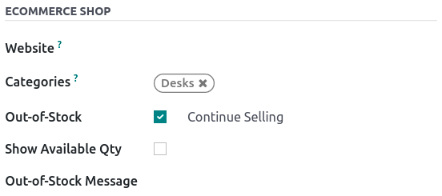
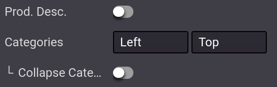
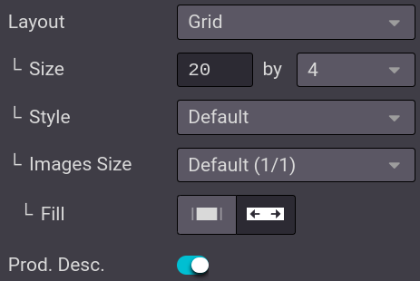
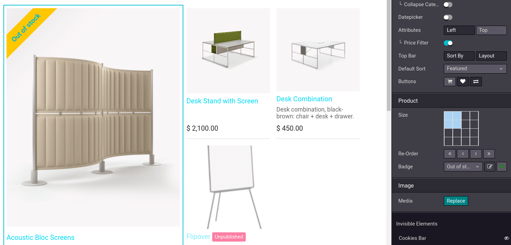
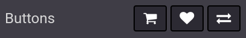
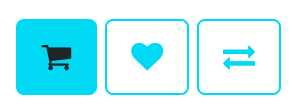

=======
Catalog
=======

The eCommerce catalog is the equivalent of your physical store shelves: it allows customers to see
what you have to offer. Product categories, available options, sorting, and navigation threads help
to structure it efficiently.

Catalog layout
==============

A well-structured product catalog consists of a :ref:`top bar <ecommerce-top-bar>`, a
:ref:`side panel <ecommerce-side-panel>` and a
:ref:`product listing area <ecommerce-product-listing>`.

.. _ecommerce-top-bar:

Top bar
-------

In the top bar, you can find a search bar, a currency selection,
:ref:`sort-by and display options <ecommerce-sort-by-and-display-option>` and
:ref:`category quick access <ecommerce-categories>`.

.. _ecommerce-sort-by-and-display-option:

Sort-by search and display options
~~~~~~~~~~~~~~~~~~~~~~~~~~~~~~~~~~

From the main shop page, click the :menuselection:`Edit --> Customize` tab, toggle the
:guilabel:`Search Bar`, and enable or disable the :guilabel:`Sort-By` option as well as the
:guilabel:`Layout` button next to :guilabel:`Top Bar`. You can choose between :guilabel:`Grid` and
:guilabel:`List` for the :guilabel:`Layout` of the product page.
Above that, you can select the :guilabel:`Default Sort` of the :guilabel:`Sort-By` button.

The sorting options are:

- :guilabel:`Featured`
- :guilabel:`Newest Arrivals`
- :guilabel:`Name (A-Z)`
- :guilabel:`Price - Low to High`
- :guilabel:`Price - High to Low`

The default sort and layout applies to *all* categories.

.. tip::
   If you don't want to display a top bar or :ref:`side panel <ecommerce-side-panel>`, you can
   disable all the options in :guilabel:`Edit` mode.

.. _ecommerce-side-panel:

Side panel
----------

The side panel servers as advanced filtering tool to organize and split your product categories.
In order to further categorize the catalog, you can activate various filters such as
:ref:`attributes <ecommerce-attributes>`.

Product categorization in catalog
~~~~~~~~~~~~~~~~~~~~~~~~~~~~~~~~~

.. _ecommerce-categories:

In Odoo, there is a specific category model for the eCommerce. Visitors can use it
to view all products under the category they select.

To use eCommerce categories, go to :menuselection:`Website --> eCommerce --> Products`, select
the product you wish to modify, click on the :guilabel:`Sales` tab, and select the
:guilabel:`Categories` it belongs to.

.. note::
   A single product can belong to multiple eCommerce categories.

Once your product's categories are configured, go to your main shop page and click on
:menuselection:`Edit --> Customize tab`. In the :guilabel:`Categories` option, you can either enable
a menu on the :guilabel:`Left`, on the :guilabel:`Top`, or both. If you select the :guilabel:`Left`
category, the option :guilabel:`Collapsable Category Recursive` appears and allows to render the
:guilabel:`Left` category menu collapsable.

.. seealso::
   :doc:`../products`

.. tip::
   - It is also possible to toggle the :guilabel:`Collapsable sidebar` to enable to fold the
     side bar in general.
   - You can also add a :guilabel:`Datepicker` option for rental products and periods.

.. _ecommerce-attributes:

Attributes
~~~~~~~~~~

Attributes refer to characteristics of a product, such as color or material, whereas
variants are the different combinations of attributes. :guilabel:`Attributes and Variants` can be
found under :menuselection:`Website --> eCommerce --> Products`, select your product, and
:guilabel:`Attributes & Variants` tab.

.. seealso::
   - :doc:`../../../sales/sales/products_prices/products/variants`

.. image:: catalog/catalog-attributes.png
   :alt: Attributes and variants of your product

To enable attribute filtering, go to your main shop page, click the :menuselection:`Edit -->
Customize` tab, and next to :guilabel:`Attributes`, select either :guilabel:`Left`, :guilabel:`Top`,
or both. Additionally, enable :guilabel:`Price Filter` and :guilabel:`Product Tags filter`
to activate price and tag filters, respectively.

.. note::
   - If you want to use tags on your ecommerce, go to :menuselection:`eCommerce --> Product Tags`
     and click :guilabel:`New`. On the product tags form in the :guilabel:`Product Templates` tab,
     add the products to link to the given tag. You can also add product variants in the
     :guilabel:`Product Variants` tab. You can find a summary of all selected products in
     the :guilabel:`All Products` tab.
   - Price filter work independently from attributes and, therefore, can be enabled on its own
     if desired.

.. tip::
   You can use attribute filters even if you do not work with product variants. When adding
   attributes to your products, make sure only to specify *one* value per attribute. Odoo does not
   create variants if no combination is possible.

.. _ecommerce-product-listing:

Product listing layout
----------------------

You can customize the layout of the category page using the website builder.

.. important::
   Editing the layout of the category page is global; editing one category layout affects *all*
   category pages.

To do so, go on to a :menuselection:`Category page --> Edit --> Customize`. Here, you can choose
the layout, the number of columns to display the products, etc. The :guilabel:`Product Description`
button makes the product description visible from the category page, underneath the product picture.

.. tip::
   You can choose the size of the grid, but be aware that displaying too many products may affect
   performance and page loading speed.

In addition, you can manually edit the catalog's order of a product by going to the main shop
page and clicking the product. Under the :guilabel:`Product` section of the
:guilabel:`Customize` section, you can rearrange the order by using the arrows. `<<` `>>` move
the product to the extreme right or left, and `<` `>` move the product by one row to the
right or left. It is also possible to change the catalog's order of products in
:menuselection:`Website --> eCommerce --> Products` and drag-and-dropping the products within the
list.

Product highlight
~~~~~~~~~~~~~~~~~

You can highlight products to make them more visible on the category or product page. On the page of
your choice, go to :menuselection:`Edit --> Customize` and click the product to highlight. In the
:guilabel:`Product` section, you can choose the size of the product image by clicking the grid,
and you can also add a ribbon or :guilabel:`Badge`. This displays a banner across the product's
image, such as:

- :guilabel:`Sale`
- :guilabel:`Sold out`
- :guilabel:`Out of stock`
- :guilabel:`New`

Alternatively, you can activate the :doc:`developer mode <../../../general/developer_mode>` on the
product's template, and under the :guilabel:`Sales` tab, change or create the ribbon from the
:guilabel:`Ribbon` field.

.. note::
   The :doc:`developer mode <../../../general/developer_mode>` is only intended for experienced
   users who wish to have access to advanced tools. Using the developer mode is *not*
   recommended for regular users.

Additional features
===================

You can access and enable additional feature buttons such as a :guilabel:`Add to cart` or
:guilabel:`Wishlist` button or a :guilabel:`comparison list`. To do so, go to the main shop page,
and at the end of the :guilabel:`Products Page` category, click the desired feature buttons.
All three buttons appear when hovering the mouse over a product's image.

- :guilabel:`Add to Cart`: adds a button to
  :doc:`add the product to the cart <../checkout>`;
- :guilabel:`Comparison List`: adds a button to **compare** products based on their price, variant,
  etc.;
- :guilabel:`Wishlist Button`: adds a button to wishlist the product.

.. tip::
   Go to :menuselection:`Website --> Configuration --> Settings`, scroll down to the
   :guilabel:`Privacy` section to restrict :guilabel:`Ecommerce Access` to :guilabel:`Logged in
   users` or to grant access for :guilabel:`All users`. Tick the
   :guilabel:`Shared Customer Accounts` checkbox to allow access to all websites with a single
   account.

Add content
===========

You can use building blocks to add content on the category page, with a variety of blocks
ranging from :guilabel:`Structure` to :guilabel:`Dynamic Content`. Specific areas are defined to use
blocks are defined and highlighted on the page when dragging-and-dropping a block.

You can add headers and footers either for the whole product catalog or for a given category. In the
latter case, the header and footer appear **only** when filtering on this specific category.

 .. image:: catalog/catalog-header-footer.png
    :alt: Place building block in the header or footer.

.. tip::
   - Adding content to an eCommerce category page is beneficial in terms of SEO strategy. Using
     keywords linked to the products or the eCommerce categories improves organic traffic.
     Additionally, each category has its own specific URL that can be pointed to and is indexed by
     search engines.
   - eCommerce categories can also be added as mega menu items for quick access. Refer to the
     :ref:`Menu editor <website/header_footer/menu-editor>` documentation.
