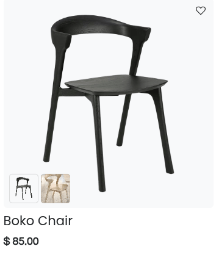

===============
Product catalog
===============

The eCommerce catalog displays products for customers to browse. It is organized using product
categories, available product variants, sorting options, and navigation paths. Essentially, the
eCommerce catalog is the shop page of your website.

The product catalog includes a :ref:`top bar <ecommerce/catalog/top-bar>`, a :ref:`side panel
<ecommerce/catalog/side-panel>`, and a :ref:`product listing area
<ecommerce/catalog/product-listing>`. Additionally, the :ref:`layout
<ecommerce/catalog/customize-layout>` can be customized per shop and category, and you can add
:ref:`building blocks <ecommerce/catalog/building-blocks>`.

To customize it, go to the shop page, click :guilabel:`Edit` in the upper-right corner, select the
section you want to change, and navigate to the :guilabel:`Style` tab.

.. _ecommerce/catalog/top-bar:

Top bar
=======

It possible to display a search bar or sort-by options in the top bar of the shop page by toggling
the :guilabel:`Sort By` and/or :guilabel:`Search` buttons next to the :guilabel:`Toolbar` label.
Enable the :guilabel:`Floating` switch to make those options follow you when scrolling, and select
a :guilabel:`Default Sort` option:

- :guilabel:`Featured`
- :guilabel:`Newest Arrivals`
- :guilabel:`Name (A-Z)`
- :guilabel:`Price - Low to High`
- :guilabel:`Price - High to Low`

To create a :ref:`category <ecommerce/categories_variants/categories>` quick access in the top bar,
click the :guilabel:`Top` button next to :guilabel:`Categories`, and choose a :guilabel:`Style`
for them.

.. tip::
   - The default sort applies to *all* :ref:`categories <ecommerce/categories_variants/categories>`.
   - If you do not want to display a top bar or :ref:`side panel <ecommerce/catalog/side-panel>`,
     disable all related options in the website editor, and make sure to only assign one pricelist
     to the website.

.. _ecommerce/catalog/side-panel:

Side panel
==========

The side panel provides advanced filtering tools to organize the catalog.

Enable :guilabel:`Filters` in the :guilabel:`Sidebar`, or set the :guilabel:`Filters` option to
:guilabel:`Off-screen menu` to add a :icon:`fa-sliders` :guilabel:`Filters` button that displays a
filters bar when clicked. You can also :guilabel:`Hide` it entirely.

By default, there are two :guilabel:`Filters` enabled:

  - :guilabel:`Price`: Use the switch to display a :guilabel:`Price Range` bar, which
    allows customers to filter products according to a specific price range by dragging adjustable
    handles.
  - :guilabel:`Tags`: Toggle the switch to display product :guilabel:`Tags` on the shop page, and
    allow customers to filter products using those tags by going to the
    :guilabel:`Tags` section in the side panel.

    .. tip::
       To create product tags on your e-commerce, go to :menuselection:`eCommerce --> Product Tags`,
       and click :guilabel:`New`. Add a :guilabel:`Tag` name, toggle the :guilabel:`Visible to
       customers` switch, and choose a :guilabel:`Color`. Optionally, add an image.

You can also add a :guilabel:`Rental Date` option to display a date range calendar to check
the availability of rental products over a specific period. The :doc:`Rental app
<../../../sales/rental>` must be installed to use this feature.

To display :ref:`categories <ecommerce/categories_variants/categories>` in the side panel, enable
the :guilabel:`Sidebar` option next to :guilabel:`Categories`. When selected, the option
:guilabel:`Collapse Category Recursive` appears, allowing you to collapse the category in the side
panel.

.. note::
   The category filters located in the sidebar work autonomously, and are not affected by the
   :guilabel:`Filters` setting.

Attributes
----------

When you offer :ref:`product variants <ecommerce/categories_variants/product-variants>` with
different :ref:`attributes <ecommerce/categories_variants/attributes>`, those options appear
in the side panel when the :guilabel:`Filters` setting is enabled. The side panel automatically
adapts to the number of attribute sections:

- **Up to 4 attributes**: all the attribute values are displayed.
- **More than 4 attributes**: the sections are automatically collapsed.

For :guilabel:`Radio` and :guilabel:`Select` :ref:`display types <products/variants/attributes>`,
a :guilabel:`View More` button appears when there are more than **8** values, and a search field
when the number of values exceeds **20**.

.. note::
   - At least two attribute values are required for the filter to be visible.
   - The attribute filters located in the sidebar do not work autonomously, and are affected by the
     :guilabel:`Filters` setting.

.. seealso::
   - :doc:`../../../sales/sales/products_prices/products/variants`
   - :doc:`categories_variants`

.. _ecommerce/catalog/product-listing:

Product listing area
====================

.. _ecommerce/catalog/layout:

Define the number of products to display on your shop pages by configuring the :guilabel:`Size`
displayed per page and line, and specify the number of columns for :guilabel:`Mobile` devices.

.. tip::
   Be aware that displaying too many products may affect performance and page loading speed.

In addition, you can manually change a product’s position on the shop page. To do so, click a
specific product, change its :guilabel:`Size`, and :guilabel:`Re-order` it using the arrows
in the :guilabel:`Product` section of the :guilabel:`Style` tab. The :icon:`fa-angle-double-left`
(:guilabel:`double left arrow`) and :icon:`fa-angle-double-right` (:guilabel:`double right arrow`)
buttons allow you to move the product to the extreme left or right, and the :icon:`fa-angle-left`
(:guilabel:`single left arrow`) and :icon:`fa-angle-right` (:guilabel:`single left arrow`) buttons
allow you to move it one row to the left or right. You can also choose or create a :ref:`ribbon or
badge <ecommerce/products/additional_features/product-highlight>` to highlight a specific product.

.. tip::
   It is also possible to change the products' positions on the shop page by going to
   :menuselection:`Website --> eCommerce --> Products`, switching to the list view, and
   dragging and dropping the products within the list.

Products design
---------------

Choose a :guilabel:`Products Design`, customize it by clicking the :icon:`fa-paint-brush`
:guilabel:`(paint brush)` icon next to it, and choose a :guilabel:`Preset` layout. You can adapt
the :guilabel:`General` design, customize the :guilabel:`Text & content`, add :ref:`images
<ecommerce/catalog/images>`, and enable some :guilabel:`Actions` for the product cards.

.. _ecommerce/catalog/product-card:

Product card
~~~~~~~~~~~~

In the :guilabel:`General` section, add a :guilabel:`Hover Effect` when hovering over the product,
define the :guilabel:`Gap` between the products, the :guilabel:`Roundness` of the cards, and the
:guilabel:`Colors`, if applicable.

In the :guilabel:`Text & content` section, configure the text :guilabel:`Alignment`, and the
:guilabel:`Title Style`, and define whether you want to show the :guilabel:`Description`, and
:guilabel:`Ratings`.

In the :guilabel:`Actions` section, add additional buttons like :icon:`fa-shopping-cart`
:ref:`Add to cart <ecommerce/checkout/add-to-cart>`, :icon:`fa-exchange` :ref:`Compare
<ecommerce/products/additional_features/product-comparison>`, or :icon:`fa-heart-o` :ref:`Add to
wishlist <ecommerce/products/additional_features/wishlists>`. Define how they should be display,
i.e.: :guilabel:`Inline`, :guilabel:`On Hover`, :guilabel:`Fixed` or :guilabel:`Fixed - On Hover`.
Lastly, define a style for the buttons: :guilabel:`Subtle`, :guilabel:`Promote`
:icon:`fa-shopping-cart`, or :guilabel:`Theme colors`.

Variants and attributes
***********************

Configure :ref:`attributes <ecommerce/categories_variants/attributes>` to make them
:guilabel:`Visible` on the product card on the shop page.

You can also add a variant picture on the product card. To do so, go to the product form, click
the :icon:`fa-sitemap` :guilabel:`Variants` :ref:`smart button
<products/variants/variants-smart-button>`, select a variant, and click the
:icon:`fa-pencil` :guilabel:`(Edit)` icon to add a picture for each variant. Make sure that the
:ref:`Show Thumbnails <ecommerce/categories_variants/attributes>` is enabled on the
attribute form.

.. _ecommerce/catalog/images:

Images
~~~~~~

Click the :icon:`fa-paint-brush` :guilabel:`(paint brush)` icon next to :guilabel:`Products Design`,
navigate to the :guilabel:`Images` section, and customize the image layout:

- :guilabel:`Image Ratio`: Define the ratio of images on the shop page.
- :guilabel:`Auto-crop`: Cut or trim images automatically to make them fit the page.
- :guilabel:`Hover Effect`: Define the zoom when hovering over the image.
- :guilabel:`Secondary Image`: Show a second image when hovering over the product image.

.. tip::
   :guilabel:`Replace` a media directly from the shop page using the :guilabel:`Image`
   section of the :guilabel:`Style` tab.

.. _ecommerce/catalog/customize-layout:

Layout customization
====================

Customize the layout of the entire shop page by choosing the :guilabel:`Regular` or
:guilabel:`Full` :guilabel:`Content Width`.

.. tip::
   It is also possible to customize individual :ref:`product pages
   <ecommerce/products/product-form>`.

You can also define different headers for the shop and each category.

.. tabs::

   .. tab:: Shop

      Define the :guilabel:`Shop Header` by changing the title, and toggling the
      :guilabel:`Show Title` and/or the :guilabel:`Center Content` switches.

   .. tab:: Category

      Define the :guilabel:`(Category) Header` by changing the title, and toggling the
      :guilabel:`Show Title`. Toggle the :guilabel:`Show Description` switch to show the
      :ref:`category description <ecommerce/categories_variants/categories>` defined on the
      category form, and/or the :guilabel:`Center Content` switch.

.. _ecommerce/catalog/building-blocks:

Building blocks
---------------

Use :doc:`building blocks <../../website/web_design/building_blocks>` to add content on the shop
and/or category page.

.. _ecommerce/catalog/customize-page-design:

Shop and category page design
~~~~~~~~~~~~~~~~~~~~~~~~~~~~~

You can customize the top and/or bottom section of the catalog, either for the entire shop page or
for a specific category. In the latter case, the block appears *only* when filtering by that
category. To do so, move the block to the far top or bottom section to display it on the general
shop page or to the area below the category's name at the top or beneath the product list to
display it only when filtering by that specific category.

 .. image:: catalog/catalog-header-footer.png
    :alt: Place building block in the header or footer.

.. tip::
   - Adding content to an eCommerce category page helps improve the :doc:`SEO
     <../../website/structure/seo>` strategy. Using keywords linked to the products or the
     eCommerce categories can also increase organic traffic. Additionally, each category has its
     own specific URL that can be pointed to and is indexed by search engines.
   - eCommerce categories can also be added as :ref:`mega menu items
     <website/header_footer/mega-menus>` for quick access.

Catalog blocks
~~~~~~~~~~~~~~

The :guilabel:`Catalog` :doc:`building blocks
</applications/websites/website/web_design/building_blocks>` are used to create quick access to
your e-commerce shop. You can showcase your categories, a specific product selection, or a banner
with general information or promotions.

Depending on the selected layout, you can customize the blocks in the :guilabel:`Style` tab.

.. example::
   Add a building block to display a selection of products sold on your website.

   .. image:: catalog/catalog-product-block.png
      :alt: Example of a catalog block for specific products

   By default, the block displays the :guilabel:`Newest Products`. To change which products are
   shown, go to the :guilabel:`Style` tab's :guilabel:`Products` section and set the
   :guilabel:`Filter` field to :guilabel:`Recently Sold Products` or :guilabel:`Recently Viewed
   Products (per user)`. In addition, it is possible to display products from a specific category
   only using the :guilabel:`Category` field.

   You can also filter products by :guilabel:`Tags`, :guilabel:`Show variants`, and adjust the
   display by selecting a different :guilabel:`Cards Design`.

Footer block
~~~~~~~~~~~~

There is a :guilabel:`eCommerce` footer block that features all the available payment methods in the
footer.
Click the footer and select the :guilabel:`eCommerce` template in the :guilabel:`Template` field.
Click the payment method section, and choose a :guilabel:`Limit` and the :guilabel:`Height` in the
:guilabel:`Supported Payment Methods` section.

.. note::
   It is not possible to create a customized footer per category.
