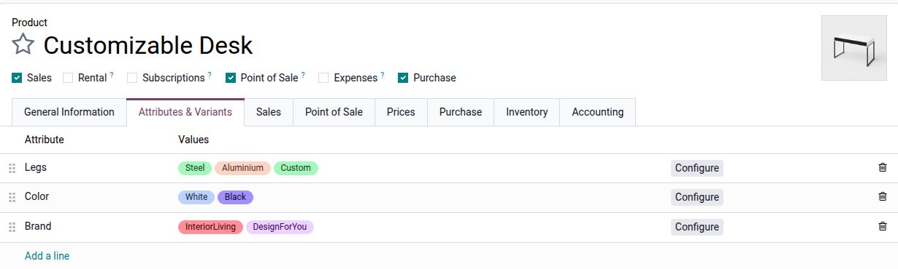
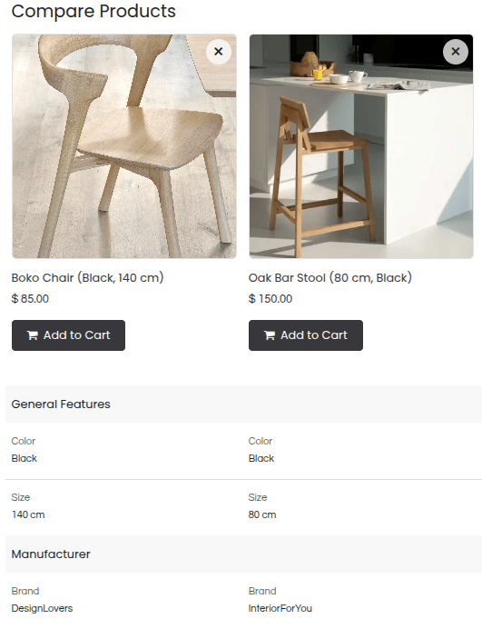

=======================
Categories and variants
=======================

Odoo eCommerce provides multiple ways to configure, :doc:`present <catalog>`, and sell different
product options to customers while organizing products by category for a better overview and
smoother navigation.

.. _ecommerce/categories_variants/product-variants:

Product variants
================

:doc:`Product variants </applications/sales/sales/products_prices/products/variants>` are different
versions of the same product, created by combining :ref:`attributes <products/variants/attributes>`
like color, size, material, etc., which can lead to differences in price and/or availability.

To configure product variants for a product:

#. Go to :menuselection:`Website --> Configuration --> Settings`.
#. Scroll down to the :guilabel:`eCommerce` section and enable the
   :guilabel:`Product Variants` feature.
#. Access the :ref:`product form <ecommerce/products/product-form>` and go to the
   :guilabel:`Attributes & Variants` tab.
#. Click :guilabel:`Add a line` and select the relevant attribute and its values. Repeat this step
   for each additional attribute.

The product variants are created automatically (or not) based on the :ref:`attribute's
configuration <products/variants/attributes>`.

.. seealso::
   :doc:`/applications/sales/sales/products_prices/products/variants`

.. _ecommerce/categories_variants/attributes:

Attributes
----------

Attributes refer to the characteristics of a product, such as its color or material. Each attribute
includes a set of values.

Once your attributes are :ref:`created <products/variants/attributes>`, set the following options
on the attribute form to control where and/or how they appear on the website:

- :guilabel:`eCommerce Filter`: Set the field to :guilabel:`Visible` to make the attribute
  available in the shop's filter section.
- :guilabel:`On Product Cards`: Set the field to :guilabel:`Visible` or :guilabel:`Hover` to display
  attributes on the product card on the shop page. These options are only available when
  :ref:`variants are created instantly for the attribute <products/variants/attributes>`.

When the field is set to :guilabel:`Visible`, the :guilabel:`Show Thumbnails` option can be toggled
to show a product variant image instead of the attribute values.

It is also possible to add a variant picture on the product card on the shop page. To do so, go to
the product form, click the :icon:`fa-sitemap` :guilabel:`Variants` :ref:`smart button
<products/variants/variants-smart-button>`, select a variant, and click the :icon:`fa-pencil`
:guilabel:`(Edit)` icon to add a picture for each variant. Make sure that the :ref:`Show Thumbnails
<ecommerce/categories_variants/attributes>` option is enabled on the attribute form.

.. image:: categories_variants/variants-show-thumbnails.png
   :alt: Variant thumbnails on product card.

.. _ecommerce/categories_variants/attribute-categories:

Attribute categories
~~~~~~~~~~~~~~~~~~~~

To group similar attributes under the same section when :ref:`comparing products
<ecommerce/products/additional_features/product-comparison>`, select the relevant
:guilabel:`eCommerce Category` or create a new one. Click the :icon:`fa-arrow-right`
:guilabel:`(internal link)` icon next to the category name to:

- Rename the category.
- Change its :guilabel:`Sequence`.
- Reorder the :guilabel:`Related Attributes` to define the order in which they are displayed in
  the comparison summary.
- Add attributes to the category by clicking :guilabel:`Add a line`.

.. _ecommerce/categories_variants/categories:

E-commerce categories
=====================

E-commerce categories are used to organize products into groups, making it easier for customers
to browse the online store.

.. image:: catalog/category-quick-access-top.png
   :alt: Category quick access in the toolbar.

To create e-commerce categories, go to :menuselection:`Website --> eCommerce -->
eCommerce Categories`, and click :guilabel:`New`. On the category form, add a
:guilabel:`Name`, optionally enter a :guilabel:`Parent` category, restrict it to a specific
:guilabel:`Website`, and write a :guilabel:`Description`, if needed. You can also add a
:guilabel:`Cover Image` for the category.

To use :guilabel:`eCommerce categories`, go to :menuselection:`Website --> eCommerce --> Products`,
select the product you wish to modify, go to the :guilabel:`Sales` tab, navigate to the
:guilabel:`Ecommerce shop` section, and select the :guilabel:`Categories` it belongs to.

.. note::
   - A single product can belong to multiple e-commerce categories.
   - Define how to :ref:`display categories <ecommerce/catalog/categories>` on the shop page.
   - Categories that do not contain any products are not visible on the shop page.

.. seealso::
   :doc:`../products`
