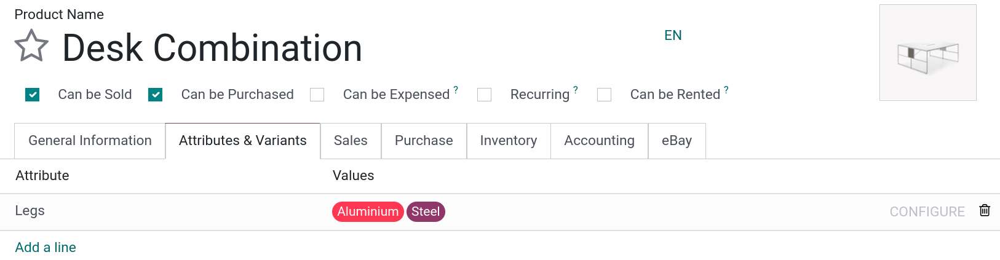

=======================
Categories and variants
=======================

Odoo's product configurator offers many possibilities to define product variants or to organize
products by category.

.. _ecommerce/categories_variants/product-variants:

Product variants
================

:doc:`Product variants </applications/sales/sales/products_prices/products/variants>` are different
versions of the same product, such as those with varying colors or materials, which may have
potential differences in price and availability.

To configure product variants for a product:

#. Go to :menuselection:`Website --> Configuration --> Settings`.
#. Scroll down to the :guilabel:`eCommerce` section and enable the
   :guilabel:`Product Variants` feature.
#. Access the :ref:`product form <ecommerce/products/product-form>`, and go to the
   :guilabel:`Attributes & Variants` tab, where you can add attributes and values, enabling
   customers to configure and select product variants on the product page. You can combine multiple
   attributes to create specific variants.

.. _ecommerce/categories_variants/attributes:

Attributes
----------

Attributes refer to the characteristics of a product, such as its color or material, whereas
variants are the different combinations of attributes. Each attribute includes a set of values.

Once your attributes are :ref:`created <products/variants/attributes>`, make sure to display them
on the shop page. To do so, configure the following settings on the attribute form:

- :guilabel:`eCommerce Filter`: Choose between :guilabel:`Visible` and :guilabel:`Hidden` to
  make it available on the shop filters section.
- :guilabel:`On Product Cards`: Choose between :guilabel:`Visible`, :guilabel:`Hidden`, and
  :guilabel:`Hover` to display attributes on the product image on the shop page when dealing with
  :guilabel:`Instantly` created variants.

When the :guilabel:`On Product cards` field is set to :guilabel:`Visible`, the :guilabel:`Show
Thumbnails` option can be toggled to show a product variant image instead of the attribute values.

.. _ecommerce/categories_variants/attribute-categories:

Attribute categories
~~~~~~~~~~~~~~~~~~~~

In the optional :guilabel:`eCommerce Category` field of the attribute form, select a category from
a drop-down menu to group similar attributes under the same section for added specificity and
organization, when :ref:`comparing products
<ecommerce/products/additional_features/product-comparison>`.

.. note::
   To view the details related to the selected attribute category, click the internal link
   :icon:`fa-arrow-right` :guilabel:`(right arrow)` icon to the far right of the
   :guilabel:`eCommerce Category` field, once an option has been selected. Doing so reveals that
   attribute category's detail form.

   .. image:: categories_variants/internal-link-attribute-category.png
      :alt: A standard attribute category detail page accessible via its internal link arrow icon.

   Here, the :guilabel:`Category Name` and :guilabel:`Sequence` are displayed at the top. Followed
   by :guilabel:`Related Attributes` associated with the category. These attributes can be
   rearranged and reordered to a desirable priority.

   Attributes can be directly added to the category by clicking :guilabel:`Add a line`.

.. tip::
   To create an attribute category directly from this field, start typing the name of the new
   category, then select either :guilabel:`Create` or :guilabel:`Create and edit...` from the
   drop-down menu that appears.

   Clicking :guilabel:`Create` creates the category, which can be modified later. Clicking
   :guilabel:`Create and edit...` creates the category and display a :guilabel:`Create eCommerce
   Category` pop-up window, in which the new attribute category can be configured and customized.

.. _ecommerce/categories_variants/categories:

Product categorization in catalog
=================================

eCommerce categories are used to organize products into groups, making it easier for customers
to browse the online store.

To create eCommerce categories, go to :menuselection:`Website --> eCommerce -->
eCommerce Categories`, and click :guilabel:`New`. On the category form, add a
:guilabel:`Name`, optionally enter a :guilabel:`Parent` category, restrict it to a specific
:guilabel:`Website`, and write a :guilabel:`Description`, if needed. You can also add a
:guilabel:`Cover Image` for the category.

To use :guilabel:`eCommerce categories`, go to :menuselection:`Website --> eCommerce --> Products`,
select the product you wish to modify, go to the :guilabel:`Sales` tab, navigate to the
:guilabel:`Ecommerce shop` section, and select the :guilabel:`Categories` it belongs to.

.. note::
   - A single product can belong to multiple eCommerce categories.
   - Define how to :doc:`display categories <catalog>` on the shop page.
   - Categories that do not contain any products are not visible on the shop page.

.. seealso::
   :doc:`../products`
