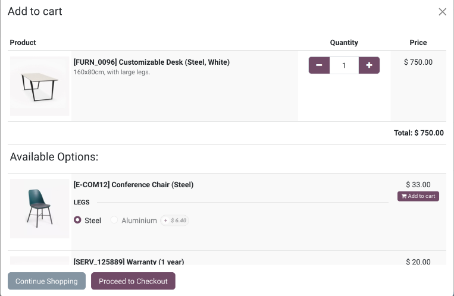
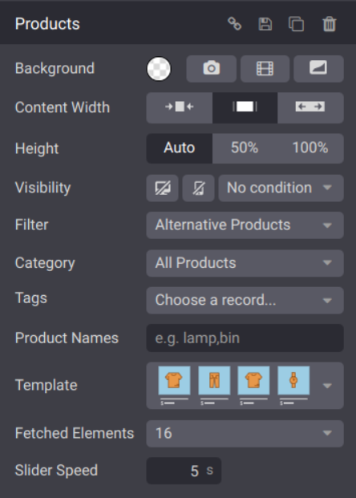

===========================
Cross-selling and upselling
===========================

Cross-selling and upselling are sales techniques designed to encourage customers to purchase
additional or higher-priced products and services from your :doc:`catalog`.

Cross-selling
=============

Cross-selling can be achieved by suggesting :ref:`optional products <cross_upselling/optional>` when
items are added to the cart or by recommending :ref:`accessory products <cross_upselling/accessory>`
on the checkout page.

.. _cross_upselling/optional:

Optional products
-----------------

**Optional products** are suggested when the customer selects a product and clicks
:guilabel:`Add to cart`.

To enable **optional products** go to :menuselection:`Website --> eCommerce --> Products`, select a
product, go to the :guilabel:`Sales` tab, and enter the products you wish to feature in the
:guilabel:`Optional Products` field.

.. _cross_upselling/accessory:

Accessory products
------------------

**Accessory products** are showcased in the :guilabel:`Suggested Accessories` section during the
:guilabel:`Review Order` step, just before proceeding to checkout.

To enable **accessory products**, go to :menuselection:`Website --> eCommerce --> Products`, select
a product, go to the :guilabel:`Sales` tab, and enter the products you wish to feature in the
:guilabel:`Accessory Products` field.

Upselling
=========

.. _cross_upselling/alternative:

Alternative products
--------------------

You can display alternative products at the bottom of the product page to encourage customers to
consider a more expensive variant or product than their initial choice.

.. image:: cross_upselling/cross_upselling-alternative.png
   :alt: Alternative products on the product page

To enable alternative products:

#. Navigate to :menuselection:`Website --> eCommerce --> Products`.
#. Select a product and go to the :guilabel:`Sales` tab.
#. In the :guilabel:`Alternative Products` field, enter the products you want to feature.
#. Click :guilabel:`Go To Website` to visit the related product page.
#. Click :guilabel:`Edit` and scroll to the :guilabel:`Dynamic Content` section.
#. Drag and drop the Products building block on the product page.
#. Click the block, go to the :guilabel:`Products` section, and select
   :guilabel:`Alternative Products` in the :guilabel:`Filter`.

You can then adjust various settings, such as :guilabel:`Template`, :guilabel:`Fetched Elements`
(number of items displayed), and :guilabel:`Slider Speed`, as needed.

