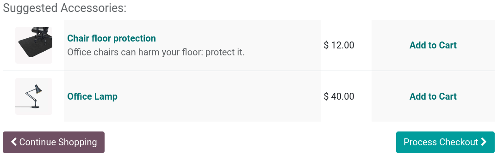
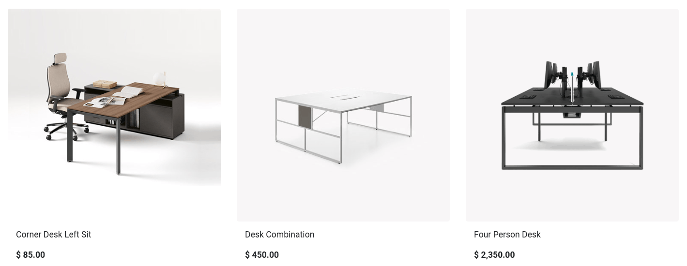

===========================
Cross-selling and upselling
===========================

Any sales process is an opportunity to maximize revenues. **Cross-selling and upselling** are sales
techniques consisting in selling customers additional or more expensive products and services than
what they were originally shopping for. It is a great way to maximize the value of each one of your
customers.

**Cross-selling** can be done via **two** features:

- :ref:`Optional products <cross_upselling/optional>` upon **adding to cart**;
- :ref:`Accessory products <cross_upselling/accessory>` on the **checkout page**.

**Upselling** is only done via :ref:`alternative products <cross_upselling/alternative>` on the
**product page**.

.. seealso::
   :doc:`catalog`

Cross-selling
=============

.. _cross_upselling/optional:

Optional products
-----------------

**Optional products** are suggested when customers click :guilabel:`Add to cart`, either from the
**product page** or **catalog page**. Upon clicking, a pop-up window opens with the
**optional products** displayed in the :guilabel:`Available Options` section.

.. image:: cross_upselling/cross_upselling-cart.png
   :align: center
   :alt: Optional products cross-selling

To enable **optional products** go to :menuselection:`Website --> eCommerce --> Products`,
select a product, go to the :guilabel:`Sales` tab, and enter the products you wish to feature in the
:guilabel:`Optional Products` field. Optional products are **linked** to the product(s) they are set
up with on the **product template**. They only appear when that product is added to the cart.

.. tip::
   You can also access the :guilabel:`Sales` tab of the **product template** by selecting a product
   on your **main shop page** and clicking :guilabel:`Product` in the top-right corner.

.. _cross_upselling/accessory:

Accessory products
------------------

**Accessory products** are displayed in the :guilabel:`Suggested Accessories` section before
processing to checkout at the :guilabel:`Review Order` step.

To enable **accessory products**, go to :menuselection:`Website --> eCommerce --> Products`, select
a product, go to the :guilabel:`Sales` tab, and enter the products you wish to feature in the
:guilabel:`Accessory Products` field. Suggested accessory products are **linked** to the product(s)
they are set up with on the **product template**. They only appear when that product is at the
checkout process review.

Upselling
=========

.. _cross_upselling/alternative:

Alternative products
--------------------

**Alternative products** are suggested on the **product page** and usually incentivize customers to
buy a more expensive variant or product than the one they were initially shopping for.

To enable **alternative products**, go to :menuselection:`Website --> eCommerce --> Products`,
select a product, go to the :guilabel:`Sales` tab, and enter the products you wish to feature in the
:guilabel:`Alternative Products` field. Then, go to the related **product page** by clicking
:guilabel:`Go To Website`, and click :menuselection:`Edit`. Stay on the :guilabel:`Blocks` tab, and
scroll down to the :guilabel:`Dynamic Content` section. Then, drag and drop the :guilabel:`Products`
building block anywhere on the **product page**.

When placed, in :guilabel:`Edit` mode, click the **block** to access various settings for that
:guilabel:`Products` building block. In the :guilabel:`Filter` field, select :guilabel:`Alternative
Products`. You can configure several additional settings, such as how many elements are displayed
(:guilabel:`Fetched Elements`), the :guilabel:`Template` used, etc.
