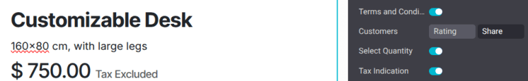

================
Price management
================

Odoo offers multiple options to select the prices displayed on a website, as well as
condition-specific prices based on set criteria.

Taxes
=====

Tax configuration
-----------------

To add a tax on a product, you can either set a tax in the :guilabel:`Customer Taxes` field of the
**product template** or use :doc:`fiscal positions
</applications/finance/accounting/taxes/fiscal_positions>`.

.. seealso::
   - :doc:`/applications/finance/accounting/taxes`
   - :doc:`/applications/finance/accounting/taxes/avatax`
   - :doc:`/applications/finance/accounting/taxes/fiscal_positions`

.. _ecommerce-price-management-tax-display:

Tax display
-----------

Choosing the displayed price tax usually depends on a country's regulations or the type of customers
**(B2B vs. B2C)**. To select the type of price displayed, go to :menuselection:`Website -->
Configuration --> Settings`, scroll down to the :guilabel:`Shop - Products` category, and select
:guilabel:`Tax Excluded` or :guilabel:`Tax Included`.

- :guilabel:`Tax Excluded`: the price displayed on the website is **tax-excluded**, and the tax is
  computed at the cart-review step;
- :guilabel:`Tax Included`: the price displayed on the website is **tax-included**.

.. note::
   This setting is website specific, and therefore can be altered for each website within a
   database.

To display the type of pricing next to the product price, navigate to :menuselection:`Website -->
Site --> Homepage --> Shop`, select a product, then click :guilabel:`Edit` and, in the
:guilabel:`Customize` tab, enable :guilabel:`Tax Indication`.

.. seealso::
   :doc:`/applications/finance/accounting/taxes/B2B_B2C`

Price per unit
==============

It is possible to display a :doc:`price per unit
<../../../inventory_and_mrp/inventory/product_management/configure/uom>` on the product page. To do
that, go to :menuselection:`Website --> Configuration --> Settings` and enable :guilabel:`Product
Reference Price` under the :guilabel:`Shop - Products` section. When enabled, ensure an amount is
set in the :guilabel:`Base Unit Count` field of the product template, and in the :guilabel:`Sales
Price` field.

.. image:: price_management/price-cost-per-unit.png
   :alt: Cost per unit pricing on the product template.

The price per unit of measure can be found above the :guilabel:`Add to Cart` button on the product
page.

.. image:: price_management/price-cost-per-unit-page.png
   :alt: Cost per unit pricing on the product page.

.. note::
   Pay attention that having the price per unit may be **mandatory** in some countries.

.. seealso::
   :doc:`../../../inventory_and_mrp/inventory/product_management/configure/uom`

.. _ecommerce/pricelists:

Pricelists
==========

Pricelists are the primary tool to manage prices on an eCommerce website. They make it possible to
define website-specific prices - different from the price on the product template - based on the
country group, currency, minimum quantity, period, or variant.

.. seealso::
   :doc:`/applications/sales/sales/products_prices/prices/pricing`

Understanding default pricelists
--------------------------------

The concept of a default pricelist in Odoo depends on the application being used. In the **Sales**
app, a customer's default pricelist is determined by their contact profile. If a pricelist is
manually assigned to a contact, the pricelist becomes their default. If no pricelist is assigned,
the default is the first pricelist listed.

In the **eCommerce** app,the default pricelist is assigned at the website level. However, it is
influenced by the user's login status and country group settings.

How pricelists are applied in eCommerce
---------------------------------------

If a portal user has a specific pricelist assigned to their contact profile, that pricelist is
applied to their purchase. However, if that pricelist is **not** assigned to the website they are
visiting, the user sees the website's default pricelist.

.. note::
   The default website pricelist is the first available pricelist assigned to a website, without the
   country group setting configured.

Public, non-logged in users, see the website's default pricelist.

If a pricelist includes a country group, Odoo checks the visitor's IP address and applies the
corresponding pricelist. If a visitor has a pricelist assigned in their contact profile, that
pricelist takes precedence over the country-based pricelist, unless the assigned pricelist has a
different country group.

.. example::
   A customer from the United States visits the website. They do not have a portal account. The
   :guilabel:`United States` pricelist is applied.

   A different visitor, also from the United States, has the :guilabel:`Loyal Customer Discount`
   pricelist assigned in their contact record. This assignment takes precedence over the country
   group assignation, so the :guilabel:`Loyal Customer Discount` is applied.

   .. image:: price_management/pricelists-example.png
      :alt: An example of various pricelists assigned to a website.

Pricelist configuration
-----------------------

To activate pricelists, navigate to :menuselection:`Website --> Configuration --> Settings`, scroll
down to the :guilabel:`Shop - Products` section, enable the :guilabel:`Pricelist` feature, then
click :guilabel:`Save`. Once pricelists have been activated, go to :menuselection:`Website -->
eCommerce --> Pricelists` to configure them.

Preventing sales if price is zero
~~~~~~~~~~~~~~~~~~~~~~~~~~~~~~~~~

The :guilabel:`Prevent Sale of Zero Priced Product` feature prevents customers from purchasing a
product if the sales price is listed as `0`. When this feature is enabled, instead of seeing
:guilabel:`Add to Cart` when attempting to purchase a product, they see :guilabel:`Contact Us`. This
feature is useful for companies that want to hide the prices of their products.

To utilize this feature, first navigate to :menuselection:`Website --> Configuration --> Settings`
and tick the :guilabel:`Prevent Sale of Zero Priced Product` checkbox, then click :guilabel:`Save`.

Next, create a pricelist that sets all product prices to `0`. Ensure the pricelist is assigned to
the correct website and is listed first among the website's pricelists.

Selectable pricelists
~~~~~~~~~~~~~~~~~~~~~

*Selectable pricelists* appear in the shop page's pricelist drop-down menu. When a pricelist is
designated as :guilabel:`Selectable`, it allows the customer to choose between available pricelists.

.. important::
   If a pricelist is designated as :guilabel:`Selectable`, and is not assigned to a specific
   website, then the pricelist is selectable on **all** websites.

If a pricelist is designated as :guilabel:`Selectable`, it appears in the drop-down menu next to the
search bar. However, if a pricelist does *not* appear in the drop-down menu, it may be for one of
the following reasons:

- If there is only one selectable pricelist, and the contact is assigned a pricelist, the drop-down
  may not appear.
- If multiple selectable pricelists exist and match a visitor's country group, only those pricelists
  are shown in the drop-down.

Foreign currency
----------------

If you are selling in **multiple currencies** and have pricelists in foreign currencies, customers
can select their corresponding pricelist anywhere on the :guilabel:`Shop` page from the drop-down
menu next to the search bar.

.. image:: price_management/price-pricelists.png
   :alt: Pricelists selection.

.. seealso::
   - :doc:`/applications/sales/sales/products_prices/prices/pricing`
   - :doc:`/applications/sales/sales/products_prices/prices/currencies`

Permanent discount
==================

If you have permanently reduced the price of a product, a popular means to attract customers is the
**strikethrough** strategy. The strategy consists in displaying the previous price crossed out and
the **new discounted price** next to it.

To display a 'striked' price, enable the :guilabel:`Comparison Price` option under
:menuselection:`Website --> Configuration --> Settings --> Shop - Products category`. Then, head to
the product's template (:menuselection:`Website --> eCommerce --> Products`), and in the
:guilabel:`Compare to Price` field, enter the **new** price.

.. note::
   If a pricelist contains a :ref:`Discount <sales/products/price-rules>` price type, the striked
   price is visible to applicable customers. This is true even if the :guilabel:`Comparison Price`
   feature has not been enabled.
