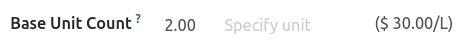
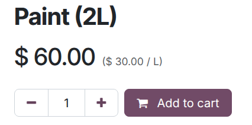
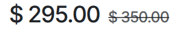

======
Prices
======

Odoo offers multiple options to configure prices on the eCommerce. Use diffrent :ref:`prices per
unit <ecommerce/prices/price-per-unit>` and :ref:`discounts <ecommerce/prices/permanent-discounts>`.
Set up :ref:`pricelists <ecommerce/pricelists>` to apply :ref:`B2B/B2C prices
<ecommerce/prices/b2b-b2c-pricelists>` and :ref:`GeoIP-based <ecommerce/prices/geoip>` prices.

.. _ecommerce/prices/price-per-unit:

Price per unit
==============

To display a :doc:`price per unit
<../../../inventory_and_mrp/inventory/product_management/configure/uom>` on the product page, go to
:menuselection:`Website --> Configuration --> Settings`, scroll to the :guilabel:`Shop - Products`
section, and enable :guilabel:`Product Reference Price`. Navigate to the product form, set an amount
in the :guilabel:`Base Unit Count` and :guilabel:`Sales Price` fields.

The price per unit of measure can be found next to the sales prices on the product page.

.. note::
   Keep in mind that the price per unit may be mandatory in some countries.

.. seealso::
   :doc:`../../../inventory_and_mrp/inventory/product_management/configure/uom`

.. _ecommerce/prices/permanent-discounts:

Permanent product discount
==========================

If the price of a specific product has been permanently reduced, the strikethrough strategy is
commonly used. This involves showing the original price crossed out, with the new discounted price
displayed alongside it.

To display a discounted price, navigate to :menuselection:`Website --> Configuration --> Settings
--> Shop - Products`, and enable the :guilabel:`Comparison Price` option. Then, go to
the product form, and in the :guilabel:`Compare to Price` field, enter the new price.

.. note::
   If a :ref:`pricelist <ecommerce/pricelists>` contains a :ref:`Discount
   <sales/products/price-rules>` price type, the striked price is visible to applicable customers,
   even if the :guilabel:`Comparison Price` feature has not been enabled.

.. important::
   The :guilabel:`Comparison Price` will not be displayed if pricelists apply.

.. _ecommerce/pricelists:

Pricelists
==========

Once the :ref:`pricelist <sales/products/pricelist-configuration>` is enabled in the Sales app,
pricelists are also available in the eCommerce app, and vice versa. However, there are additional
options to define eCommerce-specific prices, based on the :ref:`customer's location
<ecommerce/prices/geoip>` and their currency, and/or according to :ref:`B2B and B2C businesses
<ecommerce/prices/b2b-b2c-pricelists>`.

.. tip::
   Pricelists can be assigned to a specific website, a :ref:`country group
   <ecommerce/prices/country-groups>` or a specific :ref:`contact
   <essentials/contacts/sales-section>`.

To configure the eCommerce-specific prices of a pricelist, go to :menuselection:`Website -->
eCommerce --> Pricelists`, select a pricelist, and navigate to the :guilabel:`Ecommerce` tab.
If needed, assign a :guilabel:`Website`, tick the :ref:`Selectable
<ecommerce/prices/selectable-pricelists>` checkbox and/or add an
:ref:`E-commerce Promotional Code <ecommerce/prices/promotional-code>`.

.. note::
   Prices can also vary depending on :ref:`variants <ecommerce/products/product-variants>` and
   :ref:`loyalty programs <sales/products/loyalty-programs>`.

.. seealso::
   :doc:`/applications/sales/sales/products_prices/prices/pricing`

.. _ecommerce/prices/selectable-pricelists:

Selectable pricelists
---------------------

Selectable pricelists appear in the shop page's pricelist drop-down menu. To allow customers to
choose this pricelist while shopping, tick the :guilabel:Selectable checkbox. If
the :guilabel:`Selectable` box is left unticked, customers will not be able select this pricelist on
their own.

.. tip::
   Use selectable pricelists if you are selling in multiple currencies to let customers choose
   their corresponding pricelist from the drop-down menu.

.. note::
   If a pricelist is designated as :guilabel:`Selectable`, and is not assigned to a specific
   website, then the pricelist is selectable on **all** websites.

Website visitors can find the pricelist drop-down menu next to the :ref:`search bar
<ecommerce/catalog/top-bar>`. However, if a pricelist does *not* appear in the drop-down menu, it
may be for one of the following reasons:

- If there is only one selectable pricelist, and the contact is assigned a pricelist, the drop-down
  may not appear.
- If multiple selectable pricelists exist and match a visitor's :ref:`country group
  <ecommerce/prices/country-groups>`, only those pricelists are shown in the drop-down.

.. important::
   Never use the :guilabel:`Selectable` feature when you intend to :ref:`hide prices
   <ecommerce/prices/b2b-b2c-pricelists>` on the website in any case, regardless of whether
   :ref:`GeoIP <ecommerce/prices/geoip>` is enabled. The selectable features is available for both,
   logged-in users with portal access and public visitors.

   .. seealso::
      :doc:`/applications/sales/sales/products_prices/prices/currencies`

.. _ecommerce/prices/promotional-code:

E-commerce promotional code
---------------------------

In the :guilabel:`Ecommerce` tab of the pricelist form, there is the option to add an
:guilabel:`E-commerce Promotional Code`. To add a code, enter the desired promo code. When inserted
during the checkout process, this code will apply the pricelist to the customer, even if they do not
does not fall into the previously-specified criteria.

.. seealso::
   - :doc:`/applications/sales/sales/products_prices/ewallets_giftcards`
   - :doc:`/applications/sales/sales/products_prices/loyalty_discount`

.. _ecommerce/prices/geoip:

GeoIP & country groups
----------------------

It is possible to display a pricelist based on the visitor's location and IP address. To do so,
use :ref:`country groups <ecommerce/prices/country-groups>`.

.. important::
   When using GeoIP to determine the appropriate pricelist, **all** pricelists on the website must
   have a country group assigned.

On the :guilabel:`Pricelist` form, add a :guilabel:`Country group`. For instance, if you wish to
apply a specific pricelist for the `Eurpean Union`, add the corresponding country group here, and
all EU member states will be included. Add as many priclistes for sepcific regions as needed.

.. _ecommerce/prices/country-groups:

Country groups
~~~~~~~~~~~~~~
Create a new country group by clicking :guilabel:`Search more` and then :guilabel:`New`. Add
a :guilabel:`Group Name` and select the :guilabel:`Countries` you need. Use :ref:`Custom filters
<search/custom-filters>`, if needed.

.. example::
   Use the following filter if you want to add all non-EU countries to the group.

   :guilabel:`Country Group` :guilabel:`is not in` :guilabel:`European Union`

   .. image:: prices/prices-country-group
      :alt: Filter for country group creation.

A country group must as least contain one country.

You can assign a country group to a website or a contact, or both. And it is used for GeoIP
localization of website visitors.

.. note::
   When using the pricelist based on GeoIP, selectable pricelist will not show up anymore.

Pricelist application
---------------------

In the eCommerce,the *default* pricelist is automatically selected for public, non-logged in users,
without any country group assigned. However, if you are using GeoIP and country groups for public
users or assigned pricelists for logged-in users, the pricelist of the respective country group or
user is used by default.

If a portal user has a specific pricelist assigned to their contact profile, that pricelist is
applied to their purchase. However, if that pricelist is **not** assigned to the website they are
visiting, the user sees the website's default pricelist.

.. note::
   The default website pricelist is the first available pricelist assigned to a website, without the
   country group setting configured.

If a pricelist includes a country group, Odoo checks the visitor's IP address and applies the
corresponding pricelist. If a visitor has a pricelist assigned in their contact profile, that
pricelist takes precedence over the country-based pricelist, unless the assigned pricelist has a
different country group.

.. example::
   A customer from the United States visits the website. They do not have a portal account. The
   :guilabel:`United States` pricelist is applied.

   A different visitor, also from the United States, has the :guilabel:`Loyal Customer Discount`
   pricelist assigned in their contact record. This assignment takes precedence over the country
   group assignation, so the :guilabel:`Loyal Customer Discount` is applied.

   .. image:: prices/pricelists-example.png
      :alt: An example of various pricelists assigned to a website.

.. _ecommerce/prices/b2b-b2c-pricelists:

B2B and B2C pricelists
----------------------

B2B businesses often prefer to showscase their products online without displaying their
prices. To do so, they have to use the :ref:`Prevent Sale of Zero Priced Product
<ecommerce/checkout/prevent-sale>` feature.

After enabling this feature, create a pricelist that sets all product prices to `0`. Ensure the
pricelist is assigned to the correct website and is listed first among the website's pricelists.

.. important::
   To make sure that only customers with an account and granted access can see the prices, go to the
   Contacts app, click the top search bar, and select the :guilabel:`Archived` filter. Click
   the *public user*, go to the :guilabel:`Sales & Purchase` tab, and add the *zero priced
   pricelist* that has a country groups assigned that contains all countries. The public user
   **always** has to stay :guilabel:`Archived`.

Vistitors can now only see the products without prices, and only customers with an account
invitation and a pricelist assignation can access the prices in the portal.

.. tip::
   If you are running a B2B and B2C business, we recommend to create two :doc:`separate websites
   </../../website/configuration/multi_website>` and assign a zero-priced pricelist to the B2B
   website and a general pricelist to the B2C website. In case, you prefer using a single
   website, configure it using :ref:`country groups <ecommerce/prices/country-groups>` and assigning
   pricelists to customers, and deactivate the :ref:`Selectable
   <ecommerce/prices/selectable-pricelists>` option.

.. seealso::
   :doc:`../../../customer_accounts`

.. _ecommerce/prices/tax-display:

Tax display
~~~~~~~~~~~

Choosing the displayed price tax usually depends on a country's regulations or the type of customers
(B2B vs. B2C). To select the type of price displayed, go to :menuselection:`Website -->
Configuration --> Settings`, select the website, scroll down to the
:guilabel:`Shop - Products` section, and under :guilabel:`Display Product Prices` select between:

- :guilabel:`Tax Excluded`: the price displayed on the website is tax-excluded, and the tax is
  computed at the cart-review step;
- :guilabel:`Tax Included`: the price displayed on the website is tax-included.

.. note::
   This setting is website specific, and therefore can be altered for each website within a
   database.

.. tip::
   Use the :ref:`Tax indication <ecommerce/products/product-presentation>` toggle to explictly
   indicate if the price is `Tax excluded` or `Tax included`.

   .. seealso::
      - :doc:`/applications/finance/accounting/taxes/B2B_B2C`
      - :doc:`/applications/finance/accounting/taxes`
      - :doc:`/applications/finance/accounting/taxes/avatax`
      - :doc:`/applications/finance/accounting/taxes/fiscal_positions`
