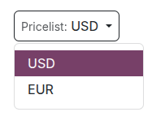

======
Prices
======

Odoo offers multiple options to configure prices on the ecommerce. For example, you can apply
:ref:`prices per unit <ecommerce/prices/price-per-unit>`, offer :ref:`discounts
<ecommerce/prices/discounts>`, and set up :ref:`pricelists <ecommerce/prices/pricelists>`.

.. _ecommerce/prices/taxes:

Taxes
=====

To add a tax on a product, you can either set a tax in the :guilabel:`Customer Taxes` field of the
**product template** or use :doc:`fiscal positions
</applications/finance/accounting/taxes/fiscal_positions>`.

.. seealso::
   - :doc:`/applications/finance/accounting/taxes`
   - :doc:`/applications/finance/accounting/taxes/avatax`

.. _ecommerce-price-management-tax-display:

Choosing the displayed price tax usually depends on a country's regulations or the type of customers
(:doc:`B2B vs. B2C <../b2b_b2c>`). To select the type of price displayed, go to
:menuselection:`Website --> Configuration --> Settings`, select the website, scroll down to the
:guilabel:`Shop - Products` section, and under :guilabel:`Display Product Prices` select between:

- :guilabel:`Tax Excluded`: the price displayed on the website is tax-excluded, and the tax is
  computed at the :ref:`order review <ecommerce/checkout/review_order>` step;
- :guilabel:`Tax Included`: the price displayed on the website is tax-included.

.. note::
   This setting is website-specific and can therefore be configured independently for every
   website in the database.

.. tip::
   - Switch the :ref:`Tax indication <ecommerce/products/product-presentation>` toggle on in the
     website editor to explicitly indicate if the price is `Tax excluded` or `Tax included` on the
     product page.
   - Enable specific :ref:`B2B fields <ecommerce/b2b_b2c/b2b-fields>` in the :ref:`delivery step
     <ecommerce/checkout/delivery>` during the checkout using the :doc:`website editor
     </applications/websites/website/web_design>`.

.. _ecommerce/prices/price-per-unit:

Price per unit
==============

To display a :doc:`price per unit
</applications/inventory_and_mrp/inventory/product_management/configure/uom>` alongside the sales
price on the product page, follow these steps:

#. Go to :menuselection:`Website --> Configuration --> Settings`, scroll to the
   :guilabel:`Shop - Products` section, and enable :guilabel:`Product Reference Price`.
#. :ref:`Navigate to the product form <ecommerce/products/create-products>`.
#. Set the product's :guilabel:`Sales price` and select the unit (e.g., :guilabel:`Units`).
#. In the :guilabel:`Base Unit Count` field, enter the number of units in the product, then
   select the relevant unit from the dropdown list.

.. example::
   Imagine you want to sell a 2-liter bucket of paint for $60, i.e., $30 per liter.

   .. image:: prices/prices-per-unit.png
      :alt: Cost per unit pricing on the product form.

   The price per units, in this case per liter, is shown next to the sales price on the
   product page.

   .. image:: prices/price-cost-per-unit-page.png
      :alt: Unit pricing on the product page.

.. note::
   The price per unit may be mandatory in some countries.

.. seealso::
   :doc:`/applications/inventory_and_mrp/inventory/product_management/configure/uom`

.. _ecommerce/prices/pricelists:

Pricelists
==========

Pricelists in Odoo allow to manage flexible pricing rules and to offer different prices and
discounts based on currencies, time periods, purchase volumes, :ref:`customers' location
<ecommerce/prices/geoip>`, and/or customer type.
To enable pricelists for eCommerce, go to :menuselection:`Website --> Configuration --> Settings`,
scroll down to the :guilabel:`Shop - Products` section, enable :guilabel:`Pricelists`, and
:guilabel:`Save`. Then, click :guilabel:`Pricelists` or go to :menuselection:`Website --> eCommerce
--> Pricelists` and :ref:`configure <sales/products/pricelist-configuration>` the relevant
pricelists.

In the :guilabel:`Ecommerce` tab, configure options specific to online sales, such as assigning a
:guilabel:`Website` to a pricelist, allowing customers to :ref:`select it
<ecommerce/prices/selectable-pricelists>`, and/or adding an :ref:`E-commerce Promotional Code
<ecommerce/prices/promotional-code>`.

.. tip::
   - If you are using several websites and you want to use the same pricelist on several of them,
     you need to duplicate the pricelist for each website. If you do not assign any
     website, the pricelist will not be used, unless it is :ref:`selectable
     <ecommerce/prices/selectable-pricelists>`.
   - Pricelists can also be :ref:`assigned to a specific customer
     <sales/products/customer-pricelist-application>`.

.. note::
   - When pricelists are enabled in the Sales app, they are automatically enabled in the eCommerce
     app, and vice versa.
   - In the list of pricelists, order the pricelists by priority: the first takes
     precedence over the second, the second over the third, and so on.
   - It is also possible to create specific pricelists for :ref:`variants
     <products/variants/configure-variants>`.

.. seealso::
   :doc:`/applications/sales/sales/products_prices/prices/pricing`

.. _ecommerce/prices/selectable-pricelists:

Selectable pricelists
---------------------

Selectable pricelists are useful, for example, when selling products in :doc:`multiple currencies
</applications/sales/sales/products_prices/prices/currencies>` and allow customers to
choose a pricelist using the catalog's pricelist selector located next to the :ref:`search bar
<ecommerce/catalog/top-bar>`.

To make a pricelist selectable, enable :guilabel:`Selectable`.

.. note::
   - If a pricelist is designated as :guilabel:`Selectable`, and is not assigned to a specific
     website, then the pricelist is selectable on **all** websites.
   - If a pricelist does *not* appear in the selector, it may be due to the following situations:

      - Only one pricelist is defined as :guilabel:`Selectable` and the :ref:`contact has a
        pricelist assigned <sales/products/customer-pricelist-application>`.
      - Multiple selectable pricelists exist, but only those matching the customer's :ref:`country
        group <ecommerce/prices/country-groups>` are shown. It is strongly recommended to disable
        the :guilabel:`Selectable` option when using pricelists with country groups on the
        ecommerce.

.. seealso::
   :ref:`sales/products/currencies/currency-specific-pricelists`

.. _ecommerce/prices/geoip:

GeoIP & country groups
----------------------

It is possible to display a specific pricelist based on the visitor's location and IP address by
assigning :ref:`country groups <ecommerce/prices/country-groups>` to pricelists.

.. _ecommerce/prices/country-groups:

To do so, :ref:`navigate to the relevant pricelist form <ecommerce/prices/pricelists>` and select
the appropriate :guilabel:`Country Groups`. Create or edit as many pricelists for specific regions
as needed. For instance, select :guilabel:`European Union` to apply the pricelist to all EU member
states.

To create a new country group, click :guilabel:`Search more` in the dropdown list, then
:guilabel:`New`. Add a :guilabel:`Group Name` and select the relevant :guilabel:`Countries`.
Use :ref:`Custom filters <search/custom-filters>` if needed.

.. note::
   Each country group must contain at least one country.

.. example::
   Use the following filter if you want to add all non-EU countries to the country group.

   `Country Group` + `is not in` + `European Union`

   .. image:: prices/pricelist-country-groups.png
      :alt: Filter for country group creation.

.. important::
   - When using GeoIP to determine the appropriate pricelist, **all** pricelists used on the
     ecommerce must have a country group assigned.
   - It is strongly recommended to disable the :guilabel:`Selectable` option when using pricelists
     with country groups. Indeed, all pricelists with the relevant country group are automatically
     applied to the catalog but if one of them is marked as :ref:`Selectable
     <ecommerce/prices/selectable-pricelists>`, the others will disappear as soon as customers
     select the selectable pricelist.

     .. example::
        Imagine you create three pricelists:

          - `EU regular prices` with the `EU` country group assigned
          - `EU prices with discounts` with the `EU` country group assigned
          - `US prices` with the `US` country group assigned

        If the :guilabel:`Selectable` option is enabled for `EU regular prices` and
        `US prices`, and the customer is from the European Union, only the pricelists
        `EU regular prices` and `EU prices with discounts` will be available. However, since the
        `EU prices with discount` list is not selectable, it will disappear once the customer selects
        the `EU regular prices` list and prices will be displayed based on the `EU regular prices`
        pricelist on the catalog.

Pricelist application
---------------------

On the ecommerce, the *default* pricelist is automatically selected for public, non-logged in users
when no country group is assigned. If :ref:`GeoIP and country groups <ecommerce/prices/geoip>` are
used, public users see the pricelist of their country group by default. Logged-in users with
:ref:`assigned pricelists <sales/products/customer-pricelist-application>` see the assigned
pricelist by default **if it is assigned to the website** they are visiting. If not, the website's
default pricelist is applied (i.e., the first available pricelist assigned to the website and
without a country group, following the sequence order).

Assigned pricelists take precedence over country-based pricelists, when applicable, unless the
assigned pricelist is linked to a different country group.

.. example::
   A customer from the United States visits the website. They do not have a portal account. The
   :guilabel:`United States` pricelist is applied.

   A different visitor, also from the United States, has the :guilabel:`Loyal Customer Discount`
   pricelist assigned in their contact form. This assignment takes precedence over the country
   group assignation, so the :guilabel:`Loyal Customer Discount` is applied.

   .. image:: prices/pricelists-example.png
      :alt: An example of various pricelists assigned to a website.

.. _ecommerce/prices/discounts:

Discounts
=========

Discounts programs
------------------

To enable :doc:`discount programs </applications/sales/sales/products_prices/loyalty_discount>`
for your ecommerce, go to :menuselection:`Website --> Configuration --> Settings`, scroll
down to the :guilabel:`Shop - Products` section, and enable the :guilabel:`Discounts, Loyalty & Gift
Card` feature.

:ref:`Configure <sales/products/loyalty-programs>` the discount program, make sure the
:guilabel:`Website` option is enabled, and add the relevant :ref:`Pricelist
<ecommerce/prices/pricelists>` and :guilabel:`Website` on the program form, if needed.

.. _ecommerce/prices/permanent-discounts:

Permanent product discount
--------------------------

If the price of a specific product has been permanently reduced, the strikethrough strategy is
commonly used. This involves showing the new discounted price, with the original price crossed out
alongside it.

.. image:: prices/price-strikethrough.png
   :alt: Price strikethrough.

To display a permanently discounted price, navigate to :menuselection:`Website --> Configuration
--> Settings`, scroll down to the :guilabel:`Shop - Products`, enable the :guilabel:`Comparison
Price` option, and :guilabel:`Save`. Then, :ref:`go to the product form
<ecommerce/products/create-products>`, enter the new (discounted) price in the
:guilabel:`Sales Price` field and the original one (strikethrough) in the
:guilabel:`Compare to Price` field.

.. note::
   The :guilabel:`Compare to Price` field must contain a price that is higher than the
   :guilabel:`Sales Price` for the original price to appear with a strikethrough.

.. important::
   The :guilabel:`Compare to Price` is not displayed if discounted pricelists apply. If you want to
   use the :guilabel:`Compare to price` with another discount, configure a pricelist with a
   :ref:`promotional code <ecommerce/prices/promotional-code>`.

Discounted pricelists
---------------------

It is also possible to create :ref:`pricelists with discounts <sales/products/price-rules>`.
To do so, :ref:`create a pricelist <sales/products/pricelist-configuration>` and
:ref:`configure the discount <sales/products/price-rules>`.

If a :ref:`pricelist <ecommerce/prices/pricelists>` contains a :ref:`Discount
<sales/products/price-rules>` price type, the price is striked through for applicable customers,
even if the :ref:`Comparison Price <ecommerce/prices/permanent-discounts>` feature has not been
enabled.

.. note::
  If using pricelists with :ref:`country groups <ecommerce/prices/geoip>`, the discounted pricelist
  must be assigned the same country group as the one used for the non-discounted pricelist.

.. _ecommerce/prices/promotional-code:

E-commerce promotional code
---------------------------

To offer a discounted pricelist for customers with a specific discount code, access the relevant
:ref:`pricelist form <ecommerce/prices/pricelists>`, go to the :guilabel:`Ecommerce` tab, and add
an :guilabel:`E-commerce Promotional Code`, e.g., `SUMMERSALE10%`. Then, go to the :guilabel:`Price
Rules` tab, click :guilabel:`Add a line`, and :ref:`configure the discount
<sales/products/price-rules>`. When a customer inserts the code during the :ref:`checkout process
<ecommerce/checkout/review_order>`, this discount is granted according to the :guilabel:`Price
Rules` configuration.

.. note::
   Make sure that the :ref:`Promo Code <ecommerce/checkout/review_order>` option
   in the website editor is enabled and, if using :ref:`country groups
   <ecommerce/prices/country-groups>`, that the discounted pricelist has the same country group
   assigned as the non-discounted pricelist.

.. _ecommerce/prices/hide-prices:

Hide prices
===========

Some businesses, such as :ref:`B2B shops <ecommerce/b2b_b2c/prices>` or companies that sell luxury
or custom items, often prefer to showcase their products online without displaying their prices.

To hide product prices on the ecommerce, go to :menuselection:`Website --> Configuration -->
Settings`, enable :guilabel:`Prevent Sale of Zero Priced Product` in the :guilabel:`Shop -
Products` section, and enter a redirect URL in the :guilabel:`Button URL` field. The
:guilabel:`Add to Cart` button on the product page is then replaced by a :guilabel:`Contact us`
button, which can be :ref:`customized <ecommerce/checkout/prevent-sale>` if needed.

After enabling this feature, either set the price to `0` for all desired products or create a
:ref:`pricelist <ecommerce/prices/pricelists>` with all product prices set to `0`. Ensure the
pricelist is assigned to the correct website and is listed first among the website's pricelists.

.. tip::
   - Ensure no pricelist used on the ecommerce has been marked as :guilabel:`Selectable` to prevent
     accidentally displaying the zero-priced pricelist.
   - To hide prices from public visitors while keeping them visible to logged-in customers, create a
     zero-priced pricelist to be used for non-logged-in customers and :ref:`assign
     <sales/products/customer-pricelist-application>` a regular pricelist (with actual prices) to
     customers with :ref:`portal access <portal/access>`.

.. seealso::
   :doc:`../customer_accounts`
