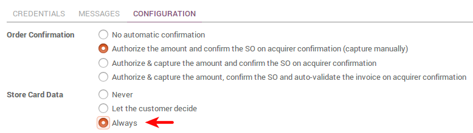

======================================
How to get paid with payment acquirers
======================================

Odoo embeds several payment methods to get paid on eCommerce, Sales 
and Invoicing apps.

What are the payment methods available
======================================

Wire transfer
-------------

Wire Transfer is the default payment method available. The aim is providing your
customers with your bank details so they can pay on their own via their bank.
This is very easy to start with but slow and inefficient process-wise. 
Opt for online acquirers as soon as you can!

Payment acquirers
-----------------

Redirect your customers to payment platforms to collect money effortless
and track the payment status (call-back).
Odoo supports more and more platforms over time: 

* `Paypal <paypal.html>`__
* Ingenico
* Authorize.net
* Adyen
* Buckaroo
* PayUmoney
* Sips
* Stripe

How to go live
==============

Once the payment method ready, make it visible in the payment interface 
and activate the **Production** mode.

.. image:: media/paypal_live.png
    :align: center

How to let customers save and reuse credit cards
================================================
To ease the payment of returning customers, you can let them
save and reuse a credit card if they want to.
If so, a payment token will be saved in Odoo.
This option is available with Ingenico and Authorize.net.

You can turn this on from the acquirer configuration form.

.. image:: media/payment_save_card.png
    :align: center

How to debit credit cards to pay subscriptions
==============================================
`Odoo Subscription <https://www.odoo.com/page/subscriptions>`__ allows to
bill services automatically on a recurring basis.
Along with it, you can have an automatic debit of the customer's credit card.

This option is available with Ingenico and Authorize.net.

You can turn this on from the acquirer configuration form.

That way a payment token will be recorded when the customer
goes for the subscription and an automatic debit will occur
whenever an invoice is issued from the subscription.

How to use other acquirers (advanced)
=====================================

Odoo can submit single payment requests and redirect to any payment acquirer.
But there is no call-back, i.e. Odoo doesn't track the transaction status.
So you will confirm orders manually once you get paid.

How to:

* Switch to developer mode.

* Take the **Custom** payment method.

* Set up the payment form (S2S Form Template) as instructed by your payment acquirer. 
  You can start from *default_acquirer_button* that you can duplicate.

Other configurations
====================

Odoo can also be used for more advanced payment processes
like installment plans (e.g. 
`Paypal Installment Plans <https://developer.paypal.com/docs/classic/paypal-payments-standard/integration-guide/installment_buttons>`__).

Such a customization service is made on-demand by our technical experts
based on your own requirements. A business advisor can reach you out for
such matter. `Contact us. <https://www.odoo.com/page/contactus>`__

.. seealso::

  * :doc:`paypal`
  * :doc:`wire_transfer`
  * :doc:`payment_acquirer`