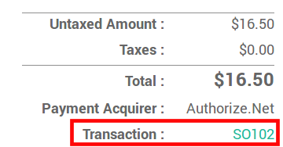
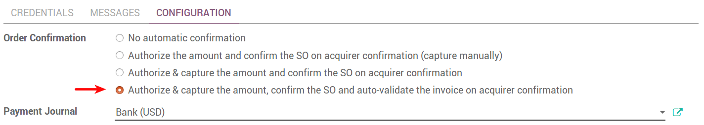
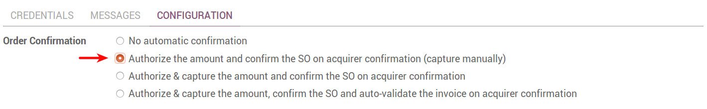
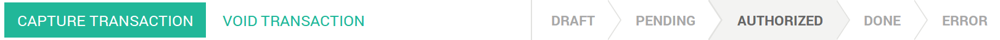

===================================================
How to manage orders paid with payment acquirers
===================================================

Odoo confirms orders automatically as soon as the payment is authorized 
by a payment acquirer. This triggers the delivery.
If you invoice based on ordered quantities,
you are also requested to invoice the order.

What are the payment status
===========================
At anytime, the salesman can check the transaction status from the order.

* *Draft*: transaction under processing.

* *Pending*: the payment acquirer keeps the transaction on hold and you 
  need to authorize it from the acquirer interface.

* *Authorized*: the payment has been authorized but not yet captured.
  In Odoo, the order is already confirmed. Once the delivery done, you
  can capture the amount from the acquirer interface (or from Odoo if you use
  Authorize.net).

* *Done*: the payment is authorized and captured. The order has been confirmed.

* *Error*: an error has occured during the transaction. 
  The customer needs to retry the payment.
  The order is still in draft.

* *Cancelled*: when the customer cancels the payment in the payment acquirer form.
  They are taken back to Odoo in order to modify the order.

.. note:: Specific messages are provided to your customers for every
   payment status, when they are redirected to Odoo after the transaction.
   To edit such messages, go to the *Messages* tab of the payment
   method.

Auto-validate invoices at order
===============================

When the order is confirmed you can also have an invoice automatically issued
and paid. This fully-automated made for businesses that invoice 
orders straight on.

.. note:: If you choose this mode you are requested to select a payment journal
  in order to record payments in your books. 
  This payment is automatically reconcilied with the invoice, marking it as paid.
  Select your **bank account** if you get paid immediately on your bank account. 
  If you don't you can create a specific journal for the payment acquirer 
  (type = Bank). That way, you can track online payments in an intermediary 
  account of your books until you get paid into your bank account 
  (see `How to register credit card payments <../../accounting/receivables/customer_payments/credit_cards.html>`__).

Capture the payment after the delivery
======================================
With this mode, the order is confirmed but the amount is kept on hold. 
Once the delivery processed, you can capture the payment from Odoo.
This mode is only available with Authorize.net.

To capture the payment, open the transaction from the order.
Then click *Capture Transaction*.

With other payment acquirers, you can manage the capture in
their own interfaces, not from Odoo.