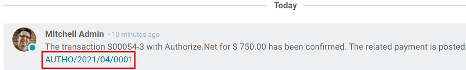
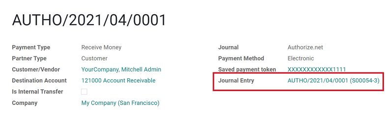
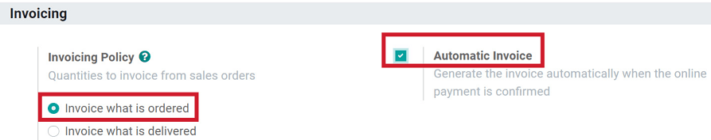

=========================================
Manage orders paid with Payment Providers
=========================================

The moment a payment is officially authorized by a Payment Provider, Odoo *automatically* confirms
the order, which triggers the delivery. And, if you invoice based on ordered quantities, you are
requested to invoice the order, as well.

Let’s take a closer look at how to manage orders paid with Payment Providers.

Checking the status of a payment
================================

To check the status of a payment, go to :menuselection:`Website --> Orders --> Orders`. Then, simply
click on the order you wish to check on.

Once you are on the Sales Order page, you will find the payment is confirmed with an automatic note
in the *Chatter*.

If the user decides to create an invoice, the payment is directly reconciled. This note in
the *Chatter* includes a link to the Payment entry, which contains various details about the
transaction, along with a link to the related Journal Entry.

.. note:: Specific messages are provided to your customers for every
   payment status whenever they are redirected to Odoo after the transaction.
   To edit these messages, go to the *Messages* tab of the payment
   method.

Automatically generate invoices at order
========================================

When the order is confirmed, you can also choose to have an invoice automatically issued
and paid. This fully-automated feature is designed for businesses that invoice
orders right away.

To do automatically generate invoices at order:
  - Go to :menuselection:`Website --> Configuration --> Settings --> Invoicing`.
  - Then, under the **Invoicing Policy** option, select *Invoice what is ordered*.
  - Then activate *Automatic Invoices* and *Save*.

Capture payment after the delivery
==================================

If the provider handling the payment is configured to capture amounts manually, the order is
confirmed, but the amount is kept on hold. Once the delivery is processed, you can capture the
payment from the related Sales Order.

.. seealso::
   - :doc:`../../../finance/payment_providers`
   - :ref:`Payment Providers: Place a hold on a card <payment_providers/features/manual_capture>`
