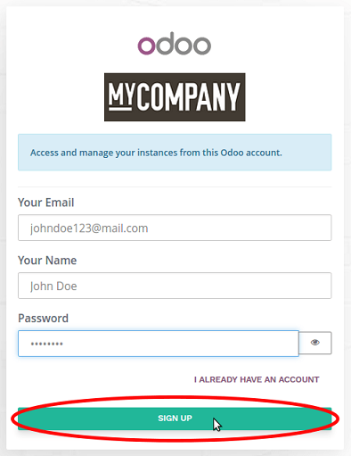
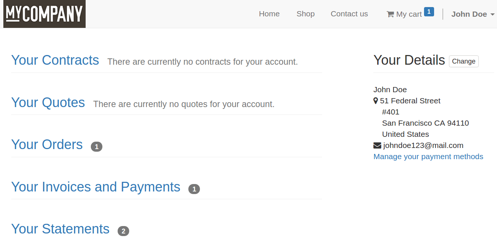

=================================================
How customers can access their customer account
=================================================

It has never been so easy for your customers to access their
customer account. Forget endless signup forms,
Odoo makes it as easy as ABC.
They are suggested to sign up (name, email, password) when the order
is placed, and not before.
Indeed, nothing is more annoying than going through a signup process
before buying something.

Sign up
=======

The invitation to sign up shows up when the customer wants to visualize
the order from order confirmation email.

Customer account
================

Once logged in the customer will access the account by clicking *My Account*
in the login dropdown menu.

.. image:: portal/portal_link.png
   :align: center

THere they find all their history. The main address (billing) can also be modified.

.. note::
    If the customer is set as a contact of a company in your address book,
    they will see all the documents whose the customer belongs to this company.
