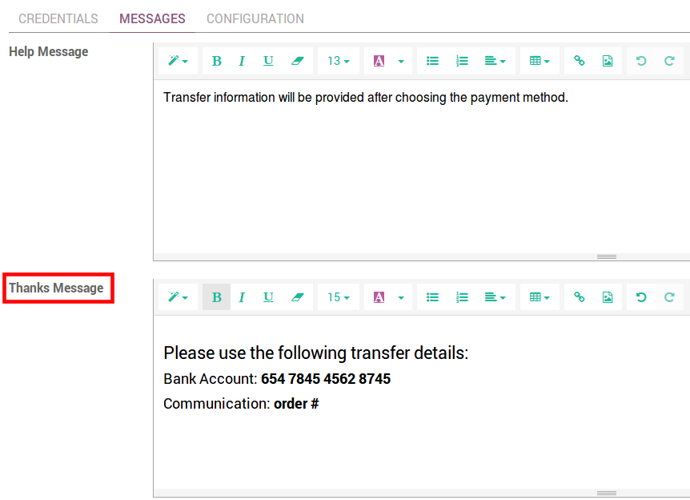
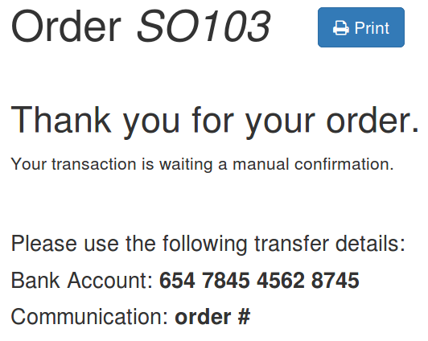
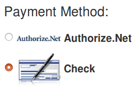

=======================================
How to get paid with wire transfers
=======================================

**Wire Transfer** is the default payment method available. 
The aim is providing your customers with your bank details 
so they can pay on their own.
This is very easy to start with but slow and inefficient process-wise. 
Opt for payment acquirers as soon as you can!

How to provide customers with payment instructions
==================================================
Put your payment instructions in the **Thanks Message** of your payment method.

They will appear to the customers when they place an order.

How to manage an order once you get paid
========================================

Whenever a customer pays by wire transfer, the order stays in an 
intermediary stage **Quotation Sent** (i.e. unpaid order). 
When you get paid,
you confirm the order manually to launch the delivery.

How to create other manual payment methods
==========================================

If you manage a B2B business, you can create other manually-processed 
payment methods like paying by check.
To do so, just rename *Wire Transfer* or duplicate it.

