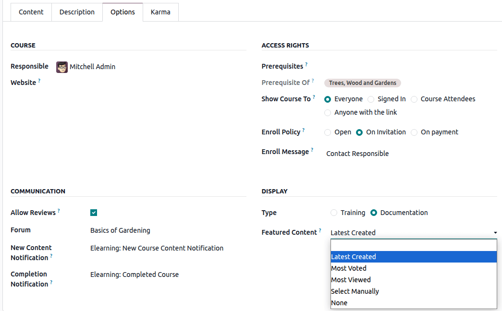
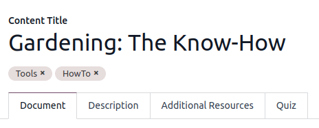
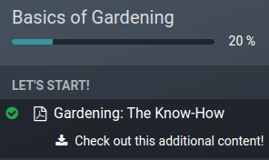
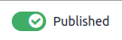

=========
eLearning
=========

The **eLearning** app allows you to easily upload content, define learning objectives, manage
attendees, assess students' progress, and even set up rewards. Engaging participants in a meaningful
learning experience enhances their attentiveness and fosters heightened productivity.

.. important::
   You can manage your eLearning content on the **front end** or the **back end**. The **front end**
   allows you to create content quickly from your website, while the **back end** provides
   additional options and allows collaboration. This documentation focuses on using the back end to
   create your content.

.. seealso::
   `Odoo Tutorials: eLearning <https://www.odoo.com/slides/elearning-56>`_

Courses
=======

By going to :menuselection:`eLearning --> Courses --> Courses`, you can get an overview of all your
courses.

Click on a course title to edit your course on the back end. Click on :guilabel:`View course` to
access your course on the front end.

Course creation
---------------

Click :guilabel:`New` to create a new course. When the page pops up, you can add your
:guilabel:`Course Title` and one or more :guilabel:`Tags` to describe your course. You can add an
image to illustrate your course by hovering your mouse on the camera placeholder image and clicking
on the edit icon. Four tabs allow you to edit your course further:
:ref:`Content <elearning/content>`, :ref:`Description <elearning/description>`,
:ref:`Options <elearning/options>`, and :ref:`Karma <elearning/karma>`.

.. image:: elearning/elearning-course-creation.png
   :align: center
   :alt: Create your elearning course.

.. _elearning/content:

Content tab
~~~~~~~~~~~

This tab allows you to manage your course content. Click on :guilabel:`Add Section` to divide your
course into different sections. Click on :guilabel:`Add Content` to create
:ref:`content <elearning/create-content>`. Click on :guilabel:`Add Certification` to assess the
level of understanding of your attendees, certify their skills, and motivate them. **Certification**
is part of the :doc:`Surveys <../marketing/surveys/create>` app.

.. _elearning/description:

Description tab
~~~~~~~~~~~~~~~

You can add a short description or information related to your course in the :guilabel:`Description`
tab. It appears under your course title on your website.

.. _elearning/options:

Options tab
~~~~~~~~~~~

In the :guilabel:`Options` tab, different configurations are available:
:ref:`Course <elearning/course>`,  :ref:`Communication <elearning/communication>`,
:ref:`Access rights <elearning/access-rights>`, and :ref:`Display <elearning/display>`.

.. _elearning/course:

Course
******

Assign a :guilabel:`Responsible` user for your course. If you have multiple websites, use the
:guilabel:`Website` field to only display the course on the selected website.

.. _elearning/communication:

Communication
*************

- :guilabel:`Allow Reviews`: tick the box to allow attendees to like and comment on your content and
  to submit reviews on your course;
- :guilabel:`Forum`: add a dedicated forum to your course (only shown if the **Forum** feature is
  enabled in the app's settings);
- :guilabel:`New Content Notification`: select an email template sent to your attendees when you
  upload new content. Click on the internal link button (:guilabel:`➜`) to have access to the email
  template editor;
- :guilabel:`Completion Notification`: select an email template sent to your attendees once they
  reach the end of your course. Click on the internal link button (:guilabel:`➜`) to access the
  email template editor;

.. _elearning/access-rights:

Access rights
*************

- :guilabel:`Prerequisites`: set one or more courses that users are advised to complete before
   accessing your course;
- :guilabel:`Show course to`: define who can access your course and their content between
  :guilabel:`Everyone`, :guilabel:`Signed In` or :guilabel:`Course Attendees`;
- :guilabel:`Enroll Policy`: define how people enroll in your course. Select:

   - :guilabel:`Open`: if you want your course to be available to anyone;
   - :guilabel:`On Invitation`: if only people who received an invitation can enroll to your course.
     If selected, fill in the :guilabel:`Enroll Message` explaining the course's enrollment process.
     This message appears on your website under the course title;
   - :guilabel:`On Payment`: if only people who bought your course can attend it. The
     :guilabel:`Paid Courses` feature must be enabled to get this option. If you select
     :guilabel:`On Payment`, you must add a :guilabel:`Product` for your course.

      .. note::
         Only products set up with :guilabel:`Course` as their :guilabel:`Product Type` are
         displayed.

.. _elearning/display:

Display
*******

- :guilabel:`Training`: the course content appears as a training program, and the courses must be
  taken in the proposed order.
- :guilabel:`Documentation`: the content is available in any order. If you choose this option, you
  can choose which page should be promoted on the course homepage by using the
  :guilabel:`Featured Content` field.

.. _elearning/karma:

Karma tab
~~~~~~~~~

This tab is about gamification to make eLearning fun and interactive.

In the :guilabel:`Rewards` section, choose how many karma points you want to grant your students
when they :guilabel:`Review` or :guilabel:`Finish` a course.

In the :guilabel:`Access Rights` section, define the karma needed to :guilabel:`Add Review`,
:guilabel:`Add Comment`, or :guilabel:`Vote` on the course.

.. note::
   From your course, click the :guilabel:`Contact Attendees` button to reach people who are
   enrolled in the course.

.. _elearning/course-groups:

Course groups
-------------

Use the **Course Groups** to inform users and allow them to filter the courses from the
:guilabel:`All Courses` dashboard.

You can manage them by going to :menuselection:`Configuration -->
Course Groups`. Click :guilabel:`New` to create a new course group. Add the :guilabel:`Course Group
Name`, tick the :guilabel:`Menu Entry` box to allow users to search by course group on the website,
and add tags in the :guilabel:`Tag Name` column. For each tag, you can select a corresponding color.

Settings
--------

You can enable different features to customize your courses by going to :menuselection:`eLearning
--> Configuration --> Settings`:

- **Certifications**: to evaluate the knowledge of your attendees and certify their skills;
- **Paid courses**: to sell access to your courses on your website and track revenues;
- **Mailing**: to update all your attendees at once through mass mailings;
- **Forum**: to create a community and let attendees answer each other's questions.

.. _elearning/create-content:

Content
=======

Manage your content by going to :menuselection:`eLearning --> Courses --> Contents`. Click
:guilabel:`New` to create content. Add your :guilabel:`Content Title`, and if you want
:ref:`Tags <elearning/tags>`, then fill in the related information among the different tabs.

Document tab
------------

- :guilabel:`Course`: select the course your content belongs to;
- :guilabel:`Content Type`: select the type of your content;
- :guilabel:`Responsible`: add a responsible person for your content;
- :guilabel:`Duration`: indicate the time required to complete the course;
- :guilabel:`Allow Download`: allow users to download the content of the slide. This option is only
  visible when the content is a document;
- :guilabel:`Allow Preview`: the course is accessible by anyone.
- :guilabel:`# of Public Views`: displays the number of views from non-enrolled participants;
- :guilabel:`# Total Views`: displays the total number of views (non-enrolled and enrolled
  participants).

Description tab
---------------

You can add a description of your content that appears front end in the :guilabel:`About` section of
your course content.

Additional Resources tab
------------------------

Click :guilabel:`Add a line` to add a link or a file that supports your participants' learning.
It appears in the course content on your website.

.. _elearning/quiz:

Quiz tab
--------

From this tab you can create a quiz to assess your students at the end of the course.

The :guilabel:`Points Rewards` section lets you give a specific number of karma points depending on
how many tries they need to correctly answer the question. Then, create your questions and the
possible answers by clicking on :guilabel:`Add a line`. A new window pops up, add the question by
filling in the :guilabel:`Question Name` and add multiple answers by clicking on :guilabel:`Add a
line`. Tick the :guilabel:`Is correct answer` to mark one or more answers as correct. You can also
fill in the :guilabel:`Comment` field to display additional information when the answer is chosen by
the participant.

.. _elearning/tags:

Content Tags
------------

The **Content Tags** help users to classify the content from the :guilabel:`Contents` dashboard.

You can manage them by going to :menuselection:`eLearning --> Configuration --> Content Tags`. Click
:guilabel:`New` to create a new tag.

Publish your content
====================

Everything created on the back end needs to be published from the front end. Unpublished content is
always visible from your website but still needs to be published to be available to your audience.

You must be on your website's front end to publish your content. To do so, click on the
:guilabel:`Go To Website` smart button, and tick the :guilabel:`Publish` option available in the
right-hand corner.

