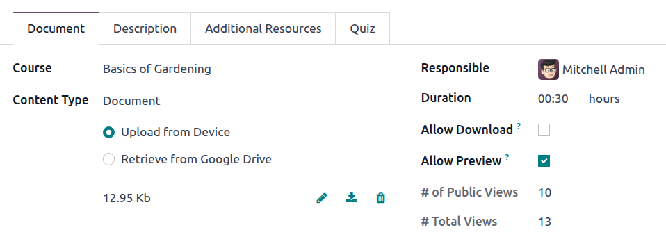

=========
eLearning
=========

The **eLearning** app allows you to easily upload content, define learning objectives, manage
attendees, assess students' progress, and even set up rewards. Engaging participants in a meaningful
learning experience enhances their attentiveness and fosters heightened productivity.

.. important::
   You can manage your eLearning content on the **front end** or the **back end**. The **front end**
   allows you to create content quickly from your website, while the **back end** provides
   additional options and allows collaboration. This documentation focuses on using the back end to
   create your content.

.. seealso::
   `Odoo Tutorials: eLearning <https://www.odoo.com/slides/elearning-56>`_

.. _elearning/courses:

Courses
=======

To get an overview of all courses, go to :menuselection:`eLearning --> Courses --> Courses`.

Click on a course card to edit the course on the back end. Click :guilabel:`View course` to access
the course on the front end.

.. _elearning/course-creation:

Course creation
---------------

Click :guilabel:`New` to create a new course. In the form that opens, add a :guilabel:`Course Title`
and one or more :guilabel:`Tags` to categorize the course and :ref:`allow users
to filter courses based on their tags <elearning/course-groups>`.
To add an image to illustrate the course, hover your mouse on the camera placeholder image and
click on :icon:`fa-pencil` :guilabel:`(Edit)`.

Four tabs allow you to edit your course further: :ref:`Content <elearning/content>`,
:ref:`Description <elearning/description>`, :ref:`Options <elearning/options>`, and
:ref:`Karma <elearning/karma>`.

.. image:: elearning/elearning-course-creation.png
   :alt: Create your elearning course.

.. _elearning/content:

Content tab
~~~~~~~~~~~

This tab allows you to manage the course content. Click :guilabel:`Add Section` to divide the
course into different sections. Click :guilabel:`Add Content` to create :ref:`content items
<elearning/content-creation>`. Click :guilabel:`Add Certification` to assess the attendees' level of
understanding, certify their skills, and motivate them. **Certification** is part of the
:doc:`Surveys <../marketing/surveys/create>` app.

.. _elearning/description:

Description tab
~~~~~~~~~~~~~~~

You can add a short description or information related to the course in the :guilabel:`Description`
tab. It appears under the course title on your website.

.. image:: elearning/course-description.png
   :alt: Add a description to your course.

.. _elearning/options:

Options tab
~~~~~~~~~~~

In the :guilabel:`Options` tab, different configurations are available:
:ref:`Course <elearning/options-course>`, :ref:`Communication <elearning/options-communication>`,
:ref:`Access rights <elearning/options-access-rights>`, and :ref:`Display
<elearning/options-display>`.

.. image:: elearning/options-tab.png
   :alt: Overview of the Options tab

.. _elearning/options-course:

Course
******

Assign a :guilabel:`Responsible` user for the course. If you have multiple websites, use the
:guilabel:`Website` field to display the course only on the selected website.

.. _elearning/options-communication:

Communication
*************

- :guilabel:`Allow Reviews`: Enable this option to allow attendees to like, comment on, and submit
  reviews for the course content.
- :guilabel:`Forum`: Add a dedicated forum to the course (only shown if the :guilabel:`Forum`
  feature is enabled in the :ref:`eLearning settings <elearning/settings>`).
- :guilabel:`New Content Notification`: Select an email template to send emails to attendees when
  you upload new content items. Click on :icon:`oi-arrow-right` :guilabel:`Internal link` to access
  the email template editor.
- :guilabel:`Completion Notification`: Select an email template to send emails to attendees once
  they reach the end of the course. Click on :icon:`oi-arrow-right` :guilabel:`Internal link` to
  access the email template editor.

.. note::
   If the :guilabel:`Mailing` feature is enabled in the :ref:`eLearning settings
   <elearning/settings>`, a :guilabel:`Contact Attendees` button at the top left of the course form
   allows you to send mass mailings to people enrolled in the course.

.. _elearning/options-access-rights:

Access rights
*************

- :guilabel:`Prerequisites`: Set one or more other courses that users are advised to complete before
  accessing the course.
- :guilabel:`Prerequisite Of`: If the course has been defined as a prerequisite for one or more
  courses, this read-only field displays the course name(s).
- :guilabel:`Show course to`: Define who can access the course and its content. Select
  :guilabel:`Everyone`, :guilabel:`Signed In`, or :guilabel:`Course Attendees`.
- :guilabel:`Enroll Policy`: Define how people enroll in the course. Select:

   - :guilabel:`Open`: to make the course available to anyone.
   - :guilabel:`On Invitation`: to restrict enrollment to invited attendees only. If enabled,
     provide an :guilabel:`Enroll Message` explaining the enrollment process. This message is
     displayed on your website beneath the course title. To send invite to attendees, click
     :guilabel:`Invite` and either:guilabel:`Copy` the link or toggle :guilabel:`Send by Email`
     to send the invitation via email.
   - :guilabel:`On Payment`: to restrict enrollment to users who purchase the course. If enabled,
     select the :guilabel:`Product` to be used. This option requires the :guilabel:`Paid Courses`
     feature to be enabled in the :ref:`eLearning settings <elearning/settings>`.

      .. note::
         Only products set up with :guilabel:`Course` as their :guilabel:`Product Type` are
         available for selection.

.. _elearning/options-display:

Display
*******

- :guilabel:`Training`: The course content appears as a training program, and the courses must be
  taken in the proposed order.
- :guilabel:`Documentation`: The content is available in any order. Use the :guilabel:`Featured
  Content` field to define which content items are promoted on the course homepage.

.. _elearning/karma:

Karma tab
~~~~~~~~~

This tab is about gamification to make eLearning fun and interactive.

In the :guilabel:`Rewards` section, choose how many karma points you want to grant attendees
when they :guilabel:`Review` or :guilabel:`Finish` a course.

In the :guilabel:`Access Rights` section, define the karma points needed to :guilabel:`Add Review`,
:guilabel:`Add Comment`, or :guilabel:`Vote` on the course.

.. _elearning/course-groups:

Course groups
-------------

**Course Groups** allow users to filter the :guilabel:`All Courses` dashboard on your website and
find the course that meets their interests, needs, level, etc.

To manage them, go to :menuselection:`eLearning --> Configuration --> Course Groups`. Click
:guilabel:`New` to create a new course group. Add the :guilabel:`Course Group Name`, enable
:guilabel:`Menu Entry` to allow users to search by course group on the website, and add tags in
the :guilabel:`Tag Name` column. For each tag, you can select a corresponding color.

.. _elearning/settings:

Settings
--------

The following options are available in the eLearning settings. Go to :menuselection:`eLearning -->
Configuration --> Settings`, then enable the desired feature:

- :guilabel:`Certifications`: Assess attendees' knowledge and provide official certification of
  their skills.
- :guilabel:`Paid Courses`: Sell course access directly through your website and track revenue.
- :guilabel:`Mailing`: Send mass mailings to keep all attendees informed and up to date.
- :guilabel:`Forum`: Build a community space where attendees can ask questions and help each other.

.. _elearning/content-creation:

Content
=======

To manage course content, go to :menuselection:`eLearning --> Courses --> Contents`. Click
:guilabel:`New` to create a content item. Add the :guilabel:`Content Title` and any desired
:ref:`Tags <elearning/content-tags>`, then fill in the required information in the different tabs.

.. image:: elearning/elearning-content-tab.png
   :alt: Create your content.

.. tip::
   You can also create new content from within a course. Go to :menuselection:`eLearning --> Courses
   --> Courses`, click the relevant course card, then click :guilabel:`Add content` at the bottom
   of the :guilabel:`Content` tab.

.. _elearning/content-document:

Document tab
------------

For each content type, provide the following information:

- :guilabel:`Course`: Select the course to which the content item belongs.
- :guilabel:`Content Type`: Select the relevant :ref:`content type <elearning/content-type>` and
  provide the required information.
- :guilabel:`Responsible`: Select the user responsible for the content item. By default, this is the
  user who creates the course, but another user can be selected.
- :guilabel:`Duration`: Enter the time required to complete the lesson.
- :guilabel:`Allow Preview`: Enable this if the content should be accessible to anyone.

.. note::
   If the :ref:`Content Type <elearning/content-type>` is :guilabel:`Document`, enabling
   :guilabel:`Allow Download` allows users to download the content.

Two read-only fields provide data about how often the content item is viewed:

- :guilabel:`# of Public Views`: displays the number of views from non-enrolled participants.
- :guilabel:`# Total Views`: displays the total number of views (non-enrolled and enrolled
  participants).

.. _elearning/content-type:

Content types
~~~~~~~~~~~~~

You can add the following content types:

- :guilabel:`Image`: To upload an image, select :guilabel:`Upload from Device`, click
  :guilabel:`Upload your file`, then select the relevant file. Supported formats include JPG, JPEG,
  PNG, SVG, GIF, and WEBP. The maximum file size is 25MB.

  Alternatively, to add an image saved on Google Drive, select :guilabel:`Retrieve from Google
  Drive`, then add the Google Drive link to the image.

- :guilabel:`Article`: Articles are website pages that are customized using the website
  builder on your website's front end.

  With the :guilabel:`Course` selected, click the :guilabel:`Go to Website` smart button, then, at
  the top-right of the screen, click :icon:`fa-pencil` :guilabel:`(Edit)`. Write the article's
  content and :doc:`customize the page using the website builder </applications/websites/website/web_design>`.

- :guilabel:`Document`: To upload a document, select :guilabel:`Upload from Device`, click
  :guilabel:`Upload your file`, then select the relevant file. Only PDF documents can be uploaded.

  Alternatively, to add a Google Slides presentation, Google Doc document, or Google Sheets
  spreadsheet, click :guilabel:`Retrieve from Google Drive` and add the Google Drive link to the
  file.

- :guilabel:`Video`: Add the YouTube, Google Drive, or Vimeo link to the video.
- :guilabel:`Quiz`: Open the :ref:`Quiz tab <elearning/content-quiz>` to create a quiz.

.. _elearning/content-description:

Description tab
---------------

Add a description for the content. This text is displayed in the :guilabel:`About` section of the
content item on your website.

.. _elearning/content-additional-resources:

Additional Resources tab
------------------------

Click :guilabel:`Add a line` to add a link or a file that supports your participants' learning.
The resource appears in the course content on your website.

.. image:: elearning/additional-content.png
  :alt: Additional ressources

.. _elearning/content-quiz:

Quiz tab
--------

From this tab, you can create a quiz to assess your students at the end of the course.

The :guilabel:`Points Rewards` section allows you to assign karma points based on how many attempts
are needed to answer correctly. To create a question, click :guilabel:`Add a line`, enter the
:guilabel:`Question Name`, and add possible answers. Mark the correct answer(s) by selecting
:guilabel:`Is correct answer`. You can also use the :guilabel:`Comment` field to provide additional
information when an answer is selected.

.. _elearning/content-tags:

Content Tags
------------

**Content Tags** are visible on the :guilabel:`Contents` dashboard of a course on your website, and
can help users identify the kind of content a particular lesson contains, e.g., theory, or exercises.

To manage content tags, go to :menuselection:`eLearning --> Configuration --> Content Tags`. Click
:guilabel:`New` to create a new tag.

.. _elearning/publish-content:

Publish courses and content
===========================

Courses and content items must be published from the front end to be available to your audience.
To access the front end, click the :guilabel:`Go to Website` smart button at the top of the course
form or an individual content form.

A course and its content items are published separately:

- To publish a course, access the main course page, then toggle the switch in the
  upper-right corner from :guilabel:`Unpublished` to :guilabel:`Published`.
- To publish individual content items, click on an item to open it, then toggle the switch
  from :guilabel:`Unpublished` to :guilabel:`Published`.

.. image:: elearning/elearning-publish-button.png
  :alt: Publish your content.

.. tip::
   When publishing a new course, publish the individual content items before publishing the course
   itself. Published content is only available to your audience once the course it is part of is
   published.

To unpublish a course or an individual content item, open the course or item, then toggle the switch
from :guilabel:`Published` to :guilabel:`Unpublished`.

.. note::
   Unpublishing a course renders the course *and* its content unavailable to your audience.
