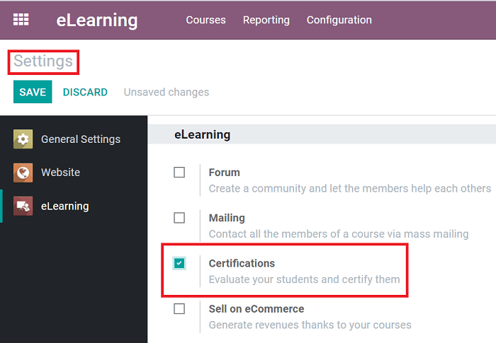
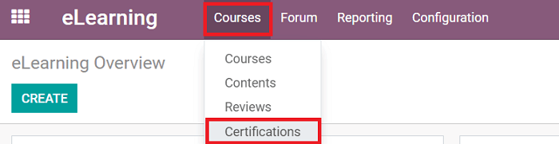
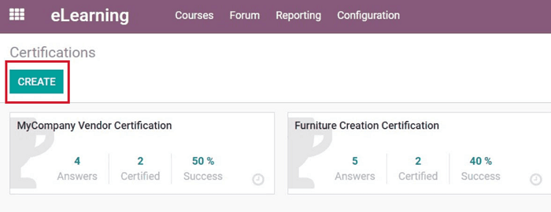
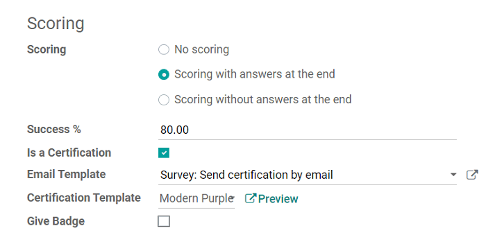
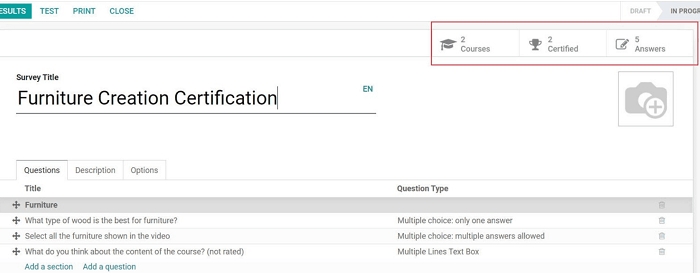
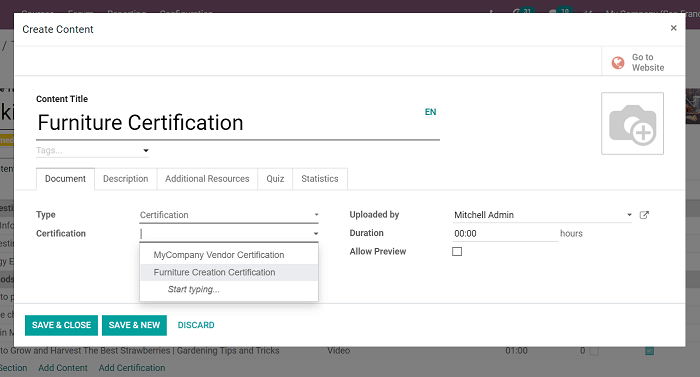
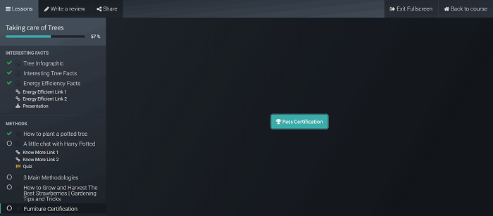
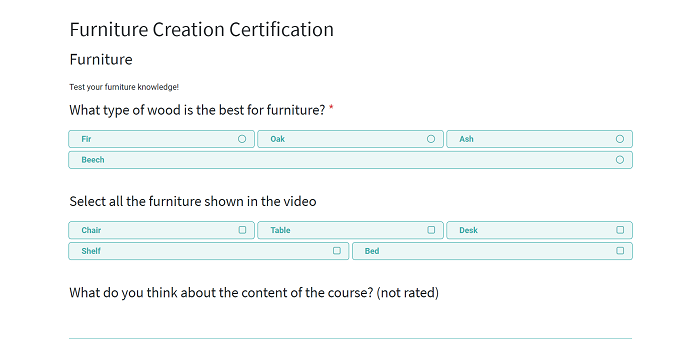
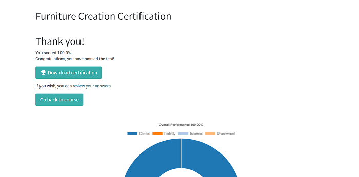

========================
Certification essentials
========================

Certifications are a great way to reward your most studious eLearning participants. Users can add
certifications to their eLearning courses as an official way to "certify" their participants'
knowledge and expertise.

For example, if you taught a course on woodworking, you could create a generic certification
filled with important questions about that topic. You can even apply it to any other courses that
cover similar subjects.

Odoo allows users to create numerous certifications, and adhere them to as many courses as they'd
like, without having to recreate new certifications for each course.

Getting started
===============

First, you'll need to activate *Certifications* in the *Settings* of the eLearning application.

To do that, go to
:menuselection:`eLearning Application --> Configuration --> Settings --> Activate Certifications`
and hit *Save*.

Then, go to :menuselection:`Courses --> Certifications`.

Then, click *Create*.

After titling the certification, users can start adding questions and sections, just like they
would when creating a standard eLearning course (or survey).

Users can elaborate on the certification (and offer additional information) in the *Description*
tab. In the *Options* tab, users can thoroughly customize their certification. And in the *Scoring*
section, users can set the success percentage needed to "pass" the certification.

They can also modify the email and certification template that the participants see. In addition
to that, users can also activate the "Give Badge" feature, which rewards participants with a
virtual "badge" for successfully completing the certification.

Once you've completed your customizations, hit *Save*, and the certification is then finalized, but
it can be modified at any time.

Also, in the upper-right corner of the certification template, you'll see smart buttons for:
*Courses*, *Certified*, and *Answers*.

The *Courses* button shows the user how many courses are currently featuring this specific
certification. The *Certified* button tells the user how many people have been successfully
certified, via this certification. And, lastly, the *Answers* button takes the user to a page
showcasing all the answers from each participant.

Applying certifications to courses
==================================

Open the template of the course you want to add a certification to, and click *Add Certification*.
A pop-up appears, in which users can title the Certification Content, and select which Certification
they want to apply.

Users can also add an image, *Description*, *Additional Resources*, or a *Quiz*. You can also view
*Statistics* of the certification here, as well.

Certifications in eLearning courses
===================================

Once participants encounter the certification, they will be presented with a unique "Pass
Certification" button.

When pressed, Odoo takes them to a Certification prompt page. Once they are are ready, they can
begin their certification.

After entering their answers to the certification questions, participants are taken to a results
page.

Here, they'll see their success percentage, along with a graph, visually representing their
answer attempts.

If they pass, they can click on *Download Certification* and have the certification immediately
downloaded onto their computer for reference. They can also revisit the course by clicking *Go
back to course*.

.. seealso::
   - :doc:`sell_courses_certifications`
   - :doc:`course_essentials`
