==============
Course content
==============

As you build your Odoo eLearning course, you can utilize all sorts of content to create an
engaging, informative, and interactive course for your participants to enjoy.

Overview
========

Each piece of content is specific to each course. Remember, you can find all your courses on the
eLearning dashboard, or by going to :menuselection:`Courses --> Courses` in the header menu.

When you find the course you wish to add content to, simply click on the course title, and Odoo
redirects you to the course template page. There, you’ll be able to add content.

You could also click on *Contents* in the corresponding course from the dashboard. When you do,
Odoo takes you to the *Contents* overview page, where you can create content for that course.

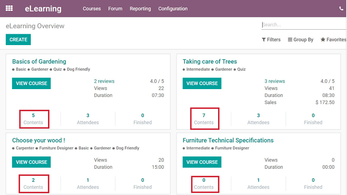

Content
=======

Adding content is one of the first things you’ll do when creating an eLearning course. You can
add content from the front-end or back-end of your website.

Adding content (front-end)
==========================

Navigate to a course page on the front-end of your website, and click *+Add Content* (or *Upload
new content* if your course is in *Documentation* layout.)

You can also add *Sections* to your course in the same way, via the *Add a section* button
(available in both layouts).

- *Training* layout:

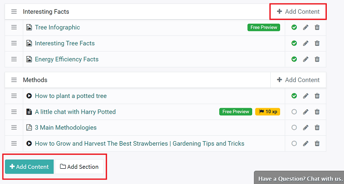

- *Documentation* layout:

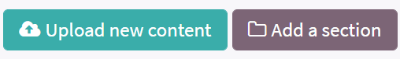

When clicked, a pop-up appears, in which you can choose what type of content you want to add.

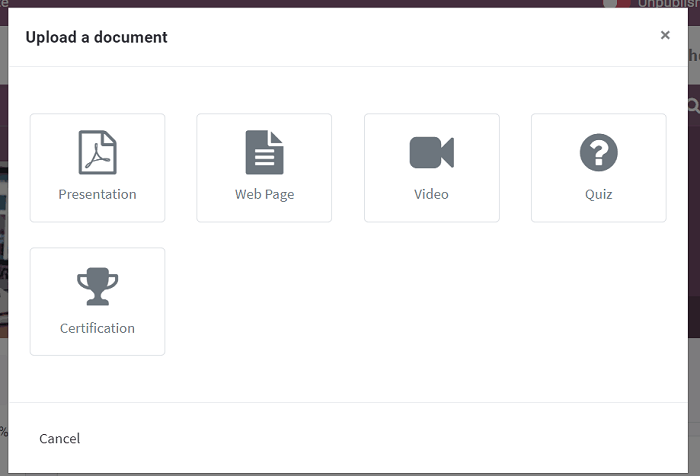

The options are:

*  **Presentation**
*  **Web Page**
*  **Video**
*  **Quiz**
*  **Certification**

When you select a type, a pop-up appears, wherein you can add and customize the content.

Presentation
------------

By selecting **Presentation**, you can upload PowerPoint presentations (or Word documents) as a
part of your eLearning course.

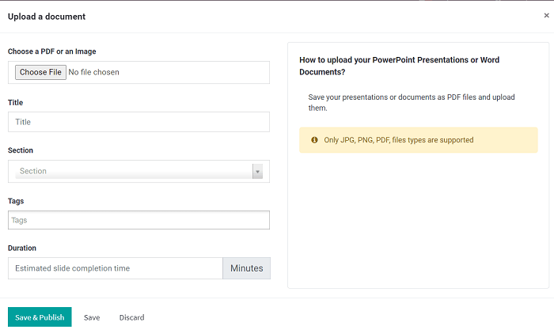

.. :note::
   Only JPG, PNG, and PDF files are supported.

Web Page
------------

You can add a **Web Page** to your eLearning course.

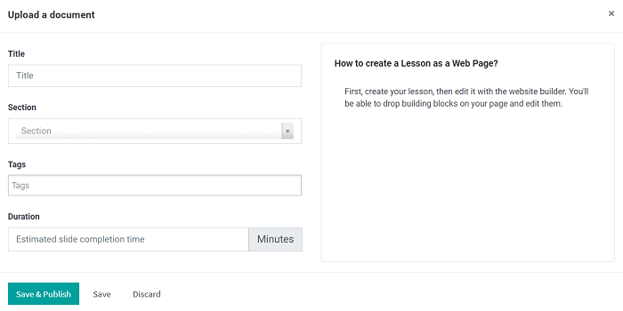

Instantly create and customize a page for your online course with Odoo's drag-and-drop "Building
Blocks" and features.

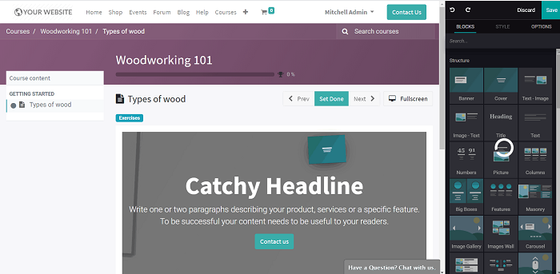

This is how a typical **Web Page** content looks to your course participants:

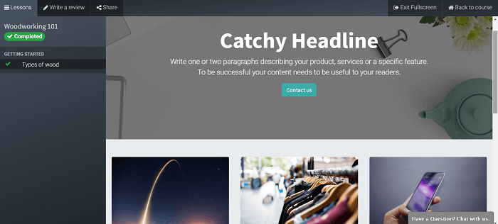

Video
-----

Odoo allows users to directly upload a video (with YouTube URLs **only**) as part of their
eLearning course.

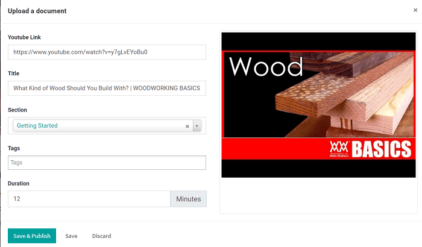

.. note::
   Once the URL is pasted into the field, Odoo automatically fills in the rest of the pertinent
   information surrounding the video.

Quiz
----

You can add a quiz to your eLearning course, which is a great way to gauge how much your
participants have learned. When **Quiz** is selected as the content type, a pop-up appears.

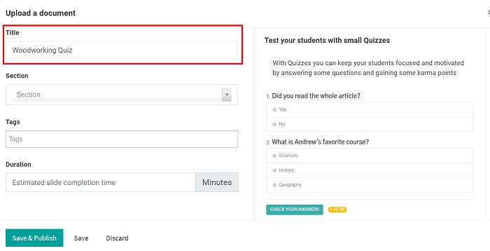

After titling, tagging, and adding a duration to your quiz, be sure to hit *Save & Publish*
(or just *Save*, if you aren't ready to publish).

Following that, you can create and customize your quiz. To do so, click the *Add Quiz* button
that appears when you hover over the quiz that you wish to modify on the main course page.

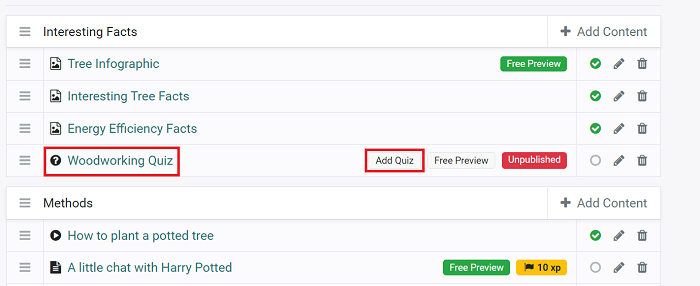

When clicked, Odoo redirects you to an empty quiz form on the front-end. You can add as many
questions (and answers) as you like. And, if you'd like to attach a quick comment to specific
answers, you can do so by clicking the "i" icon next to the answer.

Don't forget to hit *Save* when finished.

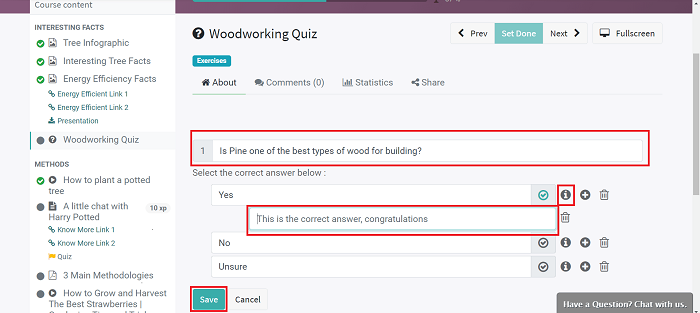

Here's what a typical quiz looks like to your participants:

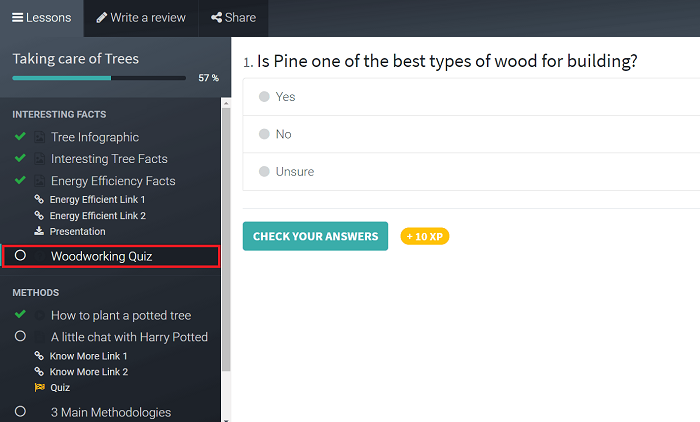

Certification
-------------

Certifications add a level of legitimacy to your eLearning course. When the pop-up appears,
simply select which certification you want to apply to this course from the drop-down
*Certification* menu.

That menu presents you with all the certifications that have already been created in the backend.
Select the one you want, and your participants can engage with it during your course.

.. seealso::
   - :doc:`certification_essentials`

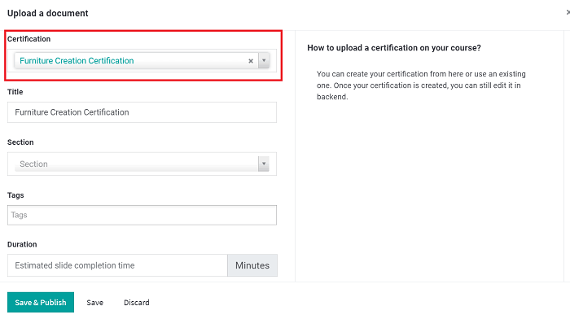

.. note::
   In order to utilize certifications, you need to activate that feature in the eLearning settings.
   Go to :menuselection:`Configuration --> Settings --> Activate Certifications`.

.. tip::
   You can edit, delete, and re-order any content from the front-end, as well.

Adding content (back-end)
=========================

Start by clicking on *Add Content* located at the bottom of the *Content* tab on the course
detail form you wish to modify. By default, all new content that’s added to your course appears in
the last position.

However, you can quickly reorder and rearrange the content (and sections) of your course by
clicking the arrows to the left of the content, then dragging and dropping it wherever you please.

Each piece of content is classified by *Type*, which is clearly displayed in the *Content* tab.

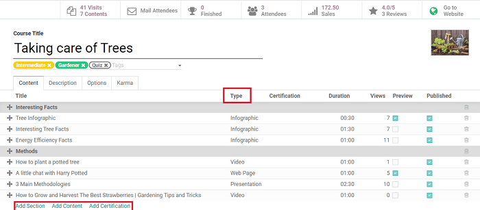

Content options
===============

-  You can add a picture for each piece of content, except for infographics because that image is
   the content, itself.

-  Feel free to write a brief description of the content, which will be visible on your website.

-  "Additional Resources" allows users to add as many links to their content as they want.

-  The "Allow Preview" feature allows anyone to view the course, even if they aren’t enrolled in
   the course.

-  The "Duration" is the amount of time it takes to complete the specific piece of content. The
   sum of *all* content durations create the overall duration of the course.

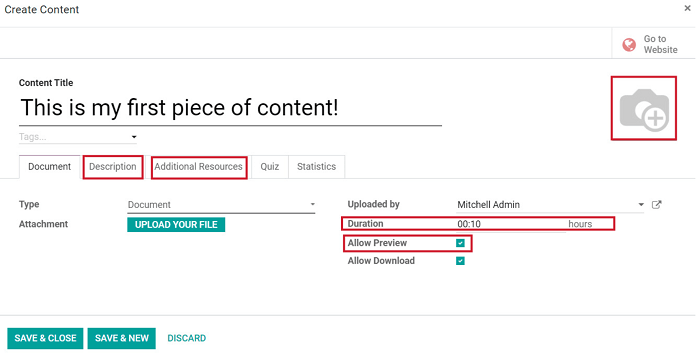

Content types
=============

Here's a quick breakdown of the various types of content you can use for your course.

-  **Infographic** Informative visual representations (i.e. charts, diagrams, etc.) that enrich your
   eLearning course. They *must* be .png files uploaded directly through the photo icon. This
   displays the image you’ve chosen as your infographic to your participants.

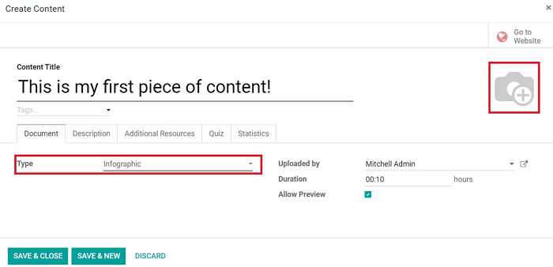

-  **Web Page** Utilize an entire web page as part of your course. Give your page a title,
   *Save*, and edit the page with Odoo's "Building Blocks" and features from the front-end by
   clicking the "pencil" icon next to the page you want to modify. That redirects you to an empty
   web page that you can start building from scratch to accompany your eLearning course.

-  **Presentation** Upload any presentation as a part of your course. However, all files must be
   converted to PDF before uploading.

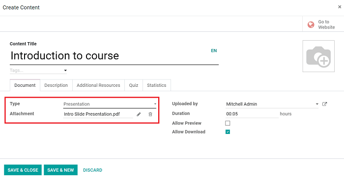

-  **Document** Upload documents, like .pdf or .docx files, directly to your course. (Similar to
   the *Presentation* type on the front-end, as mentioned above)

.. image:: course_content/elearning-document-back-end.png
   :align: center
   :alt: elearning document content type back-end

-  **Video** Odoo only supports videos uploaded with a YouTube URL. Simply copy and paste the
   YouTube URL in the *Document URL* field.

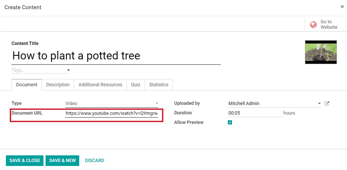

-  **Quiz** Users can create a quiz for every single piece of content in their course. The quiz is
   always multiple choice, and participants can earn points for correct answers. Users create
   the questions, answers, and decide how many points will be rewarded for these answers in the
   *Quiz* tab. There is no limit to the number of questions each quiz can have.

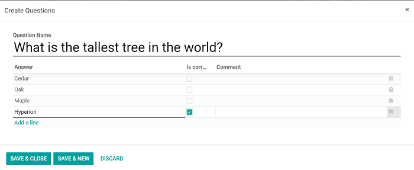

-  **Certification** Including a *Certification* adds value to your eLearning course. To do so,
   select *Certification* as the type, and proceed to pick which certification you want to apply to
   this particular course.

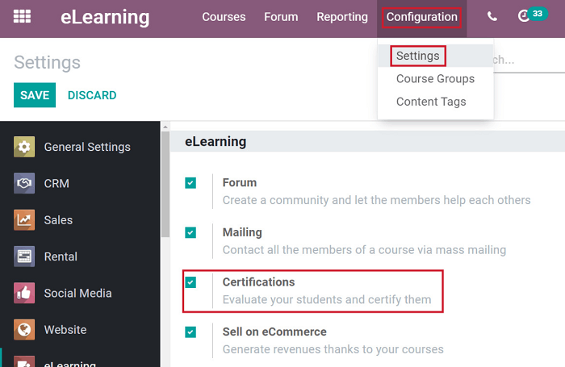

.. note::
   The *Odoo Surveys* module is **required** for *Certifications* to work.

.. seealso::
   - :doc:`course_essentials`
   - :doc:`certification_essentials`
   - :doc:`sell_courses_certifications`
   - :doc:`karma_reporting`
   - :doc:`forums`
