=================
Course essentials
=================

Odoo eLearning helps users create (and customize) courses and gets them online in just a matter of
minutes.

Once you install and open the eLearning application, you're taken to the eLearning dashboard
(which is the Course Overview, by default).

Create course (front-end)
=========================

On the front-end of your website, click the *+New* button in the upper-right corner. A number of
page options appear. Select *Course* to begin building a new eLearning course.

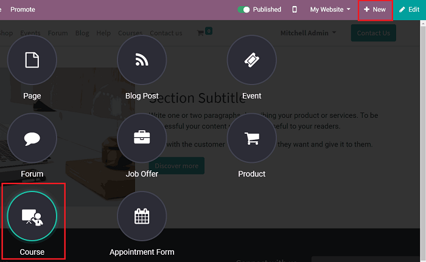

Then, a "New Course" pop-up appears. Here, you configure certain aspects of your eLearning course.

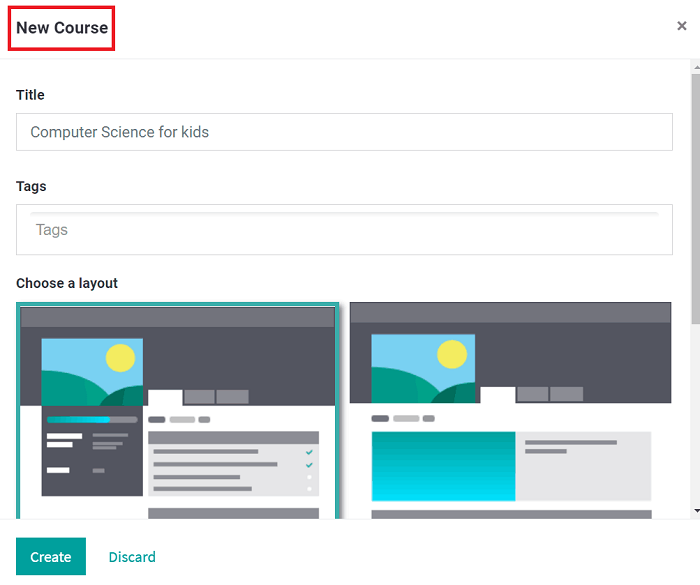

After giving the course a title and tags, you are presented with two layout options: *Training* (on
the left) or *Documentation* (on the right). Both have their own advantages and display the
content in unique, engaging ways.

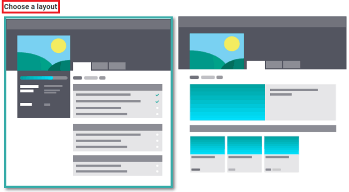

*Training* courses allow users to track their progress, and provides participants with a clear
representation of what to expect throughout the course.

*Documentation* courses are similar to *Training* courses, but they provide a more
visually-appealing layout that showcases the content in a more appealing way.

Here’s the same course in both display types (*Training* and *Documentation*):

*  **Training**

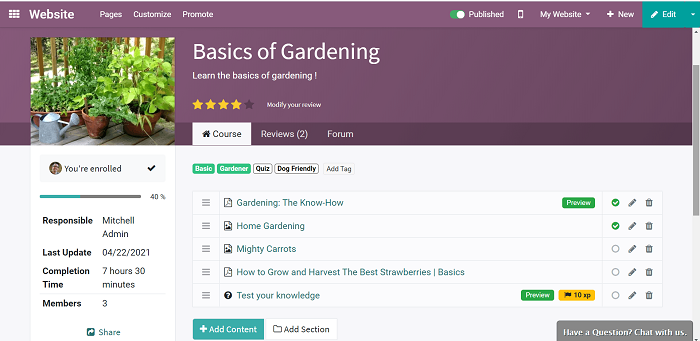

*  **Documentation**

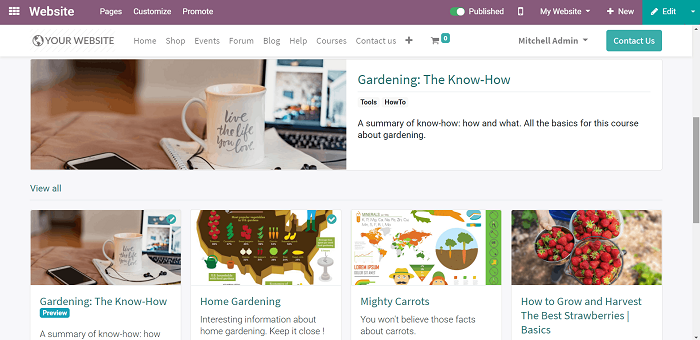

.. tip::
   You can change the layout of your course at any time on the back-end. Quickly access the
   course detail form on the front-end by clicking *Edit in backend* (in the drop-down menu, next to
   the *Edit* button in the upper-right corner.

Below that, you can add a Description and decide if you want to allow participants to review your
course.

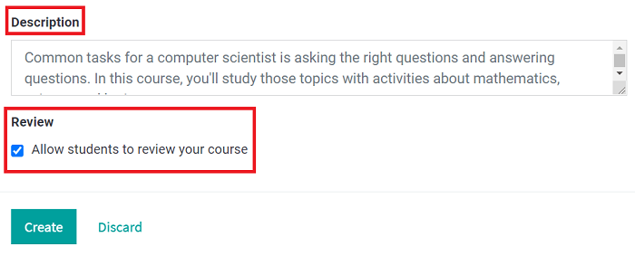

Once you've completed that form, click *Create* and start adding content and sections.

.. seealso::
   - :doc:`course_content`

Create course (back-end)
========================

From the eLearning dashboard on the back-end, you can access every course that's been created.

To create a new course, simply click *Create* on the eLearning dashboard. Users can also access
the course creation page by selecting *Courses* under the *Courses* drop-down menu.

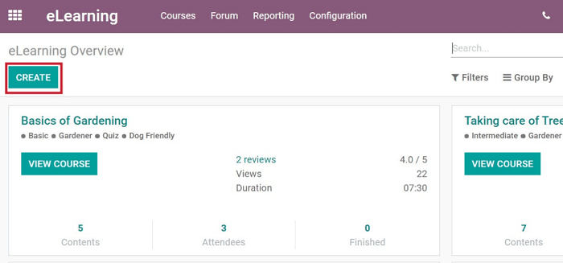

Clicking *Create* takes you to an empty course template. Here, you can fully customize
(and configure) your course, give it a title, and add all sorts of content.

Make sure to complete the following fields when creating a new course:

*  **Course Title** pick a name for your course
*  **Tags** create (and edit) tags for your course to help your participants search for (and
   find) your course.
*  **Image** click the photo icon to upload a .png file to visually represent your course.

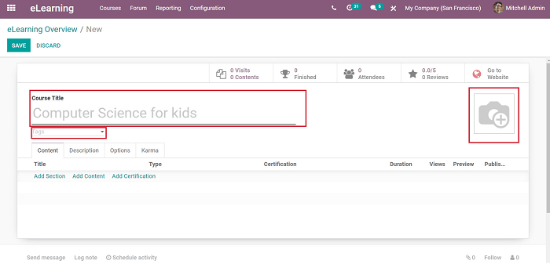

Course configuration
====================

You can configure your course as soon as you create it. You can also modify the configuration of
any course at any time.

To do so, simply click the *Edit* button, and make any adjustments that you'd like. Don't forget to
hit *Save* once you're done.

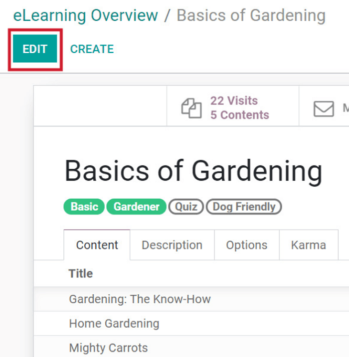

.. note::
   The most **important** configurations are found under the *Options* tab.

Responsible
-----------

A "Responsible" must be designated for each course. The "Responsible" can access every aspect of
the course. They’ll be able to see the attendee list, send emails, add content, and so much more.

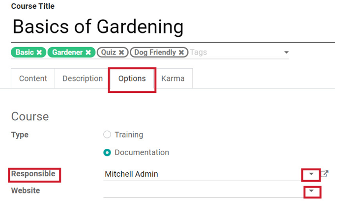

The "Responsible" can also be changed at any time. Simply click the arrow next to their name, and
select a new "Responsible."

Also, if you are working with multiple websites, you can choose *which* website this course is
displayed on in the *Course* section, as well.

Access rights
-------------

The "Access Rights" section allows you to decide who can have access to your course.

If you select *Public*, anyone who finds the course on your website can enroll and access the
content.

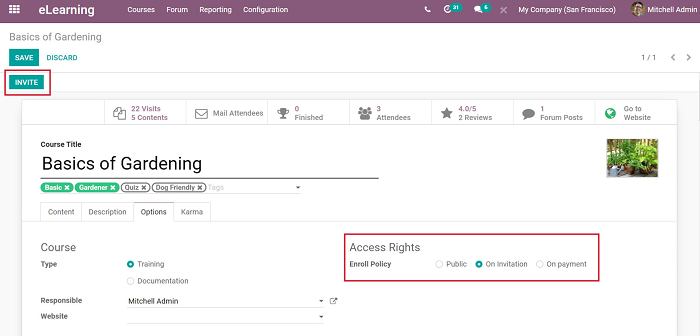

Users can send invites to courses from the main eLearning dashboard.

Click the three-dot settings button on the desired course, select *Invite*, and proceed to send an
emailed invitation to as many potential participants as you want.

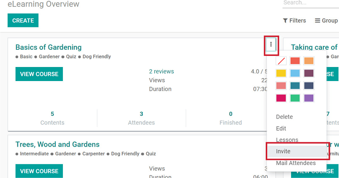

If you pick *On Invitation* in the *Enroll Policy*, an *Invite* smart button appears on the
course page (in the upper-left corner). This feature enables users to send mail to potential
participants about the course.

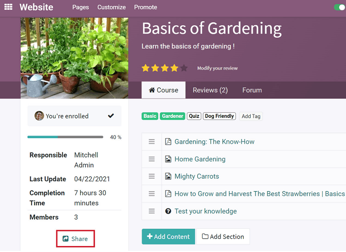

Users can also send invites from the course page on the front-end of the website, with the
*Share* button. That provides you with an access link to the course.

Simply copy the link, and send it to anyone you’d like. There is also an option to share the
course on *Social Networks* here, as well.

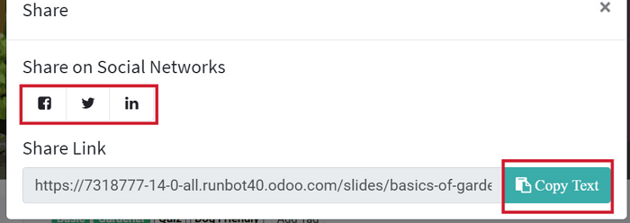

Display
-------

If the course *Visibility* is set on "Public," anyone can see and access the course.

If it’s set on "Members Only," only invited attendees can participate in the course.

If you're creating a *Documentation* course, this is where you can choose what content appears
first. The options are:

*  **Latest Published** the most recent content is first
*  **Most Voted** the most liked content (voted on by your participants) is first
*  **Most Viewed** the most viewed content in your course is first
*  **Specific** you can choose which content is first
*  **None** indicates there is no preference about what content shows up first

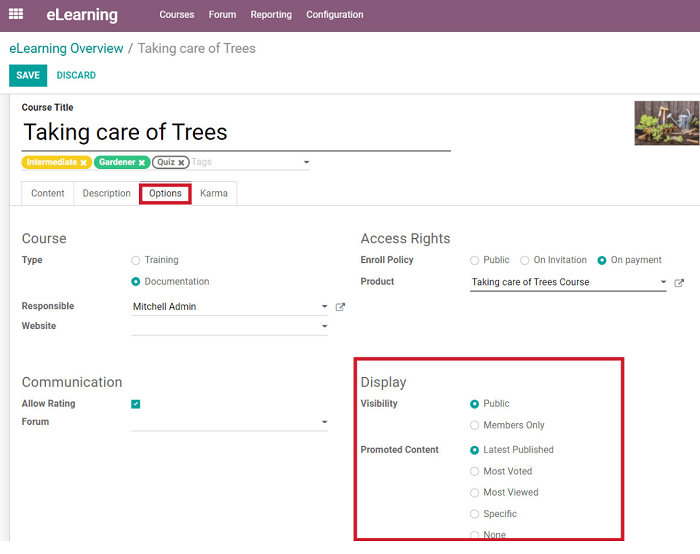

Here’s what the "Featured Content" looks like to your course participants. As you can see, it’s
clearly highlighted above the rest of the content.

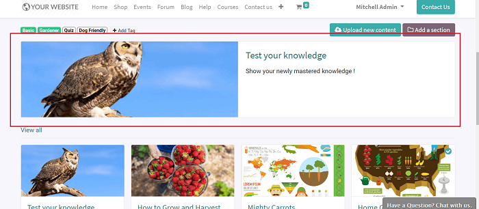

.. note::
   Remember, the display is only be affected like this if you have chosen *Documentation* as the
   "Course Type."

Description
-----------

This tab is fairly self-explanatory. Here, you can write a brief description of the course
(and its content). These descriptions are a great way for participants to know what they can
expect from the course.

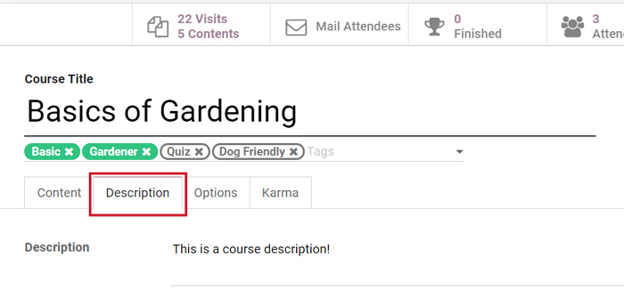

These unique descriptions appear near the title of your course, on the front-end of your
website. Once the course is published, anyone who enrolls can access the description.

.. image:: course_essentials/elearning-front-end-description.png
   :align: center
   :alt: elearning front-end course description

Publishing courses
==================

By default, every course starts "Unpublished" and isn't viewable on the website.

You’ll know if a course still needs to be published, if the Earth icon in the *Go to Website* smart
button on your course template is red.

To publish a course, click the *Go to Website* button, and modify its status on the front-end of
the website.

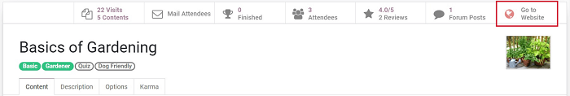

You'll find a "Publish" switch on the header of the course page. This switch allows users to
"Publish" and "Unpublish" courses instantly.

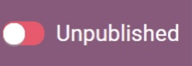

Edit from website
=================

Remember, once a course is created, you can edit it anytime from the front-end of the website, as
well. You can also add content to your course from here by clicking the *+Add Content* button.

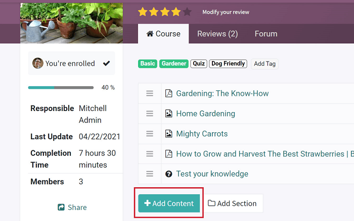

Users can also modify the layout of their course with Odoo’s intuitive building blocks.

To access those features, click the *Edit* button in the upper-right corner. Then, you can use the
sidebar full of features and building blocks to customize and change anything you want.

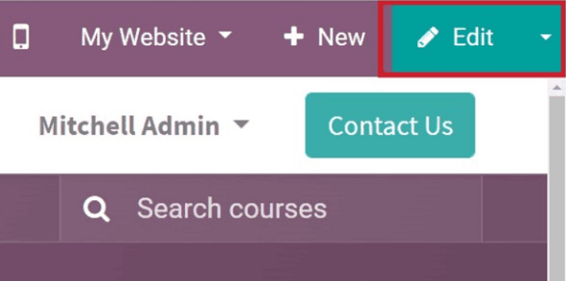

.. seealso::
   - :doc:`course_content`
   - :doc:`certification_essentials`
   - :doc:`sell_courses_certifications`
   - :doc:`karma_reporting`
   - :doc:`forums`
