===================
Forums in eLearning
===================

Forums allow participants of your courses to interact and engage with one another about the
course and its content. This offers invaluable insight on how your courses are actually being
received by participants. This helps the creator of the course realize what works (and, what
*doesn't* work) for his participants.

In forums, participants can ask (and answer) questions with one another, as well as provide
genuine, honest feedback about the course material. This level of interaction helps participants
retain knowledge and form connections with their peers.

Getting started
===============

First, users have to activate the *Forum* feature in the eLearning Settings
(:menuselection:`Configuration --> Settings`) and hit *Save*.

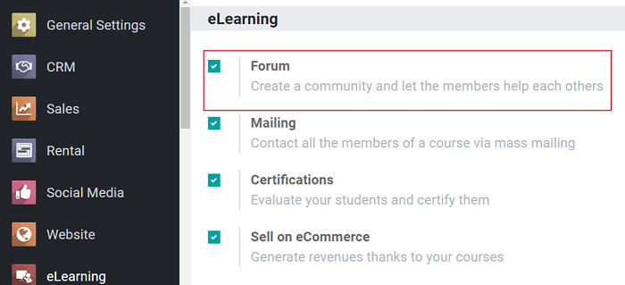

After completing that step, a *Forum* menu option appears on the header. When it does, the user
can click on *Forums* under that specific drop-down menu.

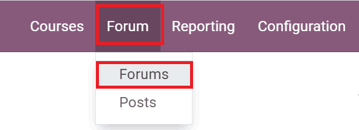

Doing so, takes the user to the *eLearning Forums* dashboard.

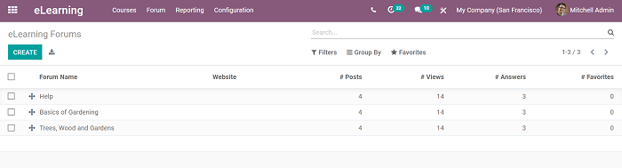

Here, the user sees all the various forums that have been created, along with how many
*Posts*, *Views*, *Answers*, and *Favorites* each forum has at that moment.

When the user is ready, they can click *Create* to build a new forum, and Odoo takes them to a
blank forum template page.

.. image:: forums/forum-template.png
   :align: center
   :alt: elearning forum template

Here, the user gives the forum a specific title, and customizes it to fit their needs.

Users then decide what "Mode" they would like their forum to be in: *Questions (1 answer)* or
*Discussions (multiple answers)*.

Below that, they decide which website they would like this forum to apply to, if
they are working in a multi-website environment.

Forum tabs
==========

Beneath those fields are the *Options*, *Karma Gains*, and *Karma Related Rights* tabs.

In the *Options* tab, users can modify the "Order and Visibility," and decide what course this
forum should be applied to. Users also have the option to add a description about
the forum in this tab, as well.

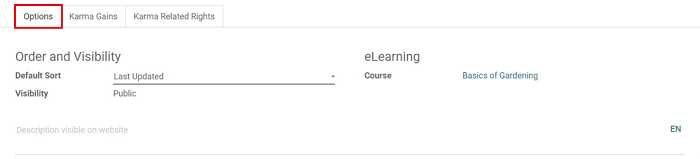

In the *Karma Gains* tab, users decide how many "Karma Points" they'd like to give people who
participate in the forum.

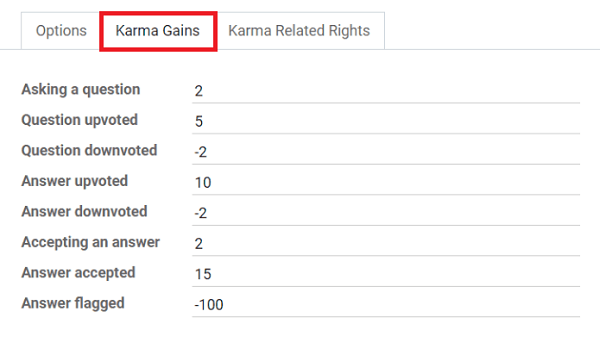

Users can modify point values for a number of different things, such as:

*  Asking a question, upvoting a question, and/or accepting an answer.

They can also choose to *take away* karma points for negative interactions, such as:

*  Downvoting a question (or answer), and/or flagging an answer.

In the *Karma Related Rights* tab, the user will find a similar set of point-related options.
However, these are specific to the participants who post and engage in the forum.

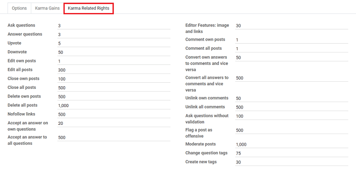

Viewing forums
==============

Once the user has completed their modifications, they can hit *Save* and see what the forum looks
like to their participants, by clicking the *Go to Website* smart button, located in the
upper-right corner of the forum template.

This takes them to their forum on the front-end of the website.

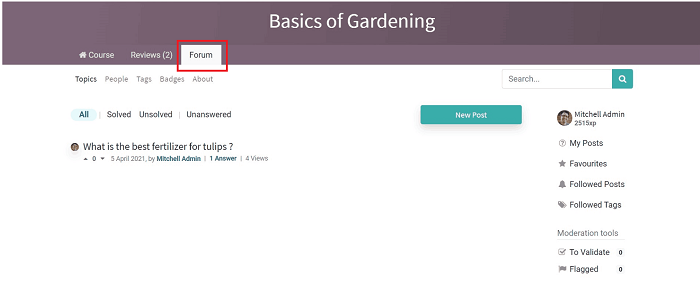

Here, the user can navigate around the forum however they'd like.

They can check out *Topics*, *People*, *Tags*, *Badges*, or the *About* section. They can even
see which forum posts have been *Solved*, *Unsolved*, or *Unanswered*.

Odoo shows **all** posts by default. Users also have the option to create a *New Post* on this page,
as well.

-  The *People* page showcases all of the forum participants, along with their rankings, personal
   statistics, and other pertinent information.

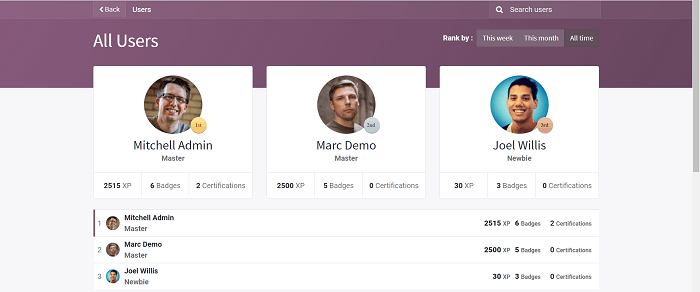

-  The *Tags* page allows users to locate certain posts that include a specific tag (or
   keyword).

-  The *Badges* page informs users of the various badges they have earned *and* badges that are
   available.

-  The *About* page allows the creator of the forum to clearly lay out the guidelines/rules
   they would like participants to follow while engaging in the forum.

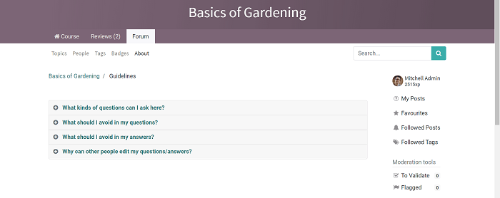

To see the various responses to a post, the user simply needs to click on the title of the post
(or on '*Answers*' beneath their desired post), and Odoo redirects them to that specific post's
page.

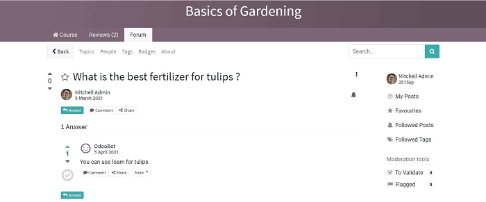

Here, users see the question, along with all the offered answers from participants. They can
choose to upvote or downvote the question (or answer), as well as offer their own response,
comment, or share the post on social media.

Under the *More* dropdown (found on the answers), users have the option to *Edit*, *Delete*,
*Flag*, or *Convert as a comment*.

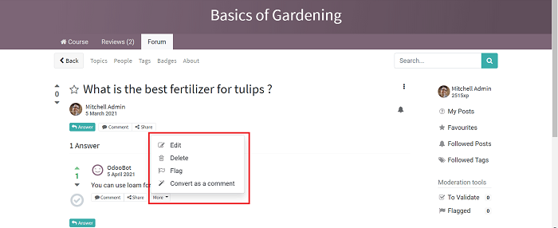

Adding a new post
=================

When users click on *New Post*, Odoo redirects them to a post template page, where they
can create a post of their own.

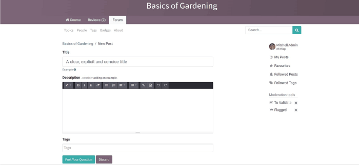

Here, they enter a title, type their post in the *Description* box, and add tags.

Once they're done with that, all they have to do is click *Post Your Question*, and
their question is immediately posted on the forum, and all participants will be able to interact
and engage with it right away.

.. seealso::
   - :doc:`course_essentials`
   - :doc:`certification_essentials`
   - :doc:`sell_courses_certifications`
   - :doc:`karma_reporting`
   - :doc:`mailing`