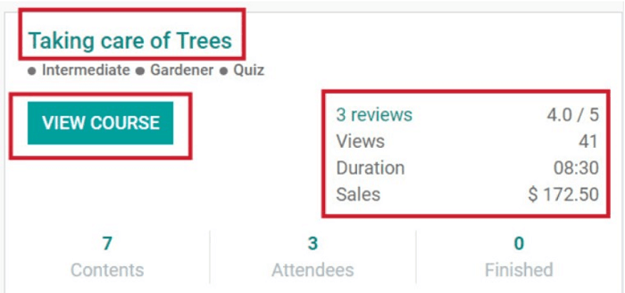
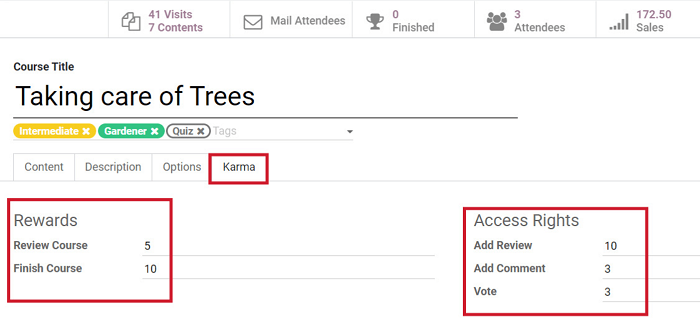
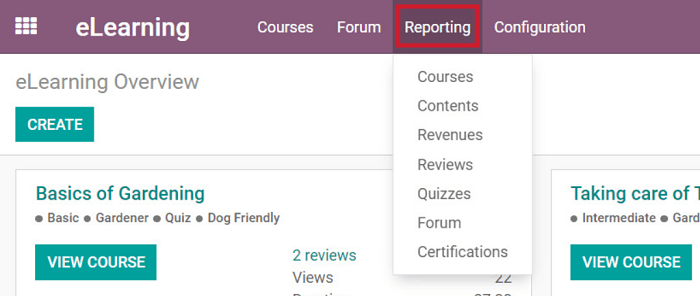
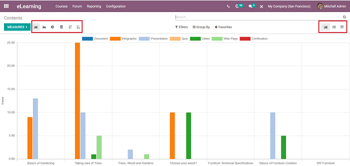
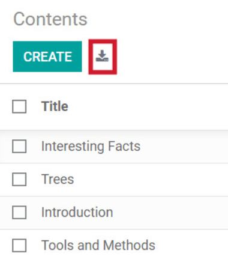

===================
Karma and Reporting
===================

Odoo provides all the tools and data you will ever need to properly (and accurately) manage your
eLearning courses *and* check on the performance of your participants.

Dashboard
=========

The eLearning dashboard is the first thing you'll see when you open the application. Here, you'll
find all the courses that have been created. Each course on the dashboard has
some easy-to-read statistics, providing a quick overview of the course, its material, and its
participants.

To see what the course looks like on the website, click "*View Course*," and Odoo takes you to
the course page on the front-end of your website.

To modify any aspect of the course, simply click on the title of the course you wish to change, and
Odoo takes you to the course template page, which you can freely edit at any time.

If people have left reviews on your course, you can access those by clicking on "Reviews" in the
course box on the eLearning dashboard. You can also access this page by going to
:menuselection:`Reporting --> Reviews`.

Karma
=====

Odoo eLearning allows users to create a gamified environment with unique Karma points.
Gamification with Karma points is a great way to create a better user experience for your
participants.

The use of Karma increases engagement, and entices participants to collect as many points as they
can throughout the course, so they can level up.

You can set points for each action on every course.

Reporting
==========

Under the *Reporting* menu in the header, you can quickly access in-depth analytics and detailed
data about your courses, content, revenues, reviews, quizzes, forums, and certifications.

Having access to this high-level of information helps you enhance the quality of your eLearning
courses moving forward.

Once you're on the *Reporting* page of your choice, you can easily change the way the data is
displayed (depending on what you're analyzing at the moment).

Visual options include: bar chart, line chart, pie chart, stacked, list view, pivot view, or
graph view. Odoo is designed to adapt to any of your analytical needs.

You can also download all your data (in .xls format) with Odoo's download button, located in the
list and pivot view of data.

.. seealso::
   - :doc:`course_essentials`
   - :doc:`certification_essentials`
