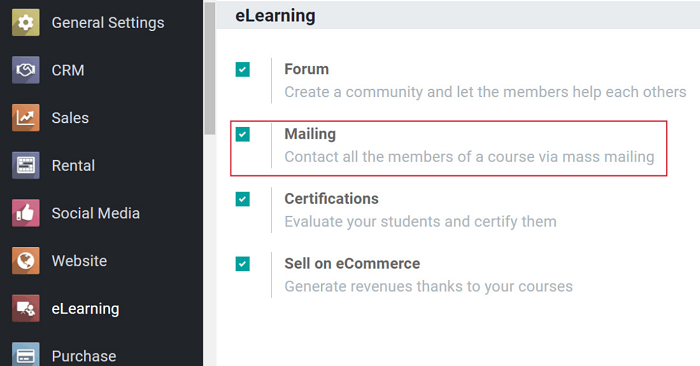
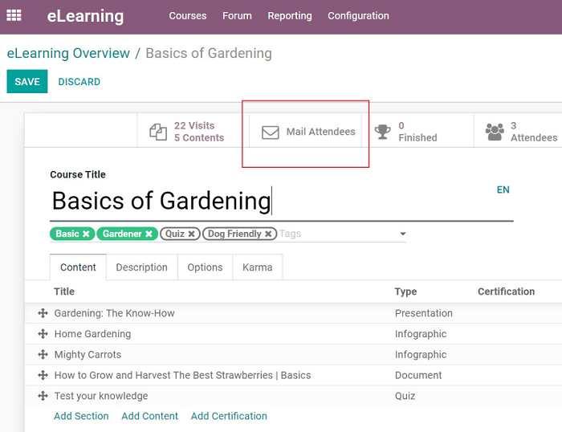
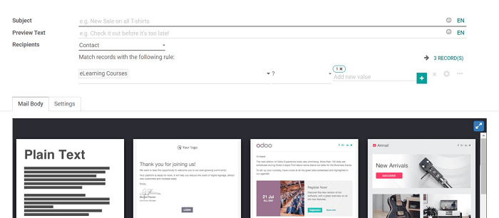
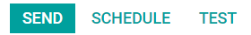

====================
Mailing in eLearning
====================

Now that you've completed the creation of your eLearning course, it's time to let your
participants know about it! And what better way to do *that* then with some mass mailing?

To do that, you'll need to activate the *Mailing* setting in the *eLearning* application
(:menuselection:`Configuration --> Settings --> Activate Mailing`).

You will also need to install the Odoo *Email Marketing* application for this feature to work, as
well.

Once activated, the user sees a *Mail Attendees* smart button on every course template page.

When clicked, the user is taken to a mass mailing template, where they can fully customize and
design a message to send to all participants of the course. Odoo provides a number of
professional-grade templates to choose from.

Then, the user can either *Send*, *Schedule*, or *Test* their mass mailing message.

.. seealso::
   - :doc:`course_essentials`
   - :doc:`certification_essentials`
   - :doc:`sell_courses_certifications`
   - :doc:`forums`
