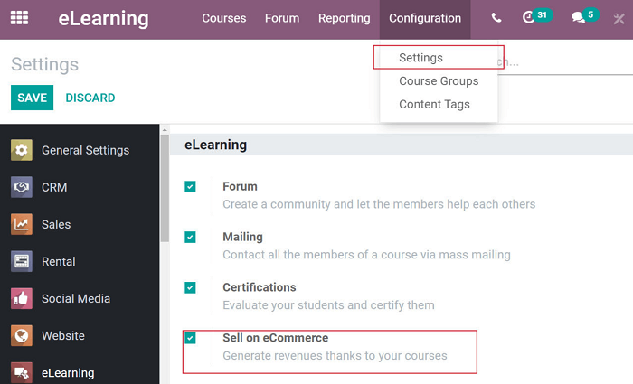
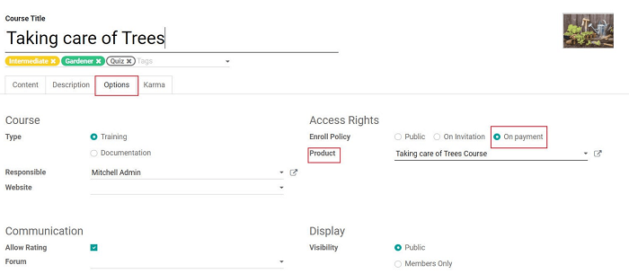
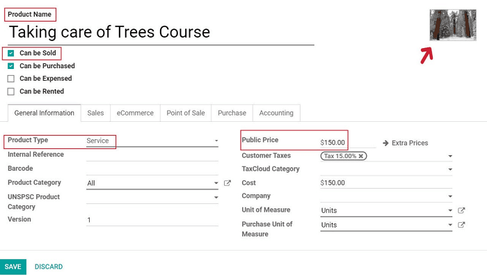
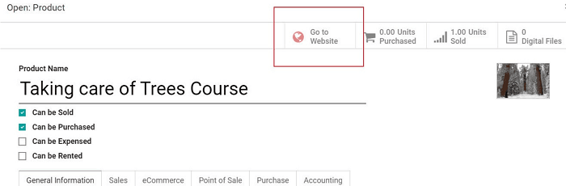
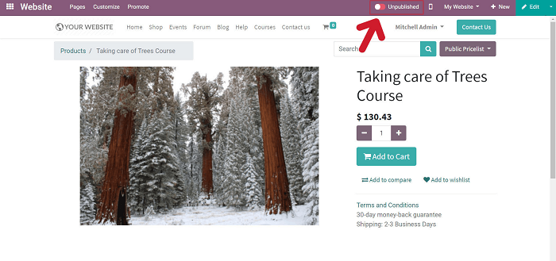

===============================
Sell courses and certifications
===============================

Odoo's user-friendly interface is built to help users sell courses online quickly and easily.
And the best part is, unlike other online marketplaces, Odoo will *never* take a cent away from
your sales.

Configuration
=============

First, you'll need to open the *eLearning* app, and activate the *Sell on eCommerce* feature. To
do that, go to :menuselection:`Configuration --> Settings` and activating the
*Sell on eCommerce* feature.

In addition to this feature, you'll need to install the eCommerce application, too (if you
haven't already).

Don't worry, Odoo will automatically remind you about this when you activate the
*Sell on eCommerce* feature.

Following that, navigate to the template page of the course you want to sell, open the
*Options* tab, and set the *Enroll Policy* to "On payment." Then, link it to a product.

Create products
===============

You’ll need to create your course as a product in your catalog in order to sell it. You can do this
directly from your eLearning course dashboard, by selecting *Create* then *Edit*.

If your product already exists, but you want to modify it, you can always edit it at any time.
Simply open the product form directly from the course, by clicking the icon next to the product
name, and make any changes you’d like.

Remember to give your course an appropriate product title. That way, your customers will know
exactly what the product is right away without any confusion.

Make sure to set the product as "Can be sold" and select "Service" as the product type. Don’t forget
to set the "Public Price," which is the value that will be displayed as the sales price for your
course on the front-end of the website.

Also, if you’d like to add an image to this product, you can do that here, as well. Don't forget
to hit *Save* before moving on.

Publish the product (course)
============================

Once you’ve created a new product, it will remain "Unpublished" by default. This means customers
won’t be able to see it available on the website until it is officially "Published."

In order to publish your course as a product, go to the front-end of the website, and click the
switch next to "Unpublished."

You’ll know your course is published, and available to all customers, when it turns green and
reads, "Published."

Sell certifications
===================

If you wish to sell a certification, simply create a course with the desired certification that
you want to sell, and follow the same procedure you would to sell a course. This feature allows
you to sell a certification at the end of a course (or training).

.. seealso::
   - :doc:`course_essentials`
   - :doc:`certification_essentials`
   - :doc:`mailing`
