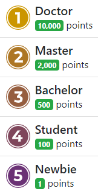
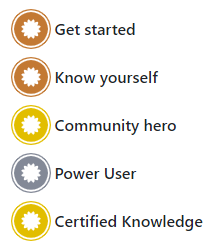
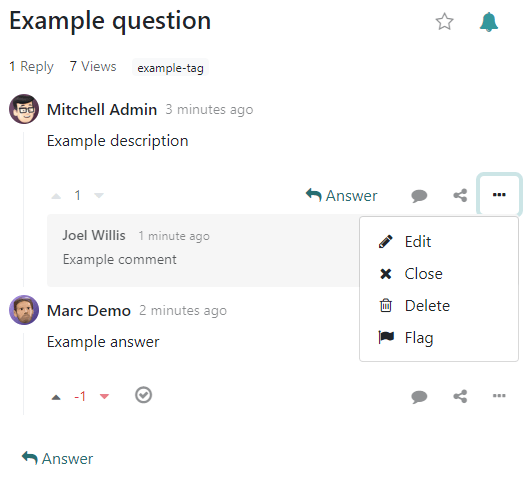
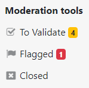
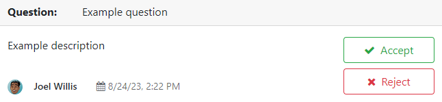
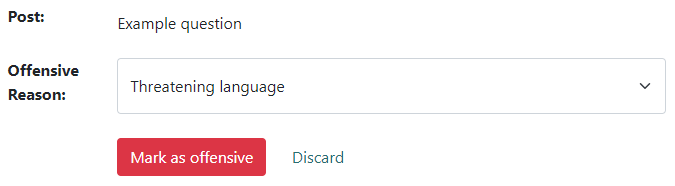

=====
Forum
=====

**Odoo Forum** is a question-and-answer forum designed with providing customer support in mind.
Adding a forum to a website enables you to build a community, encourage engagement, and share
knowledge.

.. _forum/create:

Create a forum
==============

To create or edit a forum, go to :menuselection:`Website --> Configuration --> Forum: Forums`. Click
:guilabel:`New` or select an existing forum and configure the following elements.

:guilabel:`Forum Name`: add the name of the forum.

:guilabel:`Mode`: select :guilabel:`Questions` to enable marking an answer as best, meaning
questions then appear as *solved*, or :guilabel:`Discussions` if the feature is not needed.

.. note::
   Regardless of the selected mode, only **one answer** per user is allowed on a single post.
   Commenting multiple times is allowed, however.

:guilabel:`Default Sort`: choose how questions are sorted by default.

  - :guilabel:`Newest`: by latest question posting date
  - :guilabel:`Last Updated`: by latest posting activity date (answers and comments included)
  - :guilabel:`Most Voted`: by highest vote tally
  - :guilabel:`Relevance`: by post relevancy (determined by a formula)
  - :guilabel:`Answered`: by likelihood to be answered (determined by a formula)

.. note::
   Users have several sorting options (total replies, total views, last activity) on the forum
   front end.

:guilabel:`Privacy`: select :guilabel:`Public` to let anyone view the forum, :guilabel:`Signed In`
to make it visible only for signed-in users, or :guilabel:`Some users` to make it visible only for a
specific user access group by selecting one :guilabel:`Authorized Group`.

Next, configure the :ref:`karma gains <forum/karma-gains>` and the :ref:`karma-related rights
<forum/karma-related-rights>`.

.. _forum/karma:

Karma points
------------

Karma points can be given to users based on different forum interactions. They can be used to
determine which forum functionalities users can access, from being able to vote on posts to
having moderator rights. They are also used to set user :ref:`ranks <forum/ranks>`.

.. important::
   - A user's karma points are shared across all forums, courses, etc., of a single Odoo website.
   - eLearning users can earn karma points through different :ref:`course interactions
     <elearning/karma>` and by :ref:`completing quizzes <elearning/quiz>`.

.. _forum/karma-gains:

Karma gains
~~~~~~~~~~~

Several forum interactions can give or remove karma points.

.. list-table::
   :header-rows: 1
   :stub-columns: 1

   * - Interaction
     - Description
     - Default karma gain
   * - :guilabel:`Asking a question`
     - You post a question.
     - 2
   * - :guilabel:`Question upvoted`
     - Another user votes for a question you posted.
     - 5
   * - :guilabel:`Question downvoted`
     - Another user votes against a question you posted.
     - -2
   * - :guilabel:`Answer upvoted`
     - Another user votes for an answer you posted.
     - 10
   * - :guilabel:`Answer downvoted`
     - Another user votes against an answer you posted.
     - -2
   * - :guilabel:`Accepting an answer`
     - You mark an answer posted by another user as best.
     - 2
   * - :guilabel:`Answer accepted`
     - Another user marks an answer you posted as best.
     - 15
   * - :guilabel:`Answer flagged`
     - A question or an answer you posted is :ref:`marked as offensive <forum/moderation>`.
     - -100

.. note::
   New users receive **three points** upon validating their email address.

To modify the default values, go to :menuselection:`Website --> Configuration --> Forum: Forums`,
select the forum, and go to the :guilabel:`Karma Gains` tab. Select a value to edit it.

If the value is positive (e.g., `5`), the number of points will be added to the user's tally each
time the interaction happens on the selected forum. Conversely, if the value is negative (e.g.,
`-5`), the number of points will be deducted. Use `0` if an interaction should not impact a user's
tally.

.. _forum/karma-related-rights:

Karma-related rights
~~~~~~~~~~~~~~~~~~~~

To configure how many karma points are required to access the different forum functionalities, go
to :menuselection:`Website --> Configuration --> Forum: Forums`, select the forum, and go to the
:guilabel:`Karma Related Rights` tab. Select a value to edit it.

.. warning::
   Some functionalities, such as :guilabel:`Edit all posts`, :guilabel:`Close all posts`,
   :guilabel:`Delete all posts`, :guilabel:`Moderate posts`, and :guilabel:`Unlink all comments`,
   are rather sensitive. Make sure to understand the consequences of giving *any* user reaching the
   set karma requirements access to such functionalities.

.. list-table::
   :header-rows: 1
   :stub-columns: 1

   * - Functionality
     - Description
     - Default karma requirement
   * - :guilabel:`Ask questions`
     - Post questions.
     - 3
   * - :guilabel:`Answer questions`
     - Post answers to questions.
     - 3
   * - :guilabel:`Upvote`
     - Vote for questions or answers.
     - 5
   * - :guilabel:`Downvote`
     - Vote against questions or answers.
     - 50
   * - :guilabel:`Edit own posts`
     - Edit questions or answers you posted.
     - 1
   * - :guilabel:`Edit all posts`
     - Edit any question or answer.
     - 300
   * - :guilabel:`Close own posts`
     - Close questions or answers you posted.
     - 100
   * - :guilabel:`Close all posts`
     - Close any question or answer.
     - 500
   * - :guilabel:`Delete own posts`
     - Delete questions or answers you posted.
     - 500
   * - :guilabel:`Delete all posts`
     - Delete any question or answer.
     - 1,000
   * - :guilabel:`Nofollow links`
     - If you are under the karma threshold, a *nofollow* attribute tells search engines to ignore
       links you post.
     - 500
   * - :guilabel:`Accept an answer on own questions`
     - Mark an answer as best on questions you posted.
     - 20
   * - :guilabel:`Accept an answer to all questions`
     - Mark an answer as best on any question.
     - 500
   * - :guilabel:`Editor Features: image and links`
     - Add links and images to your posts.
     - 30
   * - :guilabel:`Comment own posts`
     - Post comments under questions or answers you created.
     - 1
   * - :guilabel:`Comment all posts`
     - Post comments under any question or answer.
     - 1
   * - :guilabel:`Convert own answers to comments and vice versa`
     - Convert comments you posted as answers.
     - 50
   * - :guilabel:`Convert all answers to comments and vice versa`
     - Convert any comment as answer.
     - 500
   * - :guilabel:`Unlink own comments`
     - Delete comments you posted.
     - 50
   * - :guilabel:`Unlink all comments`
     - Delete any comment.
     - 500
   * - :guilabel:`Ask questions without validation`
     - Questions you post do not require to be :ref:`validated <forum/moderation>` first.
     - 100
   * - :guilabel:`Flag a post as offensive`
     - Flag a question or answer as offensive.
     - 500
   * - :guilabel:`Moderate posts`
     - Access all :ref:`moderation tools <forum/moderation>`.
     - 1,000
   * - :guilabel:`Change question tags`
     - Change posted questions' :ref:`tags <forum/tags>` (if you have the right to edit them).
     - 75
   * - :guilabel:`Create new tags`
     - Create new :ref:`tags <forum/tags>` when posting questions.
     - 30
   * - :guilabel:`Display detailed user biography`
     - When a user hovers their mouse on your avatar or username, a popover box showcases your
       karma points, biography, and number of :ref:`badges <forum/badges>` per level.
     - 750

.. tip::
   Track all karma-related activity and add or remove karma manually by :ref:`enabling developer
   mode <developer-mode>` and going to :menuselection:`Settings --> Gamification Tools --> Karma
   Tracking`.

.. _forum/gamification:

Gamification
------------

Ranks and badges can be used to encourage participation. Ranks are based on the total :ref:`karma
points <forum/karma>`, while badges can be granted manually or automatically by completing
challenges.

.. _forum/ranks:

Ranks
~~~~~

To create new ranks or modify the default ones, go to :menuselection:`Website --> Configuration -->
Forum: Ranks` and click :guilabel:`New` or select an existing rank.

Add the :guilabel:`Rank Name`, the :guilabel:`Required Karma` points to reach it, its
:guilabel:`Description`, a :guilabel:`Motivational` message to encourage users to reach it, and an
image.

.. _forum/badges:

Badges
~~~~~~

To create new badges or modify the default ones, go to :menuselection:`Website --> Configuration -->
Forum: Badges` and click :guilabel:`New` or select an existing badge.

Enter the badge name and description, add an image, and configure it.

Assign manually
***************

If the badge should be granted manually, select which users can grant them by selecting one of the
following :guilabel:`Allowance to Grant` options:

- :guilabel:`Everyone`: all non-portal users (since badges are granted from the backend).
- :guilabel:`A selected list of users`: users selected under :guilabel:`Authorized Users`.
- :guilabel:`People having some badges`: users who have been granted the badges selected under
  :guilabel:`Required Badges`.

It is possible to restrict how many times per month each user can grant the badge by enabling
:guilabel:`Monthly Limited Sending` and entering a :guilabel:`Limitation Number`.

Assign automatically
********************

If the badge should be granted **automatically** when certain conditions are met, select
:guilabel:`No one, assigned through challenges` under :guilabel:`Allowance to Grant`.

Next, determine how the badge should be granted by clicking :guilabel:`Add` under the
:guilabel:`Rewards for challenges` section. Select a challenge to add it or create one by clicking
:guilabel:`New`.

.. tip::
   It is possible to give the badge a :guilabel:`Forum Badge Level` (:guilabel:`Bronze`,
   :guilabel:`Silver`, :guilabel:`Gold`) to give it more or less importance.

.. _forum/tags:

Tags
----

Users can use tags to filter forum posts.

To manage tags, go to :menuselection:`Website --> Configuration --> Forum: Tags`. Click
:guilabel:`New` to create a tag and select the related :guilabel:`Forum`.

.. tip::
   - Use the :guilabel:`Tags` section on the forum's sidebar to filter all questions assigned to the
     selected tag. Click :guilabel:`View all` to display all tags.
   - New tags can be created when posting a new message, provided the user has enough :ref:`karma
     points <forum/karma-related-rights>`.

.. _forum/use:

Use a forum
===========

.. note::
   Access to many functionalities depends on a user's :ref:`karma points
   <forum/karma-related-rights>`.

.. _forum/post:

Post questions
--------------

To create a new post, access the forum's front end, click :guilabel:`New Post`, and fill in the
following:

- :guilabel:`Title`: add the question or the topic of the post.
- :guilabel:`Description`: add a description for the question.
- :guilabel:`Tags`: add up to five :ref:`tags <forum/tags>`.

Click :guilabel:`Post Your Question`.

.. _forum/interact:

Interact with posts
-------------------

Different actions are possible on a post.

- Mark a question as **favorite** by clicking the star button (:guilabel:`☆`).
- Follow a post and get **notifications** (by email or within Odoo) when it is answered by clicking
  the bell button (:guilabel:`🔔`).
- **Vote** *for* (up arrow :guilabel:`▲`) or *against* (down arrow :guilabel:`▼`) a question or
  answer.
- Mark an answer as **best** by clicking the check mark button (:guilabel:`✔`). This option is only
  available if the :guilabel:`Forum Mode` is set to :guilabel:`Questions`.
- :guilabel:`Answer` a question.
- **Comment** on a question or answer by clicking the speech bubble button (:guilabel:`💬`).
- **Share** a question on Facebook, Twitter, or LinkedIn by clicking the *share nodes* button.

Click the ellipsis button (:guilabel:`...`) to:

  - :guilabel:`Edit` a question or answer.
  - :guilabel:`Close` a question.
  - :guilabel:`Delete` a question, answer, or comment. It is possible to :guilabel:`Undelete`
    questions afterward.
  - :guilabel:`Flag` a question or answer as offensive.
  - :guilabel:`Convert` a comment into an answer.
  - :guilabel:`View` the related :ref:`Helpdesk ticket <helpdesk/forum>`, if any.

.. note::
   By default, 150 karma points are required to view another user's profile. This value can be
   configured when creating a new website.

.. _forum/moderation:

Moderate a forum
================

On the forum's front end, the sidebar's :guilabel:`Moderation tools` section gathers the essential
moderator functionalities.

:guilabel:`To Validate`: access all questions and answers waiting for validation before being
displayed to non-moderator users.

.. note::
   A question is pending if a user does not have the required karma. The user is not able to post
   questions or answers while awaiting validation. Only one pending question per user is allowed per
   forum.

:guilabel:`Flagged`: access all questions and answers that have been flagged as offensive. Click
:guilabel:`Accept` to remove the offensive flag or :guilabel:`Offensive` to confirm it, then select
a reason and click :guilabel:`Mark as offensive`. The post is then hidden from users without
moderation rights, and 100 karma points are deducted from the offending user's tally.

:guilabel:`Closed`: access all questions that have been closed. It is possible to :guilabel:`Delete`
or :guilabel:`Reopen` them. To close a question, open it, click the ellipsis button
(:guilabel:`...`), then :guilabel:`Close`, select a :guilabel:`Close Reason`, and click
:guilabel:`Close post`. The post is then hidden from users without moderation rights.

.. note::
   When selecting :guilabel:`Spam or advertising` or :guilabel:`Contains offensive or malicious
   remarks` as the reason, 100 karma points are deducted from the poster's tally.

.. tip::
   - Create and edit close reasons by going to :menuselection:`Website --> Configuration --> Forum:
     Close Reasons`. Select :guilabel:`Basic` as :guilabel:`Reason Type` if the reason should be
     used when closing a question, and :guilabel:`Offensive` if it should be used for flagged posts.
   - Manage all posts by going to :menuselection:`Website  --> Configuration --> Forum: Forums`,
     selecting the forum, and clicking the :guilabel:`Posts` smart button. By clicking the
     :guilabel:`Actions` button, it is possible to :guilabel:`Export`, :guilabel:`Archive`,
     :guilabel:`Unarchive`, or :guilabel:`Delete` one or multiple posts.
