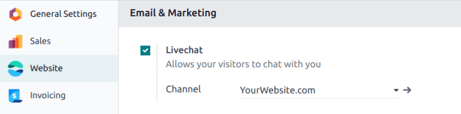
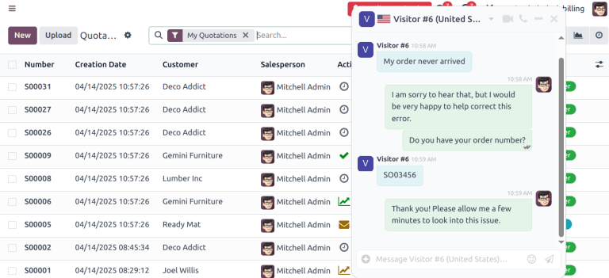

:show-content:
:show-toc:

=========
Live Chat
=========

Odoo *Live Chat* allows users to communicate with website visitors in real time. With *Live Chat*,
leads can be qualified for their sales potential, support questions can be answered quickly, and
issues can be directed to the appropriate team for further investigation (or follow up). *Live Chat*
also provides the opportunity for instant feedback from customers.

Enable Live Chat
================

In order to enable *Live Chat*, the *Live Chat* application needs to be installed. This can be done
in one of two ways.

- Go to :menuselection:`Apps --> Live Chat` and click :guilabel:`Install`.
- In the :menuselection:`Website` application, go to :menuselection:`Configuration --> Settings`,
  scroll to the :guilabel:`Email & Marketing` section, check the box next to :guilabel:`Livechat`,
  and click :guilabel:`Save`.

After the :guilabel:`Live Chat` application is installed, a live chat :guilabel:`Channel` will be
created by default and automatically selected in the drop-down.

Create a new live chat channel
==============================

To create a new live chat *Channel*, go to :menuselection:`Main Odoo Dashboard --> Live Chat app -->
New`. This will open a blank channel detail form. Enter the name of the new channel in the
:guilabel:`Channel Name` field.

To configure the remaining tabs on the channel detail form (:guilabel:`Operators`,
:guilabel:`Options`, :guilabel:`Channel Rules`, and :guilabel:`Widgets`), follow the steps below.

Operators
---------

*Operators* are the users who will respond to live chat requests from customers. When a user is
added as an operator in a live chat channel, they will be able to receive chats from website
visitors wherever they are in the database. Chat windows will open in the bottom right corner of the
screen.

The user who originally created the live chat channel will be added as an operator by default.

To add additional users, navigate back to the :guilabel:`Website Live Chat Channels` dashboard via
the breadcrumbs and click on the appropriate :guilabel:`Live Chat Channel`. Then, on the channel
detail form, under the :guilabel:`Operators` tab, click :guilabel:`ADD` to reveal an :guilabel:`Add:
Operators` pop-up window.

In the pop-up window, search for the desired user(s). Then, click the checkbox next to the user(s)
to be added, and click :guilabel:`SELECT`.

New operators can be created and added to the list directly from this pop-up, as well, by clicking
:guilabel:`New`, and filling out the :guilabel:`Create Operators` pop-up form. When the form is
complete, click :guilabel:`SAVE & CLOSE` (or :guilabel:`SAVE & NEW` for multiple record creations).

.. note::
   Current operators can be edited (or removed) by clicking on their respective boxes in the
   :guilabel:`Operators` tab, which reveals a separate :guilabel:`Open: Operators` pop-up. In that
   pop-up, adjust any information as needed, and click :guilabel:`Save`, or click :guilabel:`Remove`
   to remove that operator from the channel.

Options
-------

The :guilabel:`Options` tab on the live chat channel details form contains the visual and text
settings for the live chat window.

Livechat button
~~~~~~~~~~~~~~~

The *Livechat Button* is the icon that appears in the bottom corner of the website.

.. image:: livechat/chat-button.png
   :align: center
   :alt: View of an Odoo website emphasizing the livechat button.

Change the text in the :guilabel:`Text of the Button` field to update the greeting displayed in the
text bubble when the live chat button appears on the website.

Change the :guilabel:`Livechat Button Color` by clicking a color bubble to open the color selection
window. Click the :guilabel:`🔄 (refresh)` icon to the right of the color bubbles to reset the
colors to the default selection.

.. tip::
   Color selection, for the button or header, can be made manually using a slider or through RGB,
   HSL, or HEX color code entries from the pop-up color selection window that appears when either of
   the color bubbles are clicked. Different options will be available, depending on your operating
   system.

Livechat window
~~~~~~~~~~~~~~~

The *Livechat Window* is the space where the live chat conversation with website visitors takes
place.

Edit the :guilabel:`Welcome Message` to change the message a visitor sees when they open a new chat
session. This message will appear as though it is sent by a live chat operator, and acts as both a
greeting and an invitation to continue the conversation.

Edit the :guilabel:`Chat Input Placeholder` to alter the text that appears in the box where visitors
will type their replies.

The *Channel Header* is the colored bar at the top of the chat window. The :guilabel:`Channel Header
Color` can be changed following the same steps as the *Livechat Button Color* above.

.. figure:: livechat/chat-window.png
   :align: center

   The Livechat Window with a purple header. The chat input placeholder reads "Ask Something..."

Channel rules
-------------

The :guilabel:`Channel Rules` tab on the live chat channel details form determines when the *Live
Chat Window* opens on the website, by configuring when a :guilabel:`URL Regex` action is triggered
(e.g., a page visit).

To create a new channel rule, click :guilabel:`Add a line`. This opens the :guilabel:`Open: Rules`
pop-up.

.. image:: livechat/create-rules.png
   :align: center
   :alt: View of a channel's rules form for Odoo Live Chat.

Create new rules
~~~~~~~~~~~~~~~~

Fill out the fields on the :guilabel:`Open: Rules` pop-up as instructed below, then click
:guilabel:`Save`.

.. tabs::

   .. tab:: Live Chat Button

      The *Livechat Button* is the icon that appears in the bottom corner of the website. Select
      from one of the following display options:

      - :guilabel:`Show` displays the chat button on the page(s).
      - :guilabel:`Show with notification` displays the chat button, as well as a floating text
        bubble next to the button.
      - :guilabel:`Open automatically` displays the button and automatically opens the chat window
        after a specified amount of time (designated in the :guilabel:`Open automatically timer`
        field).
      - :guilabel:`Hide` hides the chat button on the page(s).

   .. tab:: Chatbot

      If a *Chatbot* will be included on this channel, select it from the dropdown. If the chatbot
      will only be active when no operators are active, check the box labeled :guilabel:`Enabled
      only if no operator`.

   .. tab:: URL Regex

      In the :guilabel:`URL Regex` field, input the relative URL of the page where the chat button
      should appear.

   .. tab:: Open automatically timer

      This field designates the amount of time (in seconds) a page will be open before the chat
      window will open. If the :guilabel:`Livechat Button` for this rule is not set to
      :guilabel:`Open automatically`, this field will be ignored.

   .. tab:: Country

      If this channel should only be available to site visitors in specific countries, add them to
      the :guilabel:`Country` field. If this field is left blank, the channel will be available to
      all site visitors, regardless of location.

.. note::
   In order to track the geographical location of visitors, :guilabel:`GeoIP` must be installed on
   the database. While this feature is installed by default on *Odoo Online*, *On-Premise* databases
   will require additional :doc:`setup steps </administration/install/geo_ip>`.

Widget
------

The :guilabel:`Widget` tab on the live chat channel details form provides the shortcode for an
embeddable website widget. This code can be added to a website to provide access to a live chat
window.

The live chat widget can be added to websites created through Odoo by navigating to the
:menuselection:`Website --> Configuration --> Settings`. Then scroll to the :guilabel:`Livechat`
section, and select the channel to add to the site. Click :guilabel:`Save` to apply.

To add the widget to a website created on a third-party platform, click the first :guilabel:`COPY`
button on the :guilabel:`Widget` tab and paste the code into the `<head>` tag on the site.

Likewise, to send a live chat session to a customer, click the second :guilabel:`COPY` button on the
:guilabel:`Widget` tab. This link can be sent directly to a customer, and once they click the link,
it will open a new chat.

.. image:: livechat/widget-code.png
   :align: center
   :alt: View of the widget tab for Odoo Live Chat.

Participate in a conversation
=============================

As explained above, *operators* are the users who will respond to live chat requests from customers.
The information below outlines the necessary steps for operators participating in live chat
conversations on an Odoo database.

Set an online chat name
-----------------------

Before participating in a live chat, operators should update their *Online Chat Name*. This is the
name that will be displayed to site visitors in the live chat conversation.

To update the :guilabel:`Online Chat Name`, click on the user name in the upper-right corner of any
page in the database. Select :guilabel:`My Profile` to open the Profile page. On the right side of
the :guilabel:`Preferences` tab, locate the :guilabel:`Online Chat Name` field and enter the
preferred name.

.. image:: livechat/my-profile.png
   :align: center
   :alt: View of the My Profile option in Odoo.

If a users :guilabel:`Online Chat Name` is not set, the name displayed will default to the
:guilabel:`User Name`.

.. example::
   A user has their full name as their :guilabel:`User Name`, but they do not want to include their
   last name in a live chat conversation. They would then set their :guilabel:`Online Chat Name` to
   include only their first name.

   .. image:: livechat/online-chat-name.png
      :align: center
      :alt: View of user profile in Odoo, emphasizing the Online Chat name field.

Join or leave a channel
-----------------------

To join a live chat channel, go to the :menuselection:`Live Chat` app and click the :guilabel:`JOIN`
button on the kanban card for the appropriate channel.

Any channel where the user is currently active will show a :guilabel:`LEAVE` button. Click this
button to disconnect from the channel.

.. image:: livechat/leave-channel.png
   :align: center
   :alt: View of a channel form and the option to join a channel for Odoo Live Chat.

.. important::
   *Operators* that do not show any activity in Odoo for more than thirty minutes will be considered
   disconnected, and subsequently removed from the channel.

Manage live chat requests
-------------------------

When an operator is active in a channel, chat windows will open in the bottom right corner of the
screen, no matter where they are in the database. They can participate in conversations without
leaving their current location.

.. tip::
   Conversations can also be accessed by clicking the :guilabel:`Conversations` icon in the
   menu bar.

   .. image:: livechat/menu-bar.png
      :align: center
      :alt: View of the menu bar in Odoo emphasizing the conversations icon.

Live chat conversations can also be viewed by navigating to :menuselection:`Dashboard --> Discuss`.
New conversations will appear in bold under the :guilabel:`LIVECHAT` heading along the left panel.

.. image:: livechat/managing-chat-responses.png
   :align: center
   :alt: View of the discuss application with a message sent through live chat in Odoo.

Click on a conversation in the left panel to select it. This will open the conversation. From this
view, an operator can participate in the chat the same as they would in the normal chat window.

.. seealso::
   - :doc:`Get Started with Discuss </applications/productivity/discuss/overview/get_started>`
   - :doc:`/applications/websites/livechat/responses`

.. toctree::
   :titlesonly:

   livechat/ratings
   livechat/responses
   livechat/chatbots
