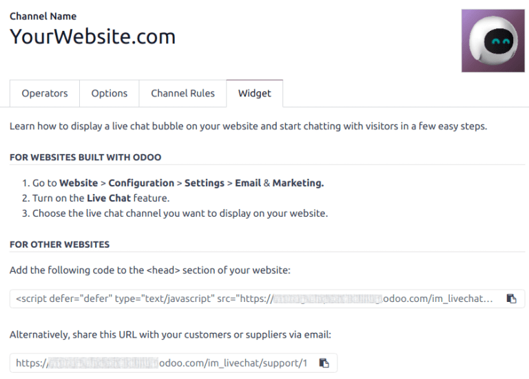

:show-content:

=========
Live Chat
=========

Odoo **Live Chat** allows users to communicate with website visitors in real-time. With **Live
Chat**, leads can be qualified for their sales potential, support questions can be answered quickly,
and issues can be directed to the appropriate team for further investigation or follow up. **Live
Chat** also provides the opportunity for instant feedback from customers.

Enable Live Chat
================

The **Live Chat** application can be installed multiple ways:

- Go to :menuselection:`Apps application`, search `Live Chat`, and click :guilabel:`Install`.
- Go to the :menuselection:`Helpdesk app --> Configuration --> Helpdesk Teams` list view, select a
  team, and on the team's settings page, click the checkbox next to :guilabel:`Live Chat`, under the
  :guilabel:`Channels` section.
- In the :menuselection:`Website` app, go to :menuselection:`Configuration --> Settings`, scroll to
  the :guilabel:`Email & Marketing` section, check the box next to :guilabel:`Livechat`, and click
  :guilabel:`Save`.

  .. image:: livechat/enable-setting.png
     :align: center
     :alt: View of the settings page and the live chat feature for Odoo Live Chat.

.. note::
   After the **Live Chat** application is installed, a live chat *Channel* is created, by default.

Create live chat channels
=========================

To create a new live chat *Channel*, go to :menuselection:`Main Odoo Dashboard --> Live Chat app -->
New`. This opens a blank channel detail form. Enter the name of the new channel in the
:guilabel:`Channel Name` field.

.. image:: livechat/open-channel.png
   :align: center
   :alt: View of a live chat channel form for Odoo Live Chat.

To configure the remaining tabs on the channel detail form (:ref:`Operators
<livechat/operators-tab>`, :ref:`Options <livechat/options-tab>`, :ref:`Channel Rules
<livechat/channel-rules-tab>`, and :ref:`Widget <livechat/widget-tab>`), follow the steps below.

.. tip::
   The channel detail form for any channel can be accessed by navigating back to the
   :guilabel:`Website Live Chat Channels` dashboard, via the breadcrumbs. Find the Kanban card for
   the appropriate live chat channel, hover over it, and then click on the :icon:`fa-ellipsis-v`
   :guilabel:`(vertical ellipsis)` icon to open the drop-down menu. Click :guilabel:`Configure
   Channel` to open the channel detail form.

.. _livechat/operators-tab:

Operators tab
-------------

*Operators* are the users who act as agents and respond to live chat requests from customers. When a
user is added as an operator in a live chat channel, they can receive chats from website visitors
wherever they are in the database. Chat windows open in the bottom-right corner of the screen.

.. image:: livechat/pop-up.png
   :align: center
   :alt: View of a live chat pop up window in an Odoo database.

On the channel detail form, click the :guilabel:`Operators` tab. The user who originally created the
live chat channel has been added as an operator by default.

.. note::
   Current operators can be edited, or removed, by clicking on their respective boxes in the
   :guilabel:`Operators` tab, which reveals a separate :guilabel:`Open: Operators` modal. In that
   modal, adjust any information, as needed. Then, click :guilabel:`Save`, or click
   :guilabel:`Remove` to remove that operator from the channel.

Click :guilabel:`Add` to reveal an :guilabel:`Add: Operators` pop-up window.

In the pop-up window, scroll to find the desired users, or enter their name in the search bar. Then,
tick the checkbox next to the users to be added, and click :guilabel:`Select`.

New operators can be created and added to the list directly from this pop-up window, as well, by
clicking :guilabel:`New`, and filling out the :guilabel:`Create Operators` form. When the form is
complete, click :guilabel:`Save & Close`, or :guilabel:`Save & New` for multiple record creations.

.. danger::
   Creating a new user can impact the status of an Odoo subscription, as the total number of users
   in a database counts towards the billing rate. Proceed with caution before creating a new user.
   If a user already exists, adding them as an operator will **not** alter the subscription or
   billing rate for a database.

.. _livechat/options-tab:

Options tab
-----------

The :guilabel:`Options` tab on the live chat channel detail form contains the visual and text
settings for the live chat window.

.. _livechat/livechat-button:

Livechat button
~~~~~~~~~~~~~~~

The *Livechat Button* is the icon that appears in the bottom-right corner of the website.

.. image:: livechat/chat-button.png
   :align: center
   :alt: View of an Odoo website emphasizing the livechat button.

Change the text in the :guilabel:`Notification text` field to update the greeting displayed in the
text bubble when the live chat button appears on the website.

The :guilabel:`Livechat Button Color` alters the color of the live chat button as it appears on the
website. To change the color, click on a color bubble to open the color selection window, then click
and drag the circle along the color gradient. Click out of the selection window once complete. Click
the :icon:`fa-refresh` :guilabel:`(refresh)` icon to the right of the color bubbles to reset the
colors to the default selection.

.. tip::
   Color selection, for the button or header, can be made manually using a slider or through RGB,
   HSL, or HEX color code entries from the pop-up color selection window that appears when either of
   the color bubbles are clicked. Different options are available, depending on the operating
   system.

Livechat Window
~~~~~~~~~~~~~~~

The *Livechat Window* is the space where the live chat conversation with website visitors takes
place.

Edit the :guilabel:`Welcome Message` to change the message a visitor sees when they open a new chat
session. This message appears as though it is sent by a live chat operator, and acts as both a
greeting and an invitation to continue the conversation.

Edit the :guilabel:`Chat Input Placeholder` to alter the text that appears in the box where visitors
type their replies. This message prompts the visitor to initiate the chat.

The *Channel Header* is the colored bar at the top of the chat window. The :guilabel:`Channel Header
Color` can be changed following the same steps as the :ref:`Livechat button
<livechat/livechat-button>`.

.. figure:: livechat/chat-window.png
   :align: center

   The live chat window with a purple channel header and placeholder text that reads, "Say
   Something..."

.. _livechat/channel-rules-tab:

Channel Rules tab
-----------------

To configure which website user actions open the live chat window, go to the :guilabel:`Channel
Rules` tab on the live chat channel detail form.

To create a new channel rule, click :guilabel:`Add a line`. This opens the :guilabel:`Create Rules`
pop-up window.

.. image:: livechat/create-rules.png
   :align: center
   :alt: View of a channel's rules form for Odoo Live Chat.

Create new rules
~~~~~~~~~~~~~~~~

Fill out the fields on the :guilabel:`Create Rules` pop-up window as instructed below, then click
:guilabel:`Save & Close`.

.. tabs::

   .. tab:: Live Chat Button

      The *Livechat Button* is the icon that appears in the bottom-right corner of the website.
      Select from one of the following display options:

      - :guilabel:`Show`: displays the chat button on the page.
      - :guilabel:`Show with notification`: displays the chat button, as well as a floating text
        bubble next to the button.
      - :guilabel:`Open automatically`: displays the button, and automatically opens the chat window
        after a specified amount of time (designated in the :guilabel:`Open automatically timer`
        field, that appears when this option is selected).
      - :guilabel:`Hide`: hides the chat button on the page.

   .. tab:: Chatbot

      To include a :doc:`Chatbot <livechat/chatbots>` on this channel, select it from the drop-down
      menu. If the chatbot should only be active when no operators are active, check the box labeled
      :guilabel:`Enabled only if no operator`.

      The :guilabel:`Enabled only if no operator` field is **only** visible if a chatbot is selected
      in the :guilabel:`Chatbot` field.

   .. tab:: URL Regex

      The *URL Regex* specifies the web pages where this rule should be applied. In the
      :guilabel:`URL Regex` field, input the relative URL of the page where the chat button should
      appear.

      For example, to apply the rule to the URL, `https://mydatabse.odoo.com/shop`, enter `/shop`
      to the :guilabel:`URL Regex` field.

      To apply the rule to *all* pages on the database, enter `/` in the :guilabel:`URL Regex`
      field.

   .. tab:: Open automatically timer

      This field designates the amount of time (in seconds) a page should be open before the chat
      window opens. This field **only** appears if the :guilabel:`Live Chat Button` for this rule is
      set to :guilabel:`Open automatically`.

   .. tab:: Country

      If this channel should **only** be available to site visitors in specific countries, add them
      to the :guilabel:`Country` field. If this field is left blank, the channel is available to all
      site visitors, regardless of location.

.. note::
   In order to track the geographical location of visitors, *GeoIP* **must** be installed on the
   database. While this feature is installed by default on *Odoo Online* databases, *On-Premise*
   databases require additional :doc:`setup steps </administration/on_premise/geo_ip>`.

.. _livechat/widget-tab:

Widget tab
----------

The :guilabel:`Widget` tab on the live chat channel detail form provides the code for a website
widget. This code can be added to a website to provide access to a live chat window.

.. tip::
   The live chat widget can be added to websites created through Odoo by navigating to
   :menuselection:`Website app --> Configuration --> Settings`. Then, scroll to the
   :menuselection:`Email & Marketing` section. In the :guilabel:`Channel` field, select the channel
   to add to the site. Click :guilabel:`Save` to apply.

To add the widget to a website created on a third-party platform, click the first :guilabel:`COPY`
button on the :guilabel:`Widget` tab, and paste the code into the `<head>` tag on the site.

Likewise, to send a live chat session to a customer, click the second :guilabel:`COPY` button on the
:guilabel:`Widget` tab. This link can be sent directly to a customer. When they click the link, they
are redirected to a new chat window.

.. seealso::
   - :doc:`../productivity/discuss`
   - :doc:`livechat/responses`
   - :doc:`livechat/ratings`
   - :doc:`livechat/chatbots`
   - :doc:`livechat/participate`

.. toctree::
   :titlesonly:

   livechat/ratings
   livechat/responses
   livechat/chatbots
   livechat/reports
   livechat/participate
