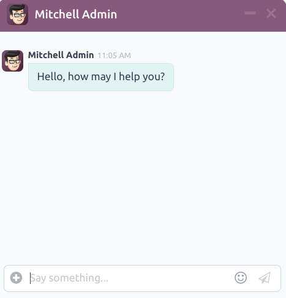

:show-content:

=========
Live Chat
=========

<<<<<<< 17.0
Odoo *Live Chat* allows users to communicate with website visitors in real-time. With *Live Chat*,
leads can be qualified for their sales potential, support questions can be answered quickly, and
issues can be directed to the appropriate team for further investigation or follow up. *Live Chat*
also provides the opportunity for instant feedback from customers.
||||||| c353ef26403768871607c5cfb6991a5f53d86bc6
Odoo *Live Chat* allows users to communicate with website visitors in real time. With *Live Chat*,
leads can be qualified for their sales potential, support questions can be answered quickly, and
issues can be directed to the appropriate team for further investigation (or follow up). *Live Chat*
also provides the opportunity for instant feedback from customers.
=======
Odoo **Live Chat** allows users to communicate with website visitors in real time. With **Live
Chat**, leads can be qualified for their sales potential, support questions can be answered quickly,
and issues can be directed to the appropriate team for further investigation or follow up. **Live
Chat** also provides the opportunity for instant feedback from customers.
>>>>>>> 6c31ca07f008bd020f8abc72bc5fd115142530a5

Enable Live Chat
================

<<<<<<< 17.0
The *Live Chat* application can be installed multiple ways:
||||||| c353ef26403768871607c5cfb6991a5f53d86bc6
In order to enable *Live Chat*, the *Live Chat* application needs to be installed. This can be done
in one of two ways.
=======
The **Live Chat** application is installed in multiple ways:
>>>>>>> 6c31ca07f008bd020f8abc72bc5fd115142530a5

<<<<<<< 17.0
- Go to :menuselection:`Apps application --> Live Chat` and click :guilabel:`Install`.
- Go to the :menuselection:`Helpdesk app --> Configuration --> Helpdesk Teams` list view, select a
  team, and on the team's settings page, click the checkbox next to :guilabel:`Live Chat`, under the
  :guilabel:`Channels` section.
- In the :menuselection:`Website` app, go to :menuselection:`Configuration --> Settings`, scroll to
  the :guilabel:`Email & Marketing` section, check the box next to :guilabel:`Livechat`, and click
  :guilabel:`Save`.
||||||| c353ef26403768871607c5cfb6991a5f53d86bc6
- Go to :menuselection:`Apps --> Live Chat` and click :guilabel:`Install`.
- In the :menuselection:`Website` application, go to :menuselection:`Configuration --> Settings`,
  scroll to the :guilabel:`Email & Marketing` section, check the box next to :guilabel:`Livechat`,
  and click :guilabel:`Save`.
=======
- Go to :menuselection:`Apps application`, search `Live Chat`, and click :guilabel:`Install`.
- Go to the :menuselection:`Helpdesk app --> Configuration --> Teams` list view, select a team, and
  on the team's settings page, tick the :guilabel:`Live Chat` checkbox, under the
  :guilabel:`Channels` section.
- In the :menuselection:`Website` app, go to :menuselection:`Configuration --> Settings`, scroll to
  the :guilabel:`How to configure the Twitter API access` section, tick the :guilabel:`Livechat`
  checkbox, and click :guilabel:`Save`.
>>>>>>> 6c31ca07f008bd020f8abc72bc5fd115142530a5

  .. image:: livechat/enable-setting.png
     :align: center
     :alt: View of the settings page and the live chat feature for Odoo Live Chat.

.. note::
<<<<<<< 17.0
   After the *Live Chat* application is installed, a live chat *Channel* is created by default.
||||||| c353ef26403768871607c5cfb6991a5f53d86bc6
After the :guilabel:`Live Chat` application is installed, a live chat :guilabel:`Channel` will be
created by default and automatically selected in the drop-down.
=======
   After the **Live Chat** application is installed, a live chat *Channel* is created by default.
>>>>>>> 6c31ca07f008bd020f8abc72bc5fd115142530a5

Create live chat channels
=========================

<<<<<<< 17.0
To create a new live chat *Channel*, go to :menuselection:`Main Odoo Dashboard --> Live Chat app -->
New`. This opens a blank channel detail form. Enter the name of the new channel in the
:guilabel:`Channel Name` field.
||||||| c353ef26403768871607c5cfb6991a5f53d86bc6
To create a new live chat *Channel*, go to :menuselection:`Main Odoo Dashboard --> Live Chat app -->
New`. This will open a blank channel detail form. Enter the name of the new channel in the
:guilabel:`Channel Name` field.
=======
To create a new live chat *Channel*, go to :menuselection:`Live Chat app --> New`. This opens a
blank channel detail form. Enter the name of the new channel in the :guilabel:`Channel Name` field.
>>>>>>> 6c31ca07f008bd020f8abc72bc5fd115142530a5

.. image:: livechat/open-channel.png
   :align: center
   :alt: View of a live chat channel form for Odoo Live Chat.

To configure the remaining tabs on the channel detail form (:ref:`Operators
<livechat/operators-tab>`, :ref:`Options <livechat/options-tab>`, :ref:`Channel Rules
<livechat/channel-rules-tab>`, and :ref:`Widget <livechat/widget-tab>`), follow the steps below.

.. tip::
   The channel detail form for any channel can be accessed by navigating back to the
<<<<<<< 17.0
   :guilabel:`Website Live Chat Channels` dashboard, via the breadcrumbs. Find the Kanban card for
   the appropriate live chat channel, hover over it, and then click on the :icon:`fa-ellipsis-v`
   :guilabel:`(vertical ellipsis)` icon to open the drop-down menu. Click :guilabel:`Configure
   Channel` to open the channel detail form.
||||||| c353ef26403768871607c5cfb6991a5f53d86bc6
Operators
---------
=======
   :guilabel:`Website Live Chat Channels` dashboard, via the breadcrumbs. Click the Kanban card for
   the appropriate live chat channel to open the channel detail form.
>>>>>>> 6c31ca07f008bd020f8abc72bc5fd115142530a5

.. _livechat/operators-tab:

Operators tab
-------------

*Operators* are the users who act as agents and respond to live chat requests from customers. When a
user is added as an operator in a live chat channel, they can receive chats from website visitors
wherever they are in the database. Chat windows open in the bottom-right corner of the screen.

.. image:: livechat/pop-up.png
   :align: center
   :alt: View of a live chat pop up window in an Odoo database.

On the channel detail form, click the :guilabel:`Operators` tab. The user who originally created the
live chat channel has been added as an operator by default.

.. note::
   Current operators can be edited, or removed, by clicking on their respective boxes in the
<<<<<<< 17.0
   :guilabel:`Operators` tab, which reveals a separate :guilabel:`Open: Operators` modal. In that
   modal, adjust any information, as needed. Then, click :guilabel:`Save`, or click
||||||| c353ef26403768871607c5cfb6991a5f53d86bc6
   Current operators can be edited (or removed) by clicking on their respective boxes in the
   :guilabel:`Operators` tab, which reveals a separate :guilabel:`Open: Operators` pop-up. In that
   pop-up, adjust any information as needed, and click :guilabel:`Save`, or click :guilabel:`Remove`
   to remove that operator from the channel.
=======
   :guilabel:`Operators` tab, which reveals a separate :guilabel:`Open: Operators` pop-up window.
   In that pop-up window, adjust any information, as needed. Then, click :guilabel:`Save`, or click
>>>>>>> 6c31ca07f008bd020f8abc72bc5fd115142530a5
   :guilabel:`Remove` to remove that operator from the channel.

<<<<<<< 17.0
Click :guilabel:`Add` to reveal an :guilabel:`Add: Operators` modal.
||||||| c353ef26403768871607c5cfb6991a5f53d86bc6
Options
-------
=======
Click :guilabel:`Add` to reveal an :guilabel:`Add: Operators` pop-up window.
>>>>>>> 6c31ca07f008bd020f8abc72bc5fd115142530a5

<<<<<<< 17.0
In the modal, scroll to find the desired users, or enter their name in the :guilabel:`Search...`
bar. Then, click the checkbox next to the users to be added, and click :guilabel:`Select`.

New operators can be created and added to the list directly from this modal, as well, by clicking
:guilabel:`New`, and filling out the :guilabel:`Create Operators` form. When the form is complete,
click :guilabel:`Save & Close`, or :guilabel:`Save & New` for multiple record creations.

.. danger::
   Creating a new user can impact the status of an Odoo subscription, as the total number of users
   in a database counts towards the billing rate. Proceed with caution before creating a new user.
   If a user already exists, adding them as an operator will **not** alter the subscription or
||||||| c353ef26403768871607c5cfb6991a5f53d86bc6
The :guilabel:`Options` tab on the live chat channel details form contains the visual and text
=======
In the pop-up window, scroll to find the desired users, or enter their name in the search bar. Then,
tick the checkbox next to the users to be added, and click :guilabel:`Select`.

New operators can be created and added to the list directly from this pop-up window, as well, by
clicking :guilabel:`New`, and filling out the :guilabel:`Create Operators` form. When the form is
complete, click :guilabel:`Save & Close`, or :guilabel:`Save & New` for multiple record creations.

.. danger::
   Creating a new user can impact the status of an Odoo subscription, as the total number of users
   in a database counts towards the billing rate. Proceed with caution before creating a new user.
   If a user already exists, adding them as an operator does **not** alter the subscription or
>>>>>>> 6c31ca07f008bd020f8abc72bc5fd115142530a5
   billing rate for a database.

.. _livechat/options-tab:

Options tab
-----------

The :guilabel:`Options` tab on the live chat channel detail form contains the visual and text
settings for the live chat window.

.. _livechat/livechat-button:
<<<<<<< 17.0

Livechat button
~~~~~~~~~~~~~~~
||||||| c353ef26403768871607c5cfb6991a5f53d86bc6
Livechat button
~~~~~~~~~~~~~~~
=======
>>>>>>> 6c31ca07f008bd020f8abc72bc5fd115142530a5

Livechat Button section
~~~~~~~~~~~~~~~~~~~~~~~

The *Livechat Button* is the icon that appears in the bottom-right corner of the website.

.. figure:: livechat/chat-button.png
   :align: center
   :alt: View of an Odoo website emphasizing the livechat button.

<<<<<<< 17.0
Change the text in the :guilabel:`Notification text` field to update the greeting displayed in the
||||||| c353ef26403768871607c5cfb6991a5f53d86bc6
Change the text in the :guilabel:`Text of the Button` field to update the greeting displayed in the
=======
   The Live Chat button in the bottom-right corner of an Odoo website.

Change the text in the :guilabel:`Text of the Button` field to update the greeting displayed in the
>>>>>>> 6c31ca07f008bd020f8abc72bc5fd115142530a5
text bubble when the live chat button appears on the website.

The :guilabel:`Livechat Button Color` alters the color of the live chat button as it appears on the
website. To change the color, click on a color bubble to open the color selection window, then click
and drag the circle along the color gradient. Click out of the selection window once complete. Click
the :icon:`fa-refresh` :guilabel:`(refresh)` icon to the right of the color bubbles to reset the
colors to the default selection.

.. tip::
   Color selection, for the button or header, can be made manually using a slider or through RGB,
   HSL, or HEX color code entries from the pop-up color selection window that appears when either of
   the color bubbles are clicked. Different options are available, depending on the operating
   system.

Livechat Window section
~~~~~~~~~~~~~~~~~~~~~~~

The *Livechat Window* is the space where the live chat conversation with website visitors takes
place.

Edit the :guilabel:`Welcome Message` to change the message a visitor sees when they open a new chat
session. This message appears as though it is sent by a live chat operator, and acts as both a
greeting and an invitation to continue the conversation.

Edit the :guilabel:`Chat Input Placeholder` to alter the text that appears in the box where visitors
type their replies. This message prompts the visitor to initiate the chat.

The *Channel Header* is the colored bar at the top of the chat window. The :guilabel:`Channel Header
Color` can be changed following the same steps as the :ref:`Livechat button
<livechat/livechat-button>`.

   The live chat window with a purple channel header and placeholder text that reads, "Say
   Something..."

.. _livechat/channel-rules-tab:

Channel Rules tab
-----------------

<<<<<<< 17.0
The :guilabel:`Channel Rules` tab on the live chat channel detail form determines when the live chat
window opens on the website, by configuring when a :guilabel:`URL Regex` action is triggered, such
as a page visit.

To create a new channel rule, click :guilabel:`Add a line`. This opens the :guilabel:`Create Rules`
modal.
||||||| c353ef26403768871607c5cfb6991a5f53d86bc6
To create a new channel rule, click :guilabel:`Add a line`. This opens the :guilabel:`Open: Rules`
pop-up.
=======
To configure which website user actions open the live chat window, go to the :guilabel:`Channel
Rules` tab on the live chat channel detail form.

To create a new channel rule, click :guilabel:`Add a line`. This opens the :guilabel:`Create Rules`
pop-up window.
>>>>>>> 6c31ca07f008bd020f8abc72bc5fd115142530a5

.. image:: livechat/create-rules.png
   :align: center
   :alt: View of a channel's rules form for Odoo Live Chat.

Create new rules
~~~~~~~~~~~~~~~~

<<<<<<< 17.0
Fill out the fields on the :guilabel:`Create Rules` modal, as instructed below. Then, click
||||||| c353ef26403768871607c5cfb6991a5f53d86bc6
Fill out the fields on the :guilabel:`Open: Rules` pop-up as instructed below, then click
:guilabel:`Save`.
=======
Fill out the fields on the :guilabel:`Create Rules` pop-up window as instructed below, then click
>>>>>>> 6c31ca07f008bd020f8abc72bc5fd115142530a5
:guilabel:`Save & Close`.

.. tabs::

   .. tab:: Live Chat Button

<<<<<<< 17.0
      The *Live Chat Button* is the icon that appears in the bottom corner of the website. Select
      from one of the following display options:
||||||| c353ef26403768871607c5cfb6991a5f53d86bc6
      The *Livechat Button* is the icon that appears in the bottom corner of the website. Select
      from one of the following display options:
=======
      The *Livechat Button* is the icon that appears in the bottom-right corner of the website.
      Select from one of the following display options:
>>>>>>> 6c31ca07f008bd020f8abc72bc5fd115142530a5

      - :guilabel:`Show`: displays the chat button on the page.
      - :guilabel:`Show with notification`: displays the chat button, as well as a floating text
        bubble next to the button.
<<<<<<< 17.0
      - :guilabel:`Open automatically`: displays the button and automatically opens the chat window
||||||| c353ef26403768871607c5cfb6991a5f53d86bc6
      - :guilabel:`Open automatically` displays the button and automatically opens the chat window
=======
      - :guilabel:`Open automatically`: displays the button, and automatically opens the chat window
>>>>>>> 6c31ca07f008bd020f8abc72bc5fd115142530a5
        after a specified amount of time (designated in the :guilabel:`Open automatically timer`
<<<<<<< 17.0
        field, which is revealed when selecting this option).
||||||| c353ef26403768871607c5cfb6991a5f53d86bc6
        field).
      - :guilabel:`Hide` hides the chat button on the page(s).
=======
        field that appears when this option is selected).
>>>>>>> 6c31ca07f008bd020f8abc72bc5fd115142530a5
      - :guilabel:`Hide`: hides the chat button on the page.

   .. tab:: Chatbot

      To include a :doc:`Chatbot <livechat/chatbots>` on this channel, select it from the drop-down
<<<<<<< 17.0
      menu. If the chatbot should only be active when no operators are active, check the box labeled
      :guilabel:`Enabled only if no operator`.

      The :guilabel:`Enabled only if no operator` field is **only** visible if a chatbot is selected
      in the :guilabel:`Chatbot` field.
||||||| c353ef26403768871607c5cfb6991a5f53d86bc6
      If a *Chatbot* will be included on this channel, select it from the dropdown. If the chatbot
      will only be active when no operators are active, check the box labeled :guilabel:`Enabled
      only if no operator`.
=======
      menu. If the chatbot should only be active when no operators are active, tick the checkbox
      labeled, :guilabel:`Enabled only if no operator`.
>>>>>>> 6c31ca07f008bd020f8abc72bc5fd115142530a5

   .. tab:: URL Regex

      The *URL Regex* specifies the web pages where this rule should be applied. In the
      :guilabel:`URL Regex` field, input the relative URL of the page where the chat button should
      appear.
<<<<<<< 17.0
||||||| c353ef26403768871607c5cfb6991a5f53d86bc6
      In the :guilabel:`URL Regex` field, input the relative URL of the page where the chat button
      should appear.
=======

      For example, to apply the rule to the URL, `https://mydatabse.odoo.com/shop`, enter `/shop`
      to the :guilabel:`URL Regex` field.

      To apply the rule to *all* pages on the database, enter `/` in the :guilabel:`URL Regex`
      field.
>>>>>>> 6c31ca07f008bd020f8abc72bc5fd115142530a5

   .. tab:: Open automatically timer

      This field designates the amount of time (in seconds) a page should be open before the chat
      window opens. This field **only** appears if the :guilabel:`Live Chat Button` for this rule is
      set to :guilabel:`Open automatically`.

   .. tab:: Country

<<<<<<< 17.0
      If this channel should only be available to site visitors in specific countries, add them to
      the :guilabel:`Country` field. If this field is left blank, the channel is available to all
||||||| c353ef26403768871607c5cfb6991a5f53d86bc6
      If this channel should only be available to site visitors in specific countries, add them to
      the :guilabel:`Country` field. If this field is left blank, the channel will be available to
      all site visitors, regardless of location.
=======
      If this channel should **only** be available to site visitors in specific countries, add them
      to the :guilabel:`Country` field. If this field is left blank, the channel is available to all
>>>>>>> 6c31ca07f008bd020f8abc72bc5fd115142530a5
      site visitors, regardless of location.

.. note::
<<<<<<< 17.0
   In order to track the geographical location of visitors, *GeoIP* **must** be installed on the
   database. While this feature is installed by default on *Odoo Online* databases, *On-Premise*
   databases require additional :doc:`setup steps </administration/on_premise/geo_ip>`.
||||||| c353ef26403768871607c5cfb6991a5f53d86bc6
   In order to track the geographical location of visitors, :guilabel:`GeoIP` must be installed on
   the database. While this feature is installed by default on *Odoo Online*, *On-Premise* databases
   will require additional :doc:`setup steps </administration/on_premise/geo_ip>`.
=======
   To track the geographical location of visitors, *GeoIP* **must** be installed on the database.
   While this feature is installed by default on *Odoo Online* databases, *On-Premise* databases
   require additional :doc:`setup steps </administration/on_premise/geo_ip>`.
>>>>>>> 6c31ca07f008bd020f8abc72bc5fd115142530a5

.. _livechat/widget-tab:

Widget tab
----------

The :guilabel:`Widget` tab on the live chat channel detail form provides the code for a website
widget. This code can be added to a website to provide access to a live chat window.

.. tip::
   The live chat widget can be added to websites created through Odoo by navigating to
   :menuselection:`Website app --> Configuration --> Settings`. Then, scroll to the
<<<<<<< 17.0
   :menuselection:`Email & Marketing` section. In the :guilabel:`Channel` field, select the channel
   to add to the site. Click :guilabel:`Save` to apply.
||||||| c353ef26403768871607c5cfb6991a5f53d86bc6
The live chat widget can be added to websites created through Odoo by navigating to the
:menuselection:`Website --> Configuration --> Settings`. Then scroll to the :guilabel:`Livechat`
section, and select the channel to add to the site. Click :guilabel:`Save` to apply.
=======
   :menuselection:`How to configure the Twitter API access` section. In the :guilabel:`Channel`
   field, select the channel to add to the site. Click :guilabel:`Save` to apply.
>>>>>>> 6c31ca07f008bd020f8abc72bc5fd115142530a5

To add the widget to a website created on a third-party platform, click the first :guilabel:`COPY`
button on the :guilabel:`Widget` tab, and paste the code into the `<head>` tag on the site.

Likewise, to send a live chat session to a customer, click the second :guilabel:`COPY` button on the
:guilabel:`Widget` tab. This link can be sent directly to a customer. When they click the link, they
are redirected to a new chat window.

.. image:: livechat/widget-code.png
   :align: center
   :alt: View of the widget tab for Odoo Live Chat.

<<<<<<< 17.0
||||||| c353ef26403768871607c5cfb6991a5f53d86bc6
Participate in a conversation
=============================

As explained above, *operators* are the users who will respond to live chat requests from customers.
The information below outlines the necessary steps for operators participating in live chat
conversations on an Odoo database.

Set an online chat name
-----------------------

Before participating in a live chat, operators should update their *Online Chat Name*. This is the
name that will be displayed to site visitors in the live chat conversation.

To update the :guilabel:`Online Chat Name`, click on the user name in the upper-right corner of any
page in the database. Select :guilabel:`My Profile` to open the Profile page. On the right side of
the :guilabel:`Preferences` tab, locate the :guilabel:`Online Chat Name` field and enter the
preferred name.

.. image:: livechat/my-profile.png
   :align: center
   :alt: View of the My Profile option in Odoo.

If a users :guilabel:`Online Chat Name` is not set, the name displayed will default to the
:guilabel:`User Name`.

.. example::
   A user has their full name as their :guilabel:`User Name`, but they do not want to include their
   last name in a live chat conversation. They would then set their :guilabel:`Online Chat Name` to
   include only their first name.

   .. image:: livechat/online-chat-name.png
      :align: center
      :alt: View of user profile in Odoo, emphasizing the Online Chat name field.

Join or leave a channel
-----------------------

To join a live chat channel, go to the :menuselection:`Live Chat` app and click the :guilabel:`JOIN`
button on the kanban card for the appropriate channel.

Any channel where the user is currently active will show a :guilabel:`LEAVE` button. Click this
button to disconnect from the channel.

.. image:: livechat/leave-channel.png
   :align: center
   :alt: View of a channel form and the option to join a channel for Odoo Live Chat.

.. important::
   *Operators* that do not show any activity in Odoo for more than thirty minutes will be considered
   disconnected, and subsequently removed from the channel.

Manage live chat requests
-------------------------

When an operator is active in a channel, chat windows will open in the bottom right corner of the
screen, no matter where they are in the database. They can participate in conversations without
leaving their current location.

.. tip::
   Conversations can also be accessed by clicking the :guilabel:`Conversations` icon in the
   menu bar.

   .. image:: livechat/menu-bar.png
      :align: center
      :alt: View of the menu bar in Odoo emphasizing the conversations icon.

Live chat conversations can also be viewed by navigating to :menuselection:`Dashboard --> Discuss`.
New conversations will appear in bold under the :guilabel:`LIVECHAT` heading along the left panel.

.. image:: livechat/managing-chat-responses.png
   :align: center
   :alt: View of the discuss application with a message sent through live chat in Odoo.

Click on a conversation in the left panel to select it. This will open the conversation. From this
view, an operator can participate in the chat the same as they would in the normal chat window.

=======
Participate in a conversation
=============================

As explained above, *operators* are the users who will respond to live chat requests from customers.
The information below outlines the necessary steps for operators participating in live chat
conversations on an Odoo database.

Set an online chat name
-----------------------

Before participating in a live chat, operators should update their *Online Chat Name*. This is the
name that will be displayed to site visitors in the live chat conversation.

To update the :guilabel:`Online Chat Name`, click on the user name in the upper-right corner of any
page in the database. Select :guilabel:`My Profile` to open the Profile page. On the right side of
the :guilabel:`Preferences` tab, locate the :guilabel:`Online Chat Name` field and enter the
preferred name.

.. image:: livechat/my-profile.png
   :align: center
   :alt: View of the My Profile option in Odoo.

If a users :guilabel:`Online Chat Name` is not set, the name displayed will default to the
:guilabel:`User Name`.

.. example::
   A user has their full name as their :guilabel:`User Name`, but they do not want to include their
   last name in a live chat conversation. They would then set their :guilabel:`Online Chat Name` to
   include only their first name.

   .. image:: livechat/online-chat-name.png
      :align: center
      :alt: View of user profile in Odoo, emphasizing the Online Chat name field.

Join or leave a channel
-----------------------

To join a live chat channel, go to the :menuselection:`Live Chat` app, and click the
:guilabel:`JOIN` button on the Kanban card for the appropriate channel.

Any channel where the user is currently active shows a :guilabel:`LEAVE` button. Click this button
to disconnect from the channel.

.. image:: livechat/leave-channel.png
   :align: center
   :alt: View of a channel form and the option to join a channel for Odoo Live Chat.

.. important::
   *Operators* that do not show any activity in Odoo for more than thirty minutes will be considered
   disconnected, and subsequently removed from the channel.

Manage live chat requests
-------------------------

When an operator is active in a channel, chat windows will open in the bottom right corner of the
screen, no matter where they are in the database. They can participate in conversations without
leaving their current location.

.. tip::
   Conversations can also be accessed by clicking the :icon:`fa-comments` :guilabel:`(messages)`
   icon in the menu bar.

   .. image:: livechat/menu-bar.png
      :align: center
      :alt: View of the menu bar in Odoo emphasizing the conversations icon.

Live chat conversations can also be viewed by navigating to :menuselection:`Dashboard --> Discuss`.
New conversations will appear in bold under the :guilabel:`LIVECHAT` heading along the left panel.

.. image:: livechat/managing-chat-responses.png
   :align: center
   :alt: View of the discuss application with a message sent through live chat in Odoo.

Click on a conversation in the left panel to select it. This will open the conversation. From this
view, an operator can participate in the chat the same as they would in the normal chat window.

>>>>>>> 6c31ca07f008bd020f8abc72bc5fd115142530a5
.. seealso::
   - :doc:`../productivity/discuss`
   - :doc:`livechat/responses`
   - :doc:`livechat/ratings`
   - :doc:`livechat/chatbots`
   - :doc:`livechat/participate`

.. toctree::
   :titlesonly:

   livechat/ratings
   livechat/responses
   livechat/chatbots
   livechat/reports
   livechat/participate
