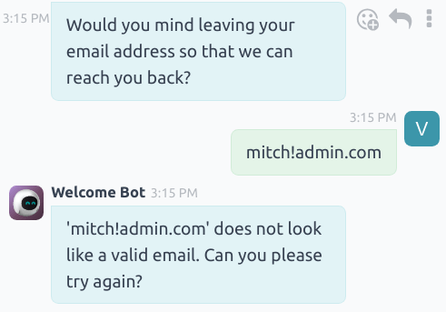
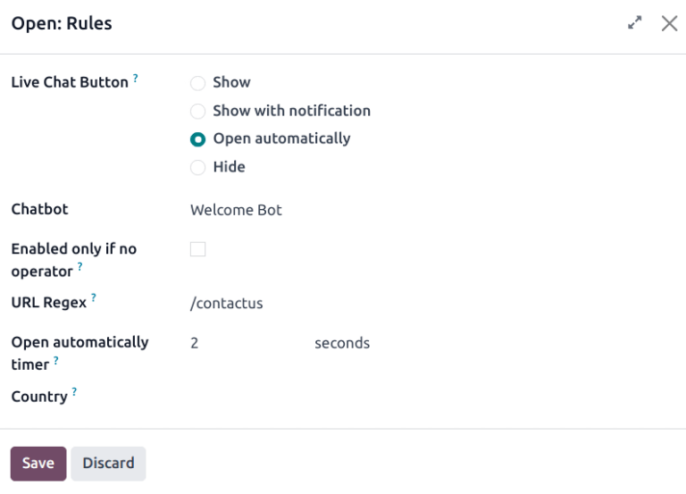

========
Chatbots
========

A *Chatbot* is a program designed to mimic a conversation with a live human. Chatbots are assigned a
script of pre-written steps to follow. The scripts are designed to anticipate a visitor's potential
response, and lead them through a series of questions and answers the same way a live team member
would.

Chatbots can be customized to fill various roles, from customer support, to creating leads, to
collecting contact information. The goal of the chatbot depends on the page of the website they are
assigned, and the messages included in the script, among other criteria.

.. image:: chatbots/chatbot-visitor-view.png
   :align: center
   :alt: View of the chat window with a helpdesk ticket created in Odoo Live Chat.

Build a chatbot
===============

Before creating a new chatbot, the *Live Chat* application must first be installed on the database.
This can be done directly from the :menuselection:`Apps` menu by searching for `Live Chat` in the
:guilabel:`search bar` and clicking :guilabel:`Install`.

Alternatively, *Live Chat* can be installed and enabled by navigating to the :menuselection:`Website
application --> Configuration --> Settings`, and checking the box labeled :guilabel:`Livechat`. Once
enabled, the database will refresh, and the *Live Chat* application is accessible.

Once the *Live Chat* application has been installed on the database, open it, and go to
:menuselection:`Configuration --> Chatbots`.

.. note::
   When the *Live Chat* app is installed, a sample chatbot is created, named *Welcome Bot*. This
   chatbot has a pre-configured script that walks through a few basic steps, including asking for a
   visitor's email address, and forwarding the conversation to an operator.

   *Welcome Bot* can be used as a starting point. The existing steps can be edited or removed, and
   new steps can be added to customize the script, as needed.

   *Welcome Bot* can be deleted (or archived).

   .. image:: chatbots/chatbot-welcome-bot.png
      :align: center
      :alt: View of the Welcome Bot script in Odoo Live Chat.

To create a new chatbot, navigate to the :guilabel:`Chatbot` page (:menuselection:`Live Chat app -->
Configuration --> Chatbots`) and click :guilabel:`New`. This opens a blank chatbot details page.

On the blank chatbot details page, enter a name in the :guilabel:`Chatbot Name` field and click on
the :guilabel:`Edit Image` icon in the upper right corner of the form to add a photo.

Chatbot scripts
---------------

Once the new chatbot has been created and named, the next step is to create a script. Chatbot
conversations follow an accompanying script. These scripts are comprised of lines of dialogue, each
designed to either deliver or capture information.

To create a chatbot script, navigate to the :guilabel:`Script` tab of the chatbot details page, and
click :guilabel:`Add a Line` to open the :guilabel:`Create Script Steps` pop-up form.

This form must be filled out for each line of text (dialogue) that the chatbot could potentially
deliver during the conversation.

First, enter the content of the message in the :guilabel:`Message` field. Then, select an option
from the :guilabel:`Step Types` drop-down menu.

Step types
~~~~~~~~~~

The :guilabel:`Step Type` selected depends on the intended purpose of the message. The available
options in the :guilabel:`Step Type` drop-down are listed below, as well as their use, and any
additional information:

Text
****

This step is used for messages where no answer is expected (or necessary). Text steps can be used
for greetings and/or to deliver information.

.. important::
   Text step types are only intended to deliver information, and do not allow for any visitor input.
   As such, they need to be followed by additional steps to continue the conversation.

Question
********

This step asks a question and provides a set of answers. The visitor clicks on one answer, which
either leads to a new step in the conversation, or can lead to an optional link to a new webpage.

.. tip::
   It is helpful to add a catchall answer to question steps (ex: "Something else"). This helps
   visitors continue the conversation, even if their needs don't exactly fit with any of the other
   answers.

Email
*****

This step prompts visitors to provide their email address, which is stored and can be used by team
members later to follow up with additional information.

The only accepted inputs for this step type are email addresses that are in a valid format. If a
visitor attempts to enter anything other than a valid email address, the chatbot responds with a
message stating it does not recognize the information submitted.

Phone
*****

Similar to email, this step type prompts the visitor to enter their phone number, which can be used
at a later time to follow up with additional information, or to schedule demos, and more.

.. warning::
   Due to the vast number of formats used for phone numbers worldwide, responses to this step type
   are **not** validated for formatting.

Forward to Operator
*******************

This step forwards the conversation to an active live chat operator, so that they can continue
assisting the visitor. As the conversation transcript is passed on to the operator they are able to
pick up where the chatbot left off. This not only saves time for all parties involved, it can also
help qualify conversations before they reach live human operators.

.. note::
   If no active operator is available on the channel, the chatbot continues the conversation with
   the visitor. Therefore, additional steps should be added after this one to ensure that there is
   no abrupt end to the conversation.

   .. image:: chatbots/chatbot-no-operator.png
      :align: center
      :alt: View of a chatbot follow up messages when no live chat operator is available.

Free Input/Multi-Line
*********************

The free input step allows visitors to respond to questions without providing pre-written responses.
Information provided in these responses is stored in the chat transcripts.

Choose between :guilabel:`Free Input` and :guilabel:`Free Input (Multi-Line)` depending on the type
and amount of information being requested from the visitor.

Create Lead
***********

This step creates a lead in the *CRM* application. Select an option from the :guilabel:`Sales Team`
drop-down to assign the created lead to a specific team.

Create Ticket
*************

This step creates a :doc:`ticket </applications/services/helpdesk/overview/receiving_tickets>` in
the *Helpdesk* application. Select an option from the :guilabel:`Helpdesk Team` drop-down to assign
the created ticket to a specific team.

Only if
~~~~~~~

Chatbot scripts operate on an if/then basis, which means the next question presented to the visitor
is determined by the answer they provide to the previous question.

To continue the progression of the conversation, the form for a new step contains a field labeled
:guilabel:`Only If`. This field is where the progression of questions is defined.

If a step is intended to follow all of the previous messages, this field can be left empty. However,
if a message should **only** be sent conditionally, based on a previous response (or several
previous responses), those responses need to be added to this field.

.. important::
   If there are any selections made in the :guilabel:`Only If` field, the step will **not** be shown
   in a conversation unless **all** of the answers have been selected. Only include selections in
   this field if they are necessary for this step to be displayed.

.. example::
   In the *Welcome Bot* script, a visitor can ask about pricing information. If the visitor selects
   this response, a step is included to forward the conversation to an operator. The chatbot first
   sends a message informing the visitor that it is checking to see if an operator is available to
   chat.

   However, this message should **only** be delivered if the visitor requests pricing information.
   In that situation, the conversation would proceed as below:

   - Welcome Bot: "*What are you looking for?*"
   - Visitor: "**I have a pricing question.**"
   - Welcome Bot: "*Hmmm, let me check if I can find someone that could help you with that...*"

   In the details form for the :guilabel:`Text` step, the *I have a pricing question* response has
   been selected in the :guilabel:`Only If` field. As such, this step is **only** shown in
   conversations where that response has been selected.

   .. image:: chatbots/chatbot-only-if.png
      :align: center
      :alt: View of the new message form emphasizing the Only If field.

Script testing
--------------

In order to ensure all visitors have a satisfactory experience with the chatbot, each message needs
to lead to a natural conclusion. Chatbot scripts should be tested to confirm there are no dead-ends,
and to get an understanding of what the visitor sees when they interact with the chatbot.

.. important::
   If there is an answer or input provided by the visitor that is **not** assigned a corresponding
   follow-up response, the conversation stops (*dead-end*). Since the visitor cannot re-engage the
   chatbot, they will have to re-start the conversation, by refreshing the chat window, or their
   browser.

To test the performance of a chatbot, first click on the :guilabel:`Test` button at the top-left of
the chatbot script page. Then, upon being redirected to the testing screen, answer the chatbot
prompts the same way a potential site visitor would.

When the script has reached an end-point, the message *Conversation ended...Restart* appears at the
bottom of the chat window. To begin the conversation at the beginning of the script, click on
:guilabel:`Restart`. To return to the script page, click :guilabel:`Back to edit mode` at the top of
the page.

Add chatbot to a channel
========================

After a chatbot has been created and tested, it needs to be added to a live chat channel.

First, open the :menuselection:`Live Chat` application, and select the kanban card for a
:guilabel:`Channel`, or create a :doc:`new one </applications/websites/livechat>`. Click on the
:guilabel:`Channel Rules` tab. Then, open an existing rule, or create a new one by clicking
:guilabel:`Add a line`.

On the :guilabel:`Create Rules` pop-up detail form, choose the appropriate chatbot in the
:guilabel:`Chatbot` field.

If the chatbot should **only** be active if there are no available live chat operators, check the
box labeled :guilabel:`Enabled only if no operator`.

.. seealso::
   :doc:`Live chat channel rules </applications/websites/livechat>`
