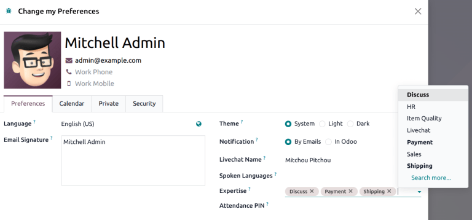
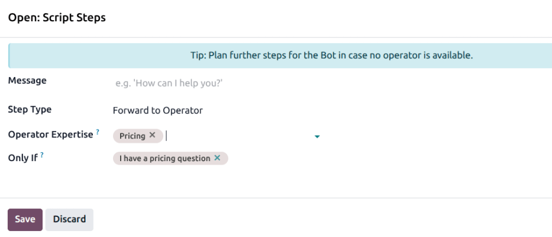
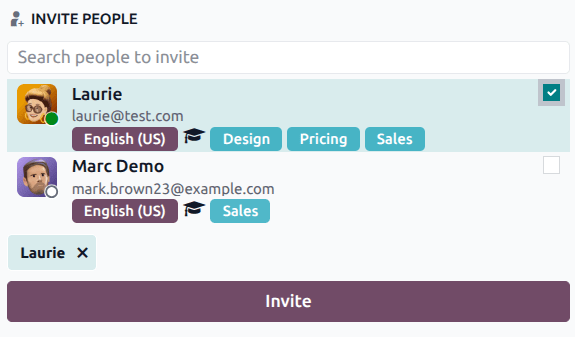
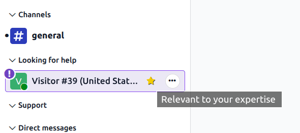

=========
Expertise
=========

In Odoo's **Live Chat**, agents can designate *expertise* in one or more areas. This allows
conversations to be assigned to them based on their scope of knowledge.

When a visitor requests help on a specific topic, Odoo can automatically assign the conversation to
an available agent with that expertise. Expertise improves routing efficiency, reduces wait time,
and ensures customers speak to the most qualified person available.

Create a new expertise
======================

To create a new expertise, navigate to :menuselection:`Live Chat app --> Configuration -->
Expertise` and click :guilabel:`New`. Enter a :guilabel:`Name` for the area of focus.

Under :guilabel:`Operators`, select one or more users from the drop-down to assign this expertise.

.. note::
   *Administrator* level :doc:`access <../../general/users/access_rights>` is required in the **Live
   Chat** application to create or edit expertise. Those with *User* level access can view the
   expertise menu and see which users are assigned to each expertise, but they cannot make changes.

Set live chat expertise
=======================

To set a user's live chat expertise, click on the user avatar in the top-right corner of any page in
the database. Select :guilabel:`My Preferences` from the drop-down menu to open the profile page. On
the right side of the :guilabel:`Preferences` tab, select one or more options from the
:guilabel:`Live Chat Expertise` drop-down list.

Forward conversations based on expertise
========================================

Once an expertise has been assigned to one or more operators, they can be used to forward
conversations. This allows a chatbot to identify the operator who is best suited to handle a
customer request.

Forward via chatbot
-------------------

:doc:`Chatbots <chatbots>` are designed to mimic a conversation with a live human, and operate based
on a pre-written script of steps to follow. The :ref:`Forward to Operator
<chatbot/forward-to-operator>` step type is used to send a conversation from a chatbot to an active
live chat agent who can then continue the conversation based on where the chatbot left off. By
adding expertise to this step, the chatbot will first look for an agent with matching expertise, to
ensure the agent is the best person for the situation.

To add expertise to a chatbot conversation, navigate to :menuselection:`Live Chat app -->
Configuration --> Chatbots`. Click on an existing chatbot to open it, or click :guilabel:`New` to
:ref:`create a new one <chatbot/build-a-chatbot>`.

On the :guilabel:`Script` tab, if there is an existing *Forward to Operator* step, click on it. If
not, click :guilabel:`Add a line`, then select *Forward to Operator* in the :guilabel:`Step Type`
field.

In the :guilabel:`Operator Expertise` field, select one or more expertise for the chatbot to
consider when prioritizing users for conversations on the related channel. Click :guilabel:`Save`
when finished.

.. tip::
   When making selections in this field, consider the use case for the chatbot. A *Support* chatbot
   will cover different topics than a *Recruitment* chatbot.

Add users to a conversation
---------------------------

Users can add other live chat agents to an ongoing conversation directly from the chat window. Open
an active live chat conversation through the :menuselection:`Discuss app`. At the top-right of the
chat, click the :icon:`fa-user-plus` :guilabel:`(user plus)` icon to open the *Invite People* menu.
The user's expertise is listed next to the :icon:`fa-graduation-cap` :guilabel:`(graduation cap)`
icon.

To add a user to the conversation, tick the checkbox to the right of the user's name, then click
:guilabel:`Invite`.

.. note::
   *Expertise* only appear on the *Invite People* pop-up for live chat conversations, not direct
   messages.

Looking for help conversations
==============================

In an active livechat conversation, the :ref:`Status <information/status>` can be set to allow
agents to identify conversations that require immediate action, and inform other agents which
conversations require their expertise at any given time. If a conversation is marked with the status
*Looking for help*, other agents have the opportunity to join.

To view *Looking for help* conversations, navigate to the :menuselection:`Discuss app`.
Conversations with the status appear under the *Looking for help* heading.

If an agent has a matching expertise, the conversation is marked with a :icon:`fa-star`
:guilabel:`(star)` icon.

.. tip::
   *Looking for help* conversations can also be viewed by navigating to :menuselection:`Live Chat
   app --> Sessions --> Looking for Help`.

To join a conversation in progress, click the :icon:`fa-sign-in` :guilabel:`(sign in)` icon at the
top of the information panel. Doing so moves the conversation back to the channel heading and
reverts the status to *In progress*. The customer is also informed that a new user has joined the
chat.
