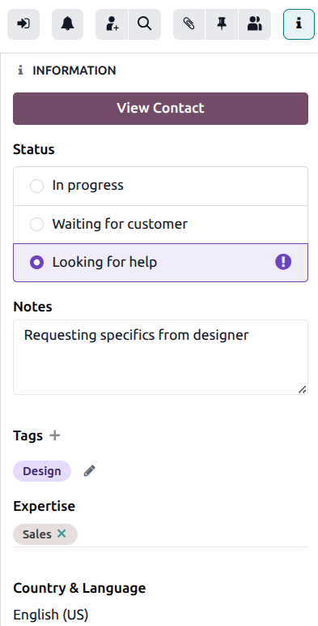
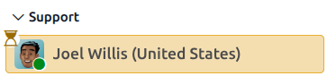
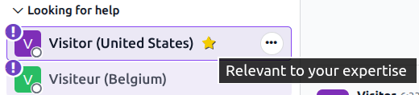
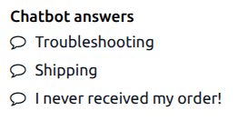
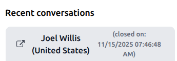
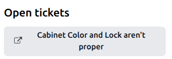
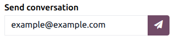

=================
Information panel
=================

The **Live Chat** information panel provides agents with the context they need to handle live chat
conversations efficiently. It gathers key information about the visitor and the conversation
history, allowing agents to respond faster and avoid repetitive messaging.

Accessing the info panel
========================

To view the info panel, open a live chat conversation either in the **Discuss** app or the **Live
Chat** app. Live chat discussions in the **Discuss** app are listed on the left side panel, under
the title of the live chat channel where the conversation began. In the **Live Chat** app,
conversations can be accessed by navigating to :menuselection:`Live Chat --> Sessions --> All
Conversations`.

The information panel appears on the right side of the conversation. Click the :icon:`fa-info`
:guilabel:`(information)` icon to toggle the info panel open or closed.

Contact information
===================

If the live chat conversation involves a known contact, a :guilabel:`View Contact` button appears at
the top of the panel. Clicking this button opens the :doc:`contact record
<../../essentials/contacts>` for the customer, without closing the conversation. The contact record
links to the customers' sales, invoices, meetings, and previous live chat sessions.

Status
======

In an active livechat conversation, the *Status* can be set to allow agents to identify
conversations that require immediate action, and inform other agents which conversations require
their expertise at any given time.

In progress
-----------

The *In progress* status is the default status for a conversation. This status indicates that the
customer is waiting for a response from an agent.

.. tip::
   If a conversation is set to *Waiting for customer*, it will revert to *In progress* as soon as
   the customer sends a new message.

Waiting for customer
--------------------

The *Waiting for customer* status indicates that an agent has sent a message to the customer and is
waiting for a response. When this status is applied, the conversation is highlighted in yellow with
a :icon:`fa-hourglass-start` :guilabel:`(hourglass)` icon.

.. important::
   The *Waiting for customer* status **must** be manually applied.

Looking for help
----------------

If a conversation is marked with the status *Looking for help*, it moves from its original channel
name heading to the *Looking for help* heading, and the :icon:`fa-exclamation-circle`
:guilabel:`(exclamation circle)` icon is added. Any user with **Live Chat** permissions can view or
join these conversations, even if they are not currently active in a live chat channel.

If a conversation with the *Looking for help* status has an :ref:`expertise <information/expertise>`
listed that matches the user's, the conversation is marked with a :icon:`fa-star` :guilabel:`(star)`
icon.

To join a conversation in progress, click the :icon:`fa-sign-in` :guilabel:`(sign in)` icon at the
top of the information panel. Doing so moves the conversation back to the channel heading and
reverts the status to *In progress*. The customer is also informed that a new user has joined the
chat.

If the icon does not appear, manually set the status to *In progress* to inform other agents the
conversation is being handled.

.. tip::
   All conversations that have been tagged with the status *Looking for help* can be found by
   navigating to :menuselection:`Live Chat app --> Sessions --> Looking for Help`. Use the filters
   to find the appropriate session date.

Notes
=====

The :guilabel:`Notes` field allows agents to leave comments about the conversation, recap the
situation when transferring it to another agent, or  to add context to the conversation that can be
viewed later in reporting.

Tags
====

Tags can be added to a conversation to assist with categorizing, tracking issues, and enhancing
reporting. Click :guilabel:`Tags` :icon:`fa-plus`, then select a tag from the list, or enter a new
one in the field. Multiple tags can be added to a single conversation.

Chatbot answers
===============

If the conversation was forwarded from a chatbot, the answers selected from the chatbot are included
on the information panel under *Chatbot answers*.

.. _information/expertise:

Expertise
=========

The :guilabel:`Expertise` field allows agents to designate the topic of conversation to a specific
skillset or knowledge scope. This helps to categorize the conversation for assignment purposes, as
well as issue tacking and enchanced reporting. Click into the field and select one or more options
from the drop-down list.

Country & language
==================

The *Country & Language* section identifies where the customer is located, and their language. A
visitor's language is determined via their browser's language settings.

.. note::
   Conversations are assigned to operators based on a number of criteria, including availability and
   the number of ongoing conversations. While the operator's main language and additional languages
   are taken into consideration, they do **not** supersede all other criteria.

Recent conversations
====================

Any recent live chat conversations with this customer also appear in the information panel. Click on
the :icon:`fa-external-link` :guilabel:`(external link)` icon on the ticket title to open the
conversation in a new tab.

Open tickets
============

Any open **Helpdesk** tickets created by the customer also appear in the information panel. Click on
the :icon:`fa-external-link` :guilabel:`(external link)` icon on the ticket title to open the ticket
record in a new tab.

Outcome
=======

For closed conversations, the *Outcome* field defines how the conversation concluded:

- *No Answer*: assigned when the customer does not respond to the agent. This usually occurs when
  the session is initiated, but the customer does not engage or send additional messages.
- *No One Available*: assigned when no agents are available to respond to the customer. This occurs
  when the session is initiated, but no operator is online or available to be assigned to the chat.
- *Success*: assigned when the live chat session is completed successfully. This outcome does
  **not** depend the customer providing a positive rating, it is dependent on the session being
  resolved without escalation or failure.
- *Escalated*: assigned when the session is forwarded to another operator. This indicates the
  initial operator could not resolve the issue, and required assistance.

Send conversation
=================

When the conversation is complete, scroll to the bottom of the info panel. The email address in the
field can be edited to send to a different address.click the :icon:`fa-paper-plane`
:guilabel:`(paper plane)` icon to send a copy of the conversation transcript.

