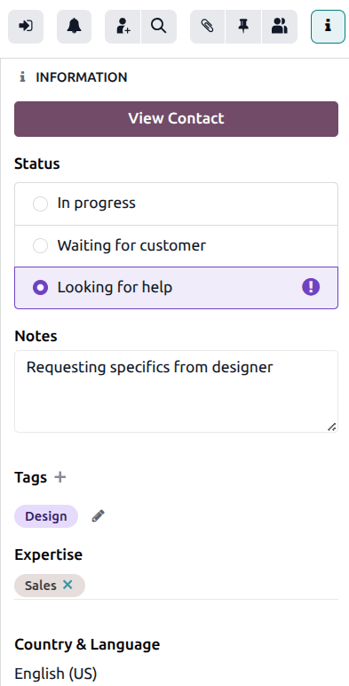
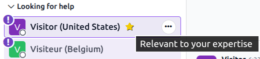
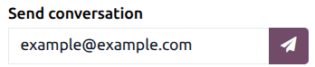

=================
Information panel
=================

The **Live Chat** information panel provides agents with context they need to handle live chat
conversations efficiently. It gathers key information about the visitor and the conversation
history, allowing agents to respond faster and avoid repetative messaging.

Accessing the info panel
========================

To view the info panel, open a live chat conversation either in the **Discuss** app or the **Live
Chat** app. Live chat discussions in the **Discuss** app are listed on the left side panel, under
the title of the live chat channel where the conversation began. In the **Live Chat** app,
conversations can be accessed by navigating to :menuselection:`Live Chat --> Sessions --> All
Conversations`.

On the right side of the conversation, click the :icon:`fa-info` :guilabel:`(information)` icon to
open the info panel.

Contact information
===================

If the live chat conversation involves a known contact, a :guilabel:`View Contact` button appears at
the top of the panel. Clicking this button opens the :doc:`contact record
<../../essentials/contacts>` for the customer, without closing the conversation. The contact record
links to the customers' sales, invoices, meetings, and previous live chat sessions.

Status
======

The *Status* feature allows agents to quickly identify conversations that require immediate action,
and allow other agents to join a convesation where their expertise could be beneficial.

In progress
-----------

The *In progress* status

Waiting for customer
--------------------

Looking for help
----------------

If a conversation is marked with the status *Looking for help*, it moves from under the channel name
heading to the *Looking for help* heading, and the :icon:`fa-exclamation-circle`
:guilabel:`(exclamation circle)` icon is added. Any user with **Live Chat** permissions can view or
join these conversations, even if they are not currently active in a live chat channel.

If a conversation with the *Looking for help* status has an expertise listed that matches the users,
the conversation is marked with a :icon:`fa-star` :guilabel:`(star)` icon.

To join a conversation in progress, click the :icon:`fa-sign-in` :guilabel:`(sign in)` icon. Doing
so moves the conversation back to the channel heading and reverts the status to *In progress*. The
customer is also informed that a new user has joined the chat.

Notes
=====

The :guilabel:`Notes` field allows agents to leave comments about the conversation, recap the
sitaution when transfering it to another agent, or to allow them to add context to the conversation
that can be viewed later in reporting.

Send transcript
===============

When the conversation is complete, scroll to the bottom of the info panel and click the
:icon:`fa-paper-plane` :guilabel:`(paper plane)` icon to send a copy of the conversation transcript.
The email address in the field can be edited to send to a different address.

