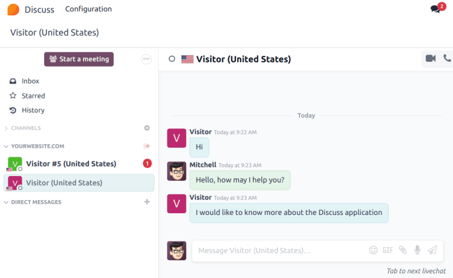

========================
Participate in live chat
========================

*Operators* are the users who respond to live chat requests from customers and website visitors. The
information below outlines the necessary steps for operators participating in live chat
conversations on an Odoo database.

Set an online chat name
-----------------------

Before participating in a live chat, operators may choose to update their *Online Chat Name*. This
is the name displayed to site visitors in the live chat conversation.

To update the *Online Chat Name*, click on the user avatar in the top-right corner of any page in
the database. Select :guilabel:`My Profile` from the drop-down menu to open the profile page. On the
right side of the :guilabel:`Preferences` tab, locate the :guilabel:`Online Chat Name` field, and
enter a preferred name.

If a user's :guilabel:`Online Chat Name` is not set, the name displayed defaults to the user's name
that is designated on their profile page.

.. example::
   Mitchell Admin has his full name as his :guilabel:`User Name`, but he does not want to include
   his last name in a live chat conversation for privacy reasons. He would then set his
   :guilabel:`Online Chat Name` to include only his first name, Mitchell.

   .. image:: participate/online-chat-name.png
      :alt: View of user profile in Odoo, emphasizing the Online Chat name field.

Set online chat languages
-------------------------

If an operator speaks multiple languages, they can add this information to their user profile. This
information can then be used to determine which conversations the operator is assigned. A visitor's
language is determined via their browser's language settings.

.. note::
   Conversations are assigned to operators based on a number of criteria, including availability and
   the number of ongoing conversations. While the operator's main language and additional languages
   are taken into consideration, they do **not** supersede all other criteria.

To add *Online Chat Languages*, click on the user avatar in the top-right corner of any page in the
database. Select :guilabel:`My Profile` from the drop-down menu to open the profile page. On the
right side of the :guilabel:`Preferences` tab, click into the :guilabel:`Online Chat Language`
field, and select one or more languages from the drop-down menu.

.. important::
   Only :doc:`languages <../../general/users/language>` that are enabled on the database can be
   selected in the :guilabel:`Online Chat Language` field.

Set live chat expertise
-----------------------

Operators can designate *Expertise* in one or more areas on their profile. A :doc:`chatbot
<chatbots>` can then assign conversations to the operator with the appropriate expertise. Select one
or more options from the :guilabel:`Live Chat Expertise` drop-down list.

To create a new expertise, navigate to :menuselection:`Live Chat app --> Configuration -->
Expertise` and click :guilabel:`New`. Enter the :guilabel:`Name` of the expertise, and, if desired,
select one or more :guilabel:`Operators`. Click :guilabel:`Save` when finished.

.. important::
   When forwarding live chat conversations, the chatbot prioritizes users with matching expertise.
   If no applicable match is found, the chatbot forwards the conversation to the next available
   operator.

Join or leave a channel
-----------------------

To join a live chat channel, go to the :menuselection:`Live Chat app --> Channels`, and click the
:guilabel:`Join` button on the Kanban card for the appropriate channel.

Any channel where the user is currently active shows a :guilabel:`Leave` button. Click this button
to disconnect from the channel.

.. important::
   Operators that do not show any activity in Odoo for more than thirty minutes are considered
   disconnected, and subsequently removed from the channel.

Manage live chat requests
-------------------------

When an operator is active in a channel, chat windows open in the bottom-right corner of the screen,
no matter what page they are on in Odoo. This allows them to access other pages and apps, while
still participating in the conversation.

Live chat conversations can also be viewed by navigating to the :menuselection:`Discuss app`. New
conversations appear in bold under the channel name, located along the left panel.

Click on a conversation in the left panel to open it. From this view, an operator can participate in
the chat the same as they would in the normal chat window.

<<<<<<< 786b97c7ddce4248fd583edd74a3f2f433fe7b81
Live chat conversations can also be viewed by navigating to the :menuselection:`Discuss app`. New
conversations appear in bold under the channel name, located along the left panel.

Click on a conversation in the left panel to select it. This opens the conversation. From this
view, an operator can participate in the chat the same as they would in the normal chat window.

.. tip::
   Conversations can also be accessed by clicking the :icon:`fa-comments` :guilabel:`(Messages)`
||||||| d50b83103237c0445b6f9b7ec6cdeff82cd64f5a
.. tip::
   Conversations can also be accessed by clicking the :icon:`fa-comments` :guilabel:`(messages)`
   icon in the menu bar.

   .. image:: participate/menu-bar.png
      :align: center
      :alt: View of the menu bar in Odoo emphasizing the comments icon.

Live chat conversations can also be viewed by navigating to the :menuselection:`Discuss app`. New
conversations appear in bold under the :guilabel:`LIVECHAT` heading, located along the left panel.

Click on a conversation in the left panel to select it. This opens the conversation. From this
view, an operator can participate in the chat the same as they would in the normal chat window.

=======
.. tip::
   Conversations can also be accessed by clicking the :icon:`fa-comments` :guilabel:`(messages)`
>>>>>>> 1ebf0002fca4c0c89362737e7c82c6251a3bc79a
   icon in the menu bar.

   .. image:: participate/menu-bar.png
      :alt: View of the menu bar in Odoo emphasizing the comments icon.

.. seealso::
   - :doc:`../../productivity/discuss`
   - :doc:`../livechat`
   - :doc:`../livechat/responses`
