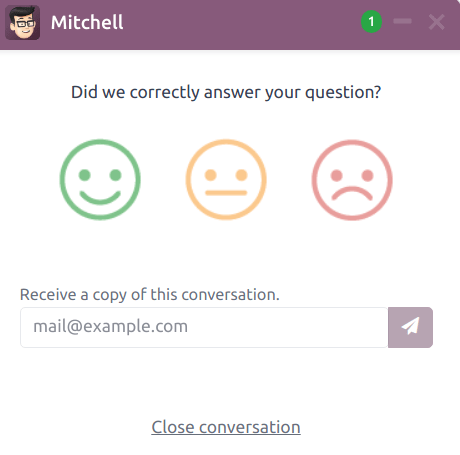
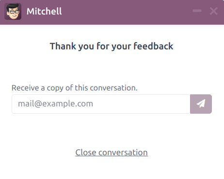
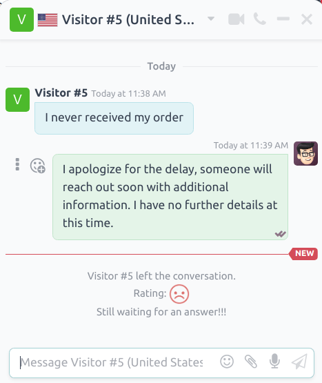
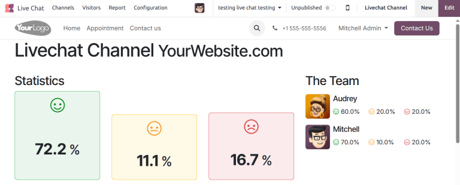
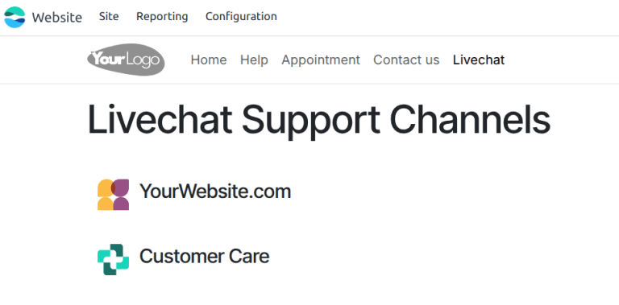
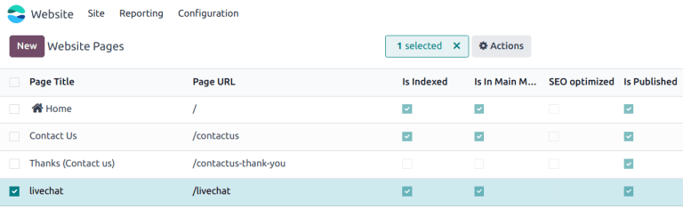
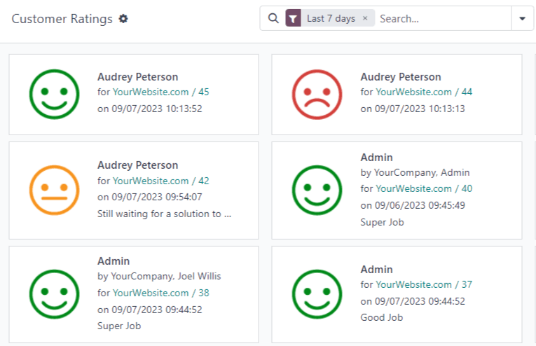
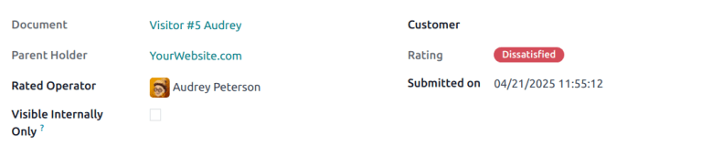

=======
Ratings
=======

.. |smile| replace:: green :icon:`fa-smile-o` :guilabel:`(smile)` icon
.. |meh| replace:: yellow :icon:`fa-meh-o` :guilabel:`(neutral)` icon
.. |frown| replace:: red :icon:`fa-frown-o` :guilabel:`(frown)` icon

At the end of a **Live Chat** conversation, customers have the opportunity to rate the quality of
support they received from the live chat *operator*. Customers provide ratings as soon as they close
the conversation. This allows operators to receive immediate feedback on their performance. It also
allows customers to share any final comments before leaving the chat window.

Rate live chat conversations
============================

Customers end a live chat conversation by clicking the :icon:`oi-close` :guilabel:`(close)` icon in
the upper right-hand corner of the chat window. They are then prompted to select an icon that
reflects their level of satisfaction. The icons represent the following ratings:

 - **Satisfied** - |smile|
 - **Okay** - |meh|
 - **Dissatisfied** - |frown|

.. note::
   When customers end a conversation, a field marked :guilabel:`Receive a copy of this conversation`
   appears under the *ratings* icons. Customers can enter their email either before or after they
   submit a rating.

If the customer selects the |smile|, they are presented with a thank you message and a
:guilabel:`Close Conversation` link.

If the customer selects either the |meh| or the |frown|, a text box appears. Customers can add
comments in this text box to explain why they chose this rating. This message, along with the rating
icon, is sent to the live chat operator.

Publish customer ratings
========================

To publish a channel's ratings on the website, first navigate to a live chat channel's record by
going to the :menuselection:`Live Chat` app and clicking on the :icon:`fa-ellipsis-v`
:guilabel:`(vertical ellipsis)` icon on the Kanban card for that team. Then, click
:guilabel:`Configure Channel` to open the channel details form. Then click on the :guilabel:`Go to
Website` smart button. This opens the :guilabel:`Live Chat Channel Statistics` page.

In the upper right corner of the page, click the red :guilabel:`Unpublished` slider. The slider
changes from :guilabel:`Unpublished` to :guilabel:`Published`.

.. note::
   The customer notes submitted with the rating are *not* published on the website; they are kept
   internal. Only a statistical overview of the operators' performance for the *channel* appears on
   the website.

Add ratings page to site
------------------------

Once the rating page has been published, it has to be manually added to the website. To do this, go
to the main Odoo dashboard and open the **Website** application. :menuselection:`Website app -->
Site --> Pages`, then click :guilabel:`New`.

This opens a :guilabel:`New Page` pop-up window. In the :guilabel:`Page Title` field, enter
`livechat`. This acts as the URL for the published webpage.

.. important::
   The URL *must* be named `livechat` in order for the database to recognize and connect the ratings
   page. After the page has been published, the page title can be changed later under the
   :guilabel:`Menu Editor`.

Click :guilabel:`Create`, and the newly created webpage opens. The :guilabel:`Web Editor` appears in
the right panel.

The page lists the names of the :guilabel:`Live Chat Channels` whose ratings pages have been
published. On the left side of the channel name is an icon, which users can click on to go to the
ratings page for the respective channel.

.. tip::
   The icon displayed on this page is configured on the live chat channel's configuration page. To
   update this image, navigate to the :menuselection:`Live Chat` app and click on the
   :icon:`fa-ellipsis-v` :guilabel:`(vertical ellipsis)` icon on the Kanban card for that team.
   Then, click :guilabel:`Configure Channel` to open the channel details form. Click the
   :icon:`fa-pencil` :guilabel:`(pencil)` icon in the image box to upload an image.

Make any desired changes or additions to this page, then click :guilabel:`Save` in the top right of
the webpage editor. The website editor side panel closes, and the webpage remains on the screen.

To publish the `livechat` webpage, return to the list of webpages by navigating to
:menuselection:`Site --> Content --> Pages`. Click the checkbox to the left of `livechat` in the
list of pages to select the page and highlight the line. Then, click the checkbox under the column
labeled :guilabel:`Is Published`. The field with the checkbox is highlighted in white. Click the
checkbox a second time to activate the :guilabel:`Is Published` box. The webpage is now published.

Once the page has been added to the site, ratings are set to be published by default. However,
individual ratings can be manually selected to be hidden from the public. The rating is still
included in internal reports, and can still be viewed by internal teams. However, public website
visitors and portal users do not have access.

See :ref:`Hide individual ratings <livechat/overview/hide-ratings>` for more information.

Customer ratings report
=======================

The :guilabel:`Customer Ratings` report (:menuselection:`Live Chat --> Report --> Customer Ratings`)
displays an overview of the ratings received on live chat conversations, as well as any additional
comments submitted with the rating.

The report defaults to a Kanban view, with each rating represented by a different card. To switch to
a different view, click on one of the icons in the upper-right corner of the screen. The report is
available in *list* view, *pivot* view, and *graph* view.

Click on an individual rating to see additional details about the conversation, and the rating.

.. _livechat/overview/hide-ratings:

Hide individual ratings
-----------------------

Ratings are set to be published by default. However, individual ratings can be manually selected to
be hidden from the public. The rating is still included in internal reports, and can still be viewed
by internal teams. However, public website visitors and portal users do not have access.

To hide a rating, go to :menuselection:`Live Chat app --> Report --> Customer Ratings`. Click on the
Kanban card for the rating to be hidden. On the individual rating's detail page, check the box
labeled :guilabel:`Visible Internally Only`.

.. seealso::
   - :doc:`/applications/websites/livechat`
   - :doc:`responses`
   - :doc:`/applications/websites/website`
