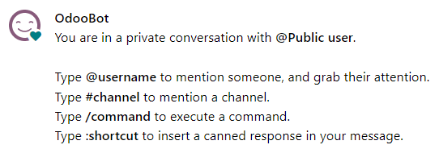
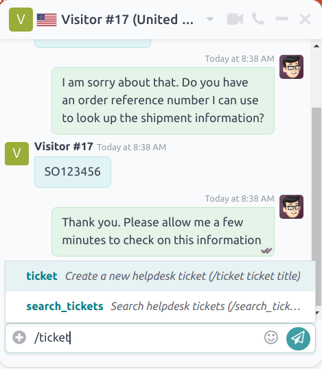
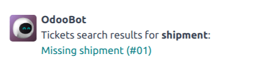
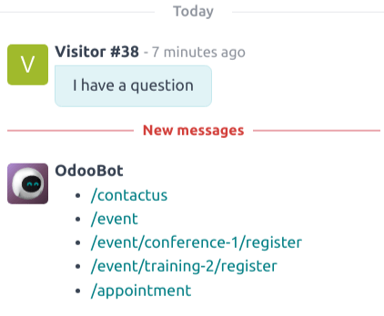
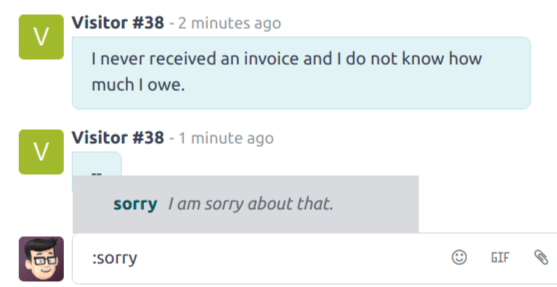

=============================
Commands and canned responses
=============================

In the Odoo *Live Chat* application, *commands* allow the user to perform specific actions both
inside the chat window, and through other Odoo applications. The *Live Chat* app also includes
*canned responses*. These are customized, preconfigured substitutions that allow users to replace
shortcut entries in place of longer, well-thought out responses to some of the most common questions
and comments.

Both commands and canned responses save time, and allow users to maintain a level of consistency
throughout their conversations.

Execute a command
=================

Live chat *commands* are keywords that trigger preconfigured actions. When a live chat *operator*
is participating in a conversation with a customer or website visitor, they can execute a command by
typing `/`, followed by the command.

Commands, and the resulting actions, are only visible in the conversation window for the live chat
operator. A customer does not see any commands that an operator uses in a conversation from their
view of the chat.

.. example::
   During a conversation with a customer, a live chat operator executes the command to :ref:`create
   a ticket <live-chat/ticket>`. After entering the command, `/ticket`, the system automatically
   creates a ticket with the information from the conversation. It also includes a link to the new
   ticket, so the operator can go there directly to add any additional information, if necessary.

   .. image:: responses/responses-ticket-link.png
      :align: center
      :alt: View of the chat window with a helpdesk ticket created in Odoo Live Chat.

More information about each available command can be found below.

Help
----

If an operator types `/help` in the chat window, an informative message that includes the potential
entry types an operator can make is displayed.

- Type `@username` to mention a user in the conversation. A notification will be sent to that user's
  inbox or email, depending on their notification settings.
- Type `#channel` to mention a *Discuss* channel.
- Type `/command` to execute a command.
- Type `:shortcut` to insert a :ref:`canned response <live-chat/canned-responses>`.

.. seealso::
   - :doc:`/applications/productivity/discuss`
   - :doc:`/applications/productivity/discuss/team_communication`

Ticket & search tickets
-----------------------

The `/ticket` and `/search_tickets` commands allow operators to create helpdesk tickets directly
from a conversation, and search through existing tickets by keyword or ticket number.

.. important::
   The `/ticket` and `/search_tickets` commands can **only** be used if the *Helpdesk* app has been
   installed, and *Live Chat* has been activated on a *Helpdesk* team. To activate *Live Chat*, go
   to :menuselection:`Helpdesk app --> Configuration --> Helpdesk Teams`, and select a team. Scroll
   to the :guilabel:`Channels` section, and check the box labeled, :guilabel:`Live Chat`.

.. _live-chat/ticket:

Create a ticket from a live chat
~~~~~~~~~~~~~~~~~~~~~~~~~~~~~~~~

If an operator types `/ticket` in the chat window, the conversation is used to create a *Helpdesk*
ticket.

After entering the `/ticket` command, type a title for the ticket into the chat window, then press
`Enter`.

The newly created ticket will be added to the *Helpdesk* team that has live chat enabled. If more
than one team has live chat enabled, the ticket will automatically be assigned based on the team's
priority.

The transcript from the conversation will be added to the new ticket, under the
:guilabel:`Description` tab.

To access the new ticket, click on the link in the chat window, or go to the
:menuselection:`Helpdesk app`, and click the :guilabel:`Tickets` button on the Kanban card for the
appropriate team.

Search for a ticket from a live chat
~~~~~~~~~~~~~~~~~~~~~~~~~~~~~~~~~~~~

If an operator types `/search_tickets` in the chat window, they can search through *Helpdesk*
tickets, either by ticket number or keyword.

After entering the `/search_tickets` command, type a keyword or ticket number, then press
:kbd:`Enter`. If one or more related tickets are found, a list of links is generated in the
conversation window.

.. note::
   Results from the search command will only be seen by the operator, not the customer.

History
-------

Typing `/history` in the chat window generates a list of the most recent pages the visitor has
viewed on the website (up to fifteen pages).

Lead
----

By typing `/lead` in the chat window, an operator can create a *lead* in the *CRM* application.

.. image:: responses/responses-lead.png
   :align: center
   :alt: View of the results from a /lead command in a Live Chat conversation.

.. important::
   The `/lead` command can only be used if the *CRM* app has been installed.

After typing `/lead`, create a title for this new lead, then press `Enter`. A link with the lead
title appears. Click the link, or navigate to the :menuselection:`CRM` app to view the
:guilabel:`Pipeline`.

.. note::
   The link to the new lead can only be seen and accessed by the operator, not the customer.

The transcript of that specific live chat conversation (where the lead was created) is added to the
:guilabel:`Internal Notes` tab of the lead form.

On the :guilabel:`Extra Information` tab of the lead form, the :guilabel:`Source` will be listed as
:guilabel:`Livechat`.

Leave
-----

If an operator types `/leave` in the chat window, they can automatically exit the conversation. This
command does not cause the customer to be removed from the conversation, nor does it automatically
end the conversation.

.. seealso::
   - :doc:`/applications/sales/crm/acquire_leads`
   - :doc:`../../services/helpdesk`

.. _live-chat/canned-responses:

Canned responses
================

*Canned responses* are customizable inputs, where a typed shortcut populates a longer response. A
user enters a keyword *shortcut*, which is then automatically replaced by the expanded
*substitution* response. The shortcut is the keyword or key phrase that is to be replaced. The
substitution is the longer message that replaces the shortcut.

.. _livechat/created-canned-response:

Create canned responses
-----------------------

To create a new canned response, go to :menuselection:`Live Chat app --> Configuration --> Canned
Responses --> New`.

Type a shortcut command in the :guilabel:`Shortcut` field. Next, click the :guilabel:`Substitution`
field, and type the message that should replace the shortcut.

.. tip::
   Try to connect the shortcut to the topic of the substitution. Not only does this make it easier
   to use the responses, it prevents the list of responses from becoming disorganized and
   overwhelming.

In the :guilabel:`Description` field, add any information that provides context for this response,
such as guidelines for when it should or should not be used.

The :guilabel:`Last Used` field keeps track of the date and time each response was most recently
used. This field **cannot** be edited.

Use canned responses in a live chat conversation
------------------------------------------------

To use a canned response during a live chat conversation, type a colon (`:`) into the chat window,
followed by the shortcut.

.. example::
   An operator is chatting with a visitor. As soon as they type `:` they would see a list of
   available responses. They can manually select one from the list, or continue to type. If they
   want to use the canned response `'I am sorry to hear that.'`, they would type `:sorry`.

.. tip::
   Typing `:` into a chat window on its own will generate a list of available canned responses.
   Responses can be manually selected from the list, in addition to the use of shortcuts.

   .. image:: responses/response-list.png
      :align: center
      :alt: View of a chat window and the list of available canned responses.
